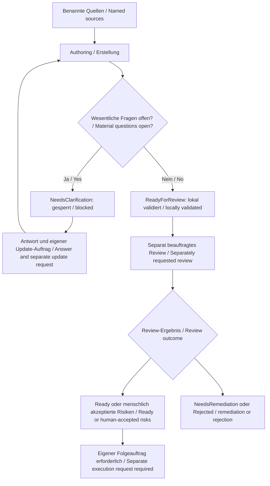

<!-- intake-authoring:begin -->
# LH-00 — Spec-Kit-Projektprofil und Lastenheft-Prozess / Spec Kit project profile and intake process

**Authoring-Status / Authoring status:** `ReadyForReview`.
**Review-Status / Review status:** Nicht durchgeführt / Not performed.
**Prozessabnahme / Process acceptance:** Offen / Open.
**Profil / Profile:** `show-commandtui400-de-en`.
**Plan-ID:** LH-00. **Issue:** [#1](https://github.com/hindermath/Show-CommandTui400/issues/1).
**Owner:** Thorsten Hindermann. **Datum / Date:** 2026-09-28.

## Zielgruppe und Begriffe / Audience and terms

Für Projektverantwortliche, Lastenheft-Autoren und spätere Implementierende.
Grundkenntnisse von Dateien, Terminal und PowerShell genügen; vorherige Spec-Kit-
Kenntnisse sind nicht erforderlich. Ein Lastenheft (Intake) beschreibt fachliche
Anforderungen. Authoring ist dessen Erstellung. Ein Receipt ist ein JSON-Nachweis
über Quellen und Inhalt; JSON ist ein textuelles Datenformat. SHA-256 ist die
Prüfsumme zur Erkennung geänderter Inhalte. Ein Review bewertet die fachliche
Qualität getrennt von der Erstellung. `ReadyForReview` heißt bereit für diese
Prüfung, nicht bereit zur Implementierung. A11Y bezeichnet Barrierefreiheit;
CEFR B2 bezeichnet das angestrebte Verständlichkeitsniveau der beiden Sprachen.

For project owners, intake authors and later implementers. Basic knowledge of
files, terminals and PowerShell is enough; prior Spec Kit experience is not
required. An intake describes domain requirements. Authoring creates it. A
receipt is a JSON record of sources and content; JSON is a text data format.
SHA-256 is a checksum used to detect changed content. Review assesses domain
quality separately from authoring. ReadyForReview means ready for that review,
not ready for implementation. A11Y means accessibility; CEFR B2 describes the
intended readability of both language tracks.

## Zweck / Purpose

Ein nachvollziehbares Verfahren schaffen, mit dem die acht vorbereiteten Issues
zu eigenständigen, prüfbaren Lastenheften werden. Fachlichkeit, technische
Spezifikation, Implementierungsplan und Freigabe bleiben unterscheidbar.

Establish a traceable procedure for turning the eight prepared issues into
independent, reviewable intakes. Keep requirements, technical specification,
implementation planning and permission separate.

## Istzustand / Current state

Das Bedienkonzept v0.2 ist die fachliche Baseline. Das Level-2-Repository ist auf
Basis von Home Baseline eingerichtet: Spec Kit 0.12.8, fünf Integrationen und
14 gepinnte Presets. Authoring 0.3.5 ist regulär installiert; kein Backport ist
erforderlich. Seine plattformübergreifenden Release-Prüfungen belegen das Werkzeug,
nicht den gesamten projektspezifischen PowerShell-Prozess. Ein minimales lokales
DE/EN-Profil und acht Issue-Entwürfe entstehen mit diesem Authoring-Auftrag.
Remote-Issues bleiben unverändert. Es gibt keine Produktimplementierung.

The interaction concept v0.2 is the domain baseline. Home Baseline setup provides
Spec Kit 0.12.8, five integrations and fourteen pinned presets. Authoring 0.3.5
is installed as a regular release; no backport is needed. Its cross-platform
release checks prove the tool, not the full project-specific PowerShell process.
This authoring task establishes a minimal local bilingual profile and eight
issue drafts. Remote issues remain unchanged. No product implementation exists.

Auf beiden Macs ist PowerShell 7.6.6.0 laut Owner installiert. Die vorhandenen
Spec-Kit-Basisskripte sind Bash-basiert. Durchgängige PowerShell-Basisskripte auf
beiden Macs sowie nativem Windows 11 und Ubuntu 24.04 unter WSL2 sind noch nicht
nachgewiesen. Windows-/WSL2-Versionen und tatsächliche Testergebnisse fehlen.
Die dokumentierte Entwicklungsumgebung entscheidet keine Produkt-Mindestversion.

The owner reports PowerShell 7.6.6.0 on both Macs. Existing Spec Kit base scripts
use Bash. End-to-end PowerShell base-script operation on both Macs, native
Windows 11 and Ubuntu 24.04 under WSL2 remains unproven. Windows/WSL2 versions
and actual results are outstanding. Development versions set no product minimum.

## Zielzustand / Target state

Ein später vollständig umgesetzter LH-00-Prozess erzeugt zweisprachige Intakes
mit eindeutiger Identität, gebundenen Quellen, überprüfbaren Anforderungen und
ehrlichen Nachweisen. Rollen, Status und Ablagen sind verständlich. Änderungen
erhalten Herkunft und Reihenfolge. Serienverwaltung und Plattformnachweise sind
validiert; Bestandsübersetzungen und zentrale Registerausrichtung sind erledigt.
Die Erstellung dieses Lastenhefts erreicht nur `ReadyForReview`.

A fully implemented later LH-00 process produces bilingual intakes with clear
identity, bound sources, testable requirements and honest evidence. Roles,
statuses and storage are understandable. Changes preserve provenance and order.
Series management and platform evidence validate; existing-document translations
and central registry alignment are complete. Authoring this document reaches
only ReadyForReview.

## Umfang / Scope

Der fachliche Umfang von LH-00 umfasst Projektprofil, Rollen, Ablage, Sprachpflege,
Authoring-/Reviewverfahren, Quellenbindung, kontrollierte Änderungen, Reihenfolge,
Serienverwaltung und Abnahme des PowerShell-Prozesses. Die aktuelle Ausführung
beschränkt sich auf lokale Governance-Ausrichtung, Issue-Entwürfe, minimales Profil,
dieses Lastenheft und sein Receipt. Die übrigen Anforderungen sind später umzusetzen.

LH-00 covers the project profile, roles, storage, language maintenance, authoring
and review, source binding, controlled changes, ordering, series management and
PowerShell process acceptance. Current execution is limited to local governance
alignment, issue drafts, a minimal profile, this intake and its receipt. Remaining
requirements are for later implementation.

## Nicht-Ziele / Non-goals

Keine Produktimplementierung, keine TUI-Framework-/Sprachentscheidung, keine
Festlegung der Produkt-Mindestversion oder technischen Sitzungsintegration.
Keine ungeprüfte TuiVision-Governance, keine Geräteadapter oder Cloud-Pflicht.
Kein automatisches Review, Specify, Autonomous oder Parallel Autonomous.
Keine Commits, Pushes, PRs, Merges, Issue-Änderungen, zentrale Flottenverteilung
oder Release-Automation im aktuellen Auftrag.

No product implementation, TUI framework/language choice, product minimum
version or technical session integration decision. No unchecked TuiVision
governance, device adapters or mandatory cloud service. No automatic review,
Specify, Autonomous or Parallel Autonomous. Current scope excludes commits,
pushes, PRs, merges, issue mutations, central fleet distribution and release automation.

## Anforderungen / Requirements

- **FR-00-001:** Spec-Kit-Version, verwendete Erweiterungen und tatsächlich verfügbare Intake-Kommandos feststellen und dokumentieren.
- **FR-00-002:** Projektprofil mit Deutsch zuerst (de-DE), Englisch danach (en), ungefähr CEFR B2 sowie Ablage, Statusmodell und Verantwortlichkeiten festlegen.
- **FR-00-003:** Bedienkonzept als fachliche Baseline referenzieren; Lastenhefte, technische Spezifikationen und Implementierungspläne getrennt halten.
- **FR-00-004:** Reihenfolge und Abhängigkeiten in einer einzigen verbindlichen Übersicht pflegen; Issue-IDs nach Erstellung verlinken.
- **FR-00-005:** Pflege fachliche Dokumente DE zuerst/EN danach mit gleichen IDs und ungefähr CEFR B2; erkläre Fach- und Workflowbegriffe bei erster Verwendung.
- **FR-00-006:** Beschreibe Status, Abhängigkeiten, Entscheidungen und nächste Aktion vollständig in Text; prüfe Tastatur-, Screenreader-, Braille- und Textbrowserzugang sowie WCAG 2.2 AA soweit anwendbar.
- **FR-00-007:** Ordne alle anwendbaren Level-2-Vorgaben Anforderungen, Abnahmekriterien, Ownern und Nachweisen zu; begründe N/A und kennzeichne offene Nachweise.
- **FR-00-008:** Erzeuge nachprüfbare Quellen- und Zielhashes mit Receipts; schütze bestehende Ziele und trenne Create, Update, Review und Ausführung.
- **FR-00-009:** Definiere Authoring- und Reviewstatus getrennt; ein Review oder ein kopierter Prompt erteilt keine automatische Produkt- oder Remote-Freigabe.
- **FR-00-010:** Weise den durchgängigen PowerShell-Spec-Kit-Prozess auf beiden Macs, nativem Windows 11 und Ubuntu 24.04 unter WSL2 getrennt nach; erfasse Versionen und Testgrenzen.
- **FR-00-011:** Konkretisiere später die portablen Collection-Rollen, Pfade und ein validiertes Serienmanifest aus der bestehenden Reihenfolge; bewahre IDs, Abhängigkeiten und Archivnachweise.
- **FR-00-012:** Erledige die inventarisierten Fachtextübersetzungen und die zentrale Register-Synchronisation vor der Abnahme des LH-00-Prozesses; bewahre historische Nachweise.

- **FR-00-001:** Identify and document the Spec Kit version, extensions and actually available intake commands.
- **FR-00-002:** Define the project profile with German first (de-DE), English second (en), about CEFR B2, storage, status model and responsibilities.
- **FR-00-003:** Reference the interaction concept as the domain baseline; keep intakes, technical specifications and implementation plans separate.
- **FR-00-004:** Maintain order and dependencies in one binding overview; link actual issues and intakes when created.
- **FR-00-005:** Maintain domain documents in German first and English second, with matching IDs and about CEFR B2; explain technical and workflow terms on first use.
- **FR-00-006:** Explain status, dependencies, decisions and the next action fully in text; assess keyboard, screen reader, Braille and text-browser access and applicable WCAG 2.2 AA criteria.
- **FR-00-007:** Map every applicable Level-2 rule to requirements, acceptance criteria, owners and evidence; justify N/A and label open evidence.
- **FR-00-008:** Produce verifiable source and target hashes in receipts; protect existing targets and separate Create, Update, Review and execution.
- **FR-00-009:** Define authoring and review states separately; review or a copied prompt grants no automatic product or remote authority.
- **FR-00-010:** Prove the end-to-end PowerShell Spec Kit process separately on both Macs, native Windows 11 and Ubuntu 24.04 under WSL2; record versions and proof boundaries.
- **FR-00-011:** Later establish portable collection roles, paths and a validated series manifest from the existing order; preserve IDs, dependencies and archival evidence.
- **FR-00-012:** Complete inventoried domain-document translations and central registry synchronization before LH-00 process acceptance; preserve historical evidence.

## Qualität und Governance / Quality and governance

Die [Zuordnung G01–G12](../docs/intake-governance.md) bindet jede relevante
Level-2-Vorgabe an Nachweise. NIST SSDF (sichere Softwareentwicklung) und CWE
Top 25 (häufige Fehlertypen) sind anwendbar. Der fachliche Owner ist Thorsten,
der Autor prüft lokale Struktur und Konsistenz; das separate Review bleibt offen.
Für jeden Standard werden Anwendbarkeit und Erfüllung getrennt erfasst.
Produkt-Threat-Model, Architektur- und Laufzeitnachweise sind noch offen;
Web-ASVS, Produkt-SBOM/VEX und AI-SBOM sind im aktuellen Dokumentumfang mit
Begründung N/A. Änderungen an Architektur oder Release lösen eine Neubewertung aus.

The linked G01–G12 mapping binds each relevant Level-2 rule to evidence. NIST
SSDF (secure development practices) and CWE Top 25 (common weakness types)
apply. Thorsten is the subject owner; the author checks local structure and
consistency, while separate review remains open. Applicability and fulfillment
are recorded separately. Product threat modeling, architecture and runtime
evidence are open. Web ASVS, product SBOM/VEX and AI-SBOM are justified N/A for
current document work. Architecture or release changes trigger reassessment.

Tastatur, Screenreader, Braille und Textbrowser sind Nachweisperspektiven;
eine Markdown-Strukturprüfung ersetzt keine assistive Feldabnahme. Die Kriterien
von WCAG 2.2 AA werden hinsichtlich ihrer Anwendbarkeit geprüft. Zustände,
Reihenfolge und Entscheidungen stehen vollständig in Text. Keine Information
wird nur durch Farbe oder räumliche Anordnung vermittelt. Beide Sprachen behalten
dieselben IDs und dieselbe Bedeutung. Personenbezogene Angaben bleiben auf die
benannte Owner-Rolle begrenzt; keine Credentials oder privaten Maschinenpfade.

Keyboard, screen readers, Braille and text browsers are evidence perspectives;
Markdown structure checks do not replace assistive field acceptance. Assess
WCAG 2.2 AA criteria for applicability. States, order and decisions are fully
explained in text. Color and layout carry no exclusive meaning. Both languages
retain the same IDs and meaning. Personal information is limited to the named
owner role; include no credentials or private machine paths.

## Ablauf und Status / Flow and status



Textalternative: Benannte Quellen führen zur Erstellung. Offene wesentliche
Fragen erzeugen `NeedsClarification` mit gesperrten Prompts. Nach Antworten braucht
eine Änderung des aktiven Intakes einen eigenen Update-Auftrag. Ohne offene
Authoring-Fragen und nach beiden Validatoren folgt `ReadyForReview`. Nur ein
separat beauftragtes Review kann `Ready`, `ReadyWithAcceptedRisks`,
`NeedsRemediation` oder `Rejected` liefern. Risiken müssen von einem Menschen
akzeptiert werden. Auch ein positives Review startet ohne eigenen Auftrag nichts.

Text alternative: Named sources enter authoring. Material open questions produce
NeedsClarification with blocked prompts. After answers, changing an active intake
requires a separate update request. With decisions resolved and both validators
passing, the result is ReadyForReview. Only a separately requested review can
produce Ready, ReadyWithAcceptedRisks, NeedsRemediation or Rejected. A human must
accept risks. Even a positive review starts nothing without its own request.

## Abhängigkeiten und Risiken / Dependencies and risks

LH-00 hat keinen fachlichen Vorgänger. Danach folgt LH-01, dann LH-02, LH-03,
LH-04 und LH-05. LH-05 hängt von LH-03 und LH-04 ab. LH-06 hängt von LH-01 und
LH-05 ab, LH-07 von LH-06. Nur der [Lastenheft-Plan](../docs/Lastenheft-Plan.md)
ist die verbindliche Reihenfolge; diese Textalternative erläutert sie.
Es existiert noch kein validiertes ausführbares Serienmanifest.

LH-00 has no domain predecessor. It is followed by LH-01, LH-02, LH-03, LH-04
and LH-05. LH-05 depends on LH-03 and LH-04. LH-06 depends on LH-01 and LH-05;
LH-07 depends on LH-06. The linked intake order is authoritative; this text
explains it. A validated executable series manifest does not yet exist.

Risiken: Remote-Issues enthalten noch alte Sprach-/Einrichtungsangaben; lokale
Entwürfe müssen vor Veröffentlichung neu verglichen werden. Lokale Quelländerungen
machen Receipts veraltet. Zentrale Registerübernahme und Bestandsübersetzungen
sind offen. Plattform- und A11Y-Nachweise dürfen nicht aus Tooling-CI abgeleitet
werden. Owner und Fristen stehen bei FU01–FU07 der Governance-Zuordnung.

Risks: remote issues retain old language/setup wording; compare drafts again
before publication. Changed local sources make receipts stale. Central registry
adoption and existing-document translations remain pending. Tooling CI must not
be treated as project platform or accessibility acceptance. Owners and deadlines
are recorded in FU01–FU07 of the governance mapping.

## Erwartete Artefakte und Nachweise / Expected artefacts and evidence

Jetzt: dieses zweisprachige Lastenheft, ein Schema-2.0-Receipt, Policy/Profil,
acht Issue-Entwürfe, Governance-Zuordnung, Planentscheidungen, zentraler
Patchvorschlag und lokaler Validierungsbericht. Später: gesondertes Review,
Collection-Konfiguration, validiertes Serienmanifest, Plattformprotokolle,
Sprach-/A11Y-Nachweise und zentrale Liefernachweise. Ein erwarteter Nachweis ist
kein bereits bestandener Test. Statistische Git-Zahlen bleiben commitgebunden.

Now: this bilingual intake, a schema-2.0 receipt, policy/profile, eight issue
drafts, governance mapping, plan decisions, central patch proposal and local
validation report. Later: separate review, collection configuration, validated
series manifest, platform records, language/accessibility evidence and central
delivery evidence. Expected evidence is not a passed test. Git statistics remain
bound to committed history.

## Abnahmekriterien / Acceptance criteria

- **AC-00-001:** Ein Lastenheft lässt sich mit dem dokumentierten, tatsächlich verfügbaren Verfahren aus einem Issue erzeugen.
- **AC-00-002:** Jeder Intake enthält Zweck, Ist-/Zielzustand, Scope, Nicht-Ziele, Anforderungen, Risiken, Nachweise, Abnahmekriterien und offene Entscheidungen.
- **AC-00-003:** Es werden keine fremden Features, Build-Anforderungen oder Freigaben aus TuiVision übernommen.
- **AC-00-004:** Alle normativen Abschnitte liegen in beiden Sprachen mit gleicher Bedeutung und gleichen IDs vor; Begriffe sind erklärt.
- **AC-00-005:** Jede Governance-Zeile hat Quelle, Anforderung, Abnahmekriterium, Owner, Prüfer und Nachweisstatus; Mermaid besitzt eine gleichwertige Textalternative.
- **AC-00-006:** Beide installierten Validatoren bestehen für das Receipt; eine kontrolliert geänderte Zielkopie wird abgelehnt und bestehende Ziele werden nicht durch Create überschrieben.
- **AC-00-007:** Authoring, unabhängiges Review und Umsetzung besitzen unterscheidbare Status und Freigaben; ohne Auftrag startet kein Folgelauf.
- **AC-00-008:** Für Mac A, Mac B, Windows 11 und WSL2 existiert je ein Ergebnis mit Versionen, Befehl, Exitcode und Grenze oder eine sichtbare offene Blockade; vollständige Prozessabnahme setzt erfolgreiche Nachweise aller vier Umgebungen voraus.
- **AC-00-009:** Collection-Konfiguration und Serienmanifest sind validiert, Bestandsübersetzungen geprüft und die zentrale Registeränderung nachgewiesen; erst dann gilt der LH-00-Prozess als abgenommen.

- **AC-00-001:** The documented, available procedure can produce an intake from an issue.
- **AC-00-002:** Each intake includes purpose, current/target state, scope, non-goals, requirements, risks, evidence, acceptance criteria and open decisions.
- **AC-00-003:** No foreign features, build requirements or permissions are imported from TuiVision.
- **AC-00-004:** All normative sections exist in both languages with matching meaning and IDs; terms are explained.
- **AC-00-005:** Each governance row has a source, requirement, acceptance criterion, owner, reviewer and evidence status; Mermaid has equivalent text.
- **AC-00-006:** Both installed validators pass the receipt; a controlled changed target copy is rejected and Create does not overwrite existing targets.
- **AC-00-007:** Authoring, separate review and implementation have distinct states and permissions; no downstream run starts without a request.
- **AC-00-008:** Mac A, Mac B, Windows 11 and WSL2 each have a result with versions, command, exit code and boundary, or a visible open blocker; full process acceptance requires successful evidence from all four environments.
- **AC-00-009:** The collection configuration and series manifest validate, existing-document translations are checked and the central registry change is evidenced; only then is the LH-00 process accepted.

## Nachweisfälle und Anforderungszuordnung / Evidence cases and requirement mapping

Die folgende Tabelle beschreibt die spätere fachliche Prozessabnahme. Der
separate Validierungsbericht belegt ausschließlich die jetzt ausgeführten
Authoring-Prüfungen. Nicht ausgeführte Teilfälle bleiben offen.

The table describes later process acceptance. The separate validation report
proves only authoring checks actually run now. Unexecuted subcases remain open.

| Fall / Case | FR-00 | AC-00 | Prüfung / Check |
|---|---|---|---|
| E01 | 001, 002 | 001 | Ein Issue anhand dokumentierter Kommandos verarbeiten; Versionen und Grenzen festhalten. / Process an issue with documented commands; capture versions and boundaries. |
| E02 | 002, 003, 005 | 002, 003, 004 | Pflichtabschnitte, DE/EN-Inhaltsparität und Scope prüfen. / Check required sections, bilingual parity and scope. |
| E03 | 006, 007 | 005 | G01–G12, Textalternative und assistiven Leserpfad prüfen; Struktur und Feldtest getrennt ausweisen. / Check mapping, text alternative and assistive reader path; separate structure from field tests. |
| E04 | 008 | 006 | Beide Validatoren; Ziel-/Quellhash-Drift und bestehendes Ziel kontrolliert ablehnen. / Both validators; reject controlled hash drift and an existing Create target. |
| E05 | 009 | 007 | Authoring-/Review-/Ausführungsstatus und fehlende Freigabe durchspielen. / Exercise authoring/review/execution states and absent authority. |
| E06 | 010 | 008 | Vollständige PowerShell-Prozessfälle auf Mac A, Mac B, Windows 11 und WSL2. / Full PowerShell process cases on all four environments. |
| E07 | 004, 011, 012 | 009 | Collection-/Serienprüfung, Sprachinventar und zentrale Registerlieferung nachweisen. / Prove collection/series validation, translations and central registry delivery. |

## Entscheidungen und offene Nachweise / Decisions and open evidence

**OD-00-001: Entschieden.** Vorhandenes GitHub Spec Kit 0.12.8 und Authoring
0.3.5 verwenden, mit fünf Integrationen und bestehender Vierzehn-Preset-Matrix.
Das ist keine Framework- oder Produktspracheentscheidung.

**OD-00-001: Resolved.** Use installed GitHub Spec Kit 0.12.8 and Authoring 0.3.5,
with five integrations and the existing fourteen-preset matrix. This selects
neither a product framework nor a product language.

IAD001–IAD007 stehen vollständig in den [angenommenen Entscheidungen](../docs/planning/lh00-authoring-decisions.md).
Die frühere Deutsch-Ausnahme wurde durch den Owner-Plan ausdrücklich ersetzt;
veraltete Setup-Angaben sind durch den belegten Installationsstand korrigiert.
Quellenreihenfolge allein entscheidet keine Konflikte. In diesem Authoring-Pass
sind keine wesentlichen Fragen offen. Offene Prozessnachweise und spätere
Produktentscheidungen bleiben als Anforderungen bzw. Zuständigkeiten bestehen.

IAD001–IAD007 are fully recorded in the linked accepted decisions. The owner plan
explicitly replaces the former German-only exception; verified installation
state corrects outdated setup claims. Source order alone resolves no conflict.
This authoring pass has no material open question. Outstanding process evidence
and later product decisions remain requirements or future responsibilities.

## Dokumentationsauswirkung / Documentation impact

`UpdateRequired`; Owner Thorsten. Leserpfad: README → Entwicklungsumgebung →
Governance/Profil → LH-00 → getrenntes Review. DE/EN in einer Datei; Distribution
`sourceOnly`. Keine Home-Runtime-Verteilung. Lokale Dokumentprüfung, keine
plattformübergreifende Produktabnahme. Bei Quellen-, Policy- oder Scopeänderung
Receipt-Freshness und Reviewstatus neu bewerten. Das [Receipt](../specs/intake-authoring-receipts/lh-00.json)
bindet die Quellen; der [Validierungsbericht](../docs/lh00-validation.md) nennt
Ergebnisse und Grenzen. Ein abgeschlossener Spec-Kit-Feature-Lauf liegt nicht vor.

UpdateRequired; owner Thorsten. Reader path: README → environment → governance/
profile → LH-00 → separate review. DE/EN in one file; sourceOnly distribution,
no Home Runtime deployment. Local document validation is not cross-platform
product acceptance. Reassess receipt freshness and review status after source,
policy or scope changes. The linked receipt binds sources; the validation report
states outcomes and limits. No Spec Kit feature run has completed.

<!-- intake-authoring:prompts -->
## Kopierfertige Folgeprompts / Copy-ready follow-up prompts

Die Prompts sind Vorlagen für einen späteren ausdrücklichen Auftrag nach
gesondertem Review. Dieser Authoring-Auftrag führt sie nicht aus. Gleiche Pfade
und IDs gelten für beide Sprachen; eine Invocation je Kommando vermeidet doppelte
Ausführung. Nächste fachliche Aktion ist ausschließlich das getrennte Review.

These prompts are templates for a later explicit request after separate review.
This authoring request does not execute them. Both languages use the same paths
and IDs; one invocation per command avoids duplicate execution. The only next
domain action is separate review.

<!-- spec-kit-command-id: speckit.specify -->
### Specify

```text
$speckit-specify Nutze ausschließlich intakes/LH-00.md als fachlichen Intake mit Profil show-commandtui400-de-en. Prüfe zuvor das aktuelle, gültige Intake-Review und den Receipt specs/intake-authoring-receipts/lh-00.json. Erzeuge nur die technische Spezifikation des beschriebenen LH-00-Prozesses, DE zuerst/EN danach. Keine Implementierung, keine Commits und keine Remote-Schreibzugriffe. Keine LH-01–LH-07-Funktion hinzufügen.
English: Bind the same intake and receipt, require a current valid intake review, and create only the bilingual technical specification of the LH-00 process. No implementation, commits, remote writes or LH-01–LH-07 product functions.
```

<!-- spec-kit-command-id: speckit.autonomous -->
### Autonomous

```text
$speckit-autonomous Intake intakes/LH-00.md; DeliveryMode LocalImplementation. Nur nach neuem ausdrücklichem Laufauftrag und aktuellem gültigem Intake-Review beginnen. Binde specs/intake-authoring-receipts/lh-00.json und Profil show-commandtui400-de-en. Setze ausschließlich den LH-00-Prozess um, DE zuerst/EN danach. Keine Produktimplementierung aus LH-01–LH-07, keine Commits, Remote-Schreibzugriffe, zentralen Rollouts oder Freigabebypässe. Nicht verfügbare Plattformnachweise offen ausweisen.
English: With a new explicit run request and current valid review, implement only the LH-00 process locally using the same intake, receipt and profile. No product features, commits, remote writes, central rollout or approval bypass. Keep unavailable platform evidence open.
```

<!-- intake-authoring:end -->
