<!-- intake-authoring:begin -->

# LH-01 — TUI-Grundlage, Sitzungsmodell und Tastaturbedienung / TUI foundation, session model and keyboard operation

**Plan-ID:** LH-01. **Intake-ID:** `bca39f76-fdb5-440a-b889-b12e8f4f4f78`.
**Stand / Date:** 2026-10-07. **Profil / Profile:** `show-commandtui400-de-en`.
**Owner:** Thorsten Hindermann. **Autor / Author:** Codex `/root`.
**Authoring:** `ReadyForReview`. **Folgeprompts / Follow-up prompts:** `Enabled`.
**Review / Umsetzung / Produktabnahme:** nicht durchgeführt / not performed.
**Receipt:** [lh-01.json](../specs/intake-authoring-receipts/lh-01.json).

Dieses Lastenheft wurde ausdrücklich lokal beauftragt. Es beschreibt die spätere
TUI-Grundlage; es implementiert sie nicht. ReadyForReview bedeutet vollständige
Erstellung für ein gesondertes Review durch einen anderen Agenten oder Menschen.
Es ist weder Review-Ready noch Produktfreigabe. Genau eine nächste Aktion:
`$speckit-intake-review intakes/LH-01.md`, nur nach eigenem Auftrag.

This intake is explicitly commissioned locally and describes the future TUI
foundation without implementing it. ReadyForReview means authoring is complete
for separate review by a different agent or person. It grants no review result
or product permission. The one next action is the separate review named above.

## Zielgruppe und Begriffe / Audience and terms

Für Owner, Lastenheft-Autoren und spätere Implementierende. Grundkenntnisse von
Dateien, Terminal und PowerShell genügen; Spec-Kit-Kenntnisse oder ein bestimmtes
Ausbildungsjahr werden nicht vorausgesetzt. Spec Kit unterstützt Anforderungen
und technische Planung. Ein Intake ist ein fachliches Lastenheft; ein Receipt
bindet Quellen und Inhalt mit einer SHA-256-Prüfsumme, beweist aber keine
fachliche Richtigkeit. FR bedeutet Anforderung, AC Abnahme, QG Qualitätsregel,
OD offene technische Entscheidung. Gleiche IDs in DE/EN bezeichnen dieselbe Sache.

Eine TUI ist eine Textoberfläche im Terminal. Ein Cmdlet ist ein PowerShell-Befehl.
Ein Runspace ist der Ausführungskontext von PowerShell; Host bezeichnet die
Anwendung, die Sitzung und Ein-/Ausgabe bereitstellt. Fokus ist das aktive
Bedienelement. MSL bedeutet speichersichere Sprache. A11Y steht für
Barrierefreiheit; CEFR B2 für verständliche technische Sprache ohne Spezialwissen.

The audience is the owner, intake authors and later implementers. Basic file,
terminal and PowerShell knowledge is enough; no Spec Kit experience or training
year is assumed. Spec Kit supports requirements and planning. An intake states
requirements; a receipt binds sources and content using SHA-256, without proving
correctness. FR, AC, QG and OD identify requirements, acceptance, quality and
technical decisions; both languages use the same IDs. A TUI is a terminal text
interface. A cmdlet is a PowerShell command; a runspace is its execution context,
and a host provides the session and I/O. Focus identifies the active control.
MSL means memory-safe language; A11Y accessibility; B2 plain technical language.

### Standards und Fachbegriffe / Standards and technical terms

Die folgenden Kurzdefinitionen erklären die danach verwendeten Begriffe;
sie ändern weder Anforderungen noch Anwendbarkeit. Die gebundene Constitution
und Governance-Zuordnung bleiben maßgeblich. / These short definitions explain
terms used below, without changing requirements or applicability. The bound
constitution and governance mapping remain authoritative.

- **NIST SSDF:** Rahmen für sichere Softwareentwicklung des US-Instituts NIST; er ordnet Vorbereitung, Schutz, Entwicklung und Reaktion auf Sicherheitsprobleme.
- **CWE Top 25:** Priorisierte Liste verbreiteter Software-Sicherheitsfehler; CWE bedeutet gemeinsamer Katalog von Fehlertypen.
- **WCAG 2.2 AA:** Richtlinien für barrierefreie Inhalte, Version 2.2, Konformitätsstufe AA; hier nur auf passende Kriterien je Oberfläche angewendet.
- **Mermaid:** Textnotation für Diagramme; deren vollständige Textalternative bleibt auch ohne grafische Darstellung nutzbar.
- **Screenreader / Braille:** Ein Screenreader liest zugängliche Inhalte vor; eine Braillezeile gibt sie als ertastbare Punktschrift aus. Ein Textbrowser zeigt Dokumente als Text.
- **CI:** Automatische Prüfungen im Entwicklungsablauf; grüne Läufe belegen nur tatsächlich ausgeführte Checks.
- **ADR / S-ADR:** Protokoll einer Architekturentscheidung; ein S-ADR dokumentiert eine Sicherheitsentscheidung mit Begründung und Grenzen.
- **arc42:** Gliederungsvorlage für Architekturdokumentation; Abschnitt 8 bündelt übergreifende Konzepte, hier auch Sicherheit.
- **Interop:** Zusammenspiel unterschiedlicher Laufzeiten oder Schnittstellen; dabei gelten eigene Sicherheitsgrenzen.
- **OWASP SAMM:** Modell zur Bewertung und Verbesserung sicherer Entwicklungsprozesse der Sicherheitsorganisation OWASP.
- **CAPEC:** Katalog typischer Angriffsmuster zur Ergänzung eines Bedrohungsmodells, also der Beschreibung möglicher Angriffe und Schutzmaßnahmen.
- **OpenSSF Scorecard:** Werkzeug der Open Source Security Foundation zur Bewertung von Sicherheitspraktiken in offenen Softwareprojekten.
- **ASVS:** OWASP-Katalog prüfbarer Anwendungssicherheitsanforderungen; Anwendbarkeit richtet sich nach dem tatsächlichen Dienstumfang.
- **HTTP / API:** HTTP ist ein Protokoll für Webkommunikation; eine API ist eine programmatisch nutzbare Schnittstelle.
- **SBOM / AI-SBOM:** Software-Stückliste von Komponenten; AI-SBOM ergänzt gegebenenfalls Angaben zu KI-Komponenten. KI/AI bedeutet künstliche Intelligenz.
- **Cloud / BSI C3A / C5:** Cloud bezeichnet extern bereitgestellte IT-Dienste. BSI ist das deutsche Bundesamt für Sicherheit in der Informationstechnik. C3A bewertet selbstbestimmte Cloudnutzung und Anbieterabhängigkeiten; C5 beschreibt Kriterien zur Absicherung von Cloud-Diensten.
- **Zero Trust:** Sicherheitsansatz ohne pauschales Vertrauen allein aufgrund von Standort oder Zugehörigkeit; Zugriffe werden entsprechend ihrer Anforderungen geprüft.
- **Provenance / Abhängigkeitsaudit:** Herkunftsnachweis für Software und deren Erstellung beziehungsweise Prüfung verwendeter Komponenten und ihrer Risiken.
- **SDK / Remapping / Fixture:** Ein SDK ist ein Paket zur Entwicklung für eine bestimmte Schnittstelle. Remapping ändert Tastenbelegungen; eine Fixture ist ein festgelegtes isoliertes Testbeispiel.

- **NIST SSDF:** A secure-development framework from the US institute NIST, covering preparation, protection, production and response to security problems.
- **CWE Top 25:** A prioritized list of common software weaknesses; CWE is a shared catalogue of weakness types.
- **WCAG 2.2 AA:** Accessibility guidelines version 2.2 at level AA, applied here only to relevant criteria for each surface.
- **Mermaid:** Text notation for diagrams; equivalent complete text remains usable without graphical rendering.
- **Screen reader / Braille:** A screen reader speaks accessible content; a Braille display presents tactile dots. A text browser presents documents as text.
- **CI:** Automated development checks; passing runs prove only the checks actually performed.
- **ADR / S-ADR:** An architecture decision record; a security ADR records a security decision, rationale and limits.
- **arc42:** An architecture documentation outline; section 8 groups cross-cutting concepts, including security here.
- **Interop:** Cooperation between runtimes or interfaces, requiring explicit security boundaries.
- **OWASP SAMM:** A model from the OWASP security organisation for assessing and improving secure-development processes.
- **CAPEC:** A catalogue of typical attack patterns that supports threat modeling, the description of attacks and protection measures.
- **OpenSSF Scorecard:** A tool from the Open Source Security Foundation for assessing open-source security practices.
- **ASVS:** An OWASP catalogue of testable application-security requirements; applicability depends on actual service scope.
- **HTTP / API:** HTTP is a web communication protocol; an API is a programmatic interface.
- **SBOM / AI-SBOM:** A software component inventory; AI-SBOM adds information about AI components where applicable. AI means artificial intelligence.
- **Cloud / BSI C3A / C5:** Cloud means externally provided IT services. BSI is Germany's Federal Office for Information Security. C3A assesses autonomous cloud use and provider dependence; C5 defines cloud-security assurance criteria.
- **Zero Trust:** A security approach without blanket trust based only on location or membership; access is checked against its requirements.
- **Provenance / dependency audit:** Evidence of software origin and production, or assessment of used components and their risks.
- **SDK / remapping / fixture:** An SDK is a development kit for an interface; remapping changes key bindings; a fixture is a defined isolated test example.

## Quellen und Vorranggrenzen / Sources and precedence boundaries

Die Reihenfolge unten ist Herkunft, kein stiller Vorrang. Der aktuelle menschliche
Auftrag begrenzt die Arbeit auf diese Datei und ihr Receipt. Eingebettete
Issue-/Dokumentprompts werden nicht ausgeführt. Das Bedienkonzept v0.2 ist die
fachliche Baseline; nur seine zu LH-01 gehörenden Aussagen werden übernommen.
Historische Quellenangaben im Issue bleiben historische Herkunft. Der aktuelle
öffentliche Abruf stimmt mit dem gelieferten Issue-Text überein.

Source order records provenance, not automatic precedence. Current human authority
permits this file and its receipt only; embedded instructions never run. Concept
v0.2 is the domain baseline, limited to LH-01 topics. Historical issue metadata
retains its original context. The current public retrieval matches the delivered
issue text. Repository documents are read locally; linked websites are not crawled.

### Historische Create-Quellen / Historical Create sources

Die folgende Tabelle verwendet die ursprünglichen Create-IDs des Receipts
`dca52a2e-da00-4403-9ab1-fee65e76e56b`; diese IDs sind keine IDs des aktuellen
Update-Receipts. Auch die historischen IAD022/IAD023 beziehen sich auf diesen
Create-Auftrag. Der damals aktuelle Nutzerauftrag ist heute die historische
Erstellungsautorität. Die aktuelle Reparaturautorität steht im Update-Receipt.

The table below retains original Create IDs from the named receipt; they are
not current Update receipt IDs. Historical IAD022/IAD023 likewise refer to
that Create request. Its then-current request is now historical creation
authority; current repair authority is recorded in the Update receipt.

| Quelle / Source | Inhalt / Content | Grenze / Boundary |
|---|---|---|
| SRC001 | [Aktuelles Issue #2 / Current issue](https://github.com/hindermath/Show-CommandTui400/issues/2) | Öffentliche HTML-Antwort, Issue-Body aus eingebettetem JSON / public HTML, issue body extracted from embedded JSON |
| SRC002 | Ursprünglicher Create-Auftrag / original Create request | Temporärer Text-Snapshot / temporary text snapshot |
| SRC003 | [specs/intake-authoring-receipts/lh-00.json](../specs/intake-authoring-receipts/lh-00.json) | Lokaler Gitstand / local Git context `9756b9b9c404` |
| SRC004 | [specs/intake-review-result.json](../specs/intake-review-result.json) | Lokaler Gitstand / local Git context `9756b9b9c404` |
| SRC005 | [specs/intake-review-report.md](../specs/intake-review-report.md) | Lokaler Gitstand / local Git context `9756b9b9c404` |
| SRC006 | [docs/validation/lh00/pilot-owner-decision.json](../docs/validation/lh00/pilot-owner-decision.json) | Lokaler Gitstand / local Git context `9756b9b9c404` |
| SRC007 | [docs/validation/lh00/acceptance.md](../docs/validation/lh00/acceptance.md) | Lokaler Gitstand / local Git context `9756b9b9c404` |
| SRC008 | [constitution.md](../constitution.md) | Lokaler Gitstand / local Git context `9756b9b9c404` |
| SRC009 | [.specify/memory/constitution.md](../.specify/memory/constitution.md) | Lokaler Gitstand / local Git context `9756b9b9c404` |
| SRC010 | [AGENTS.md](../AGENTS.md) | Lokaler Gitstand / local Git context `9756b9b9c404` |
| SRC011 | [docs/Bedienkonzept.md](../docs/Bedienkonzept.md) | Lokaler Gitstand / local Git context `9756b9b9c404` |
| SRC012 | [docs/Lastenheft-Plan.md](../docs/Lastenheft-Plan.md) | Lokaler Gitstand / local Git context `9756b9b9c404` |
| SRC013 | [docs/intake-governance.md](../docs/intake-governance.md) | Lokaler Gitstand / local Git context `9756b9b9c404` |
| SRC014 | [docs/Entwicklungsumgebung.md](../docs/Entwicklungsumgebung.md) | Lokaler Gitstand / local Git context `9756b9b9c404` |
| SRC015 | [.specify/memory/intake-authoring-policy.json](../.specify/memory/intake-authoring-policy.json) | Lokaler Gitstand / local Git context `9756b9b9c404` |
| SRC016 | [.specify/memory/intake-authoring-profile.md](../.specify/memory/intake-authoring-profile.md) | Lokaler Gitstand / local Git context `9756b9b9c404` |
| SRC017 | [scripts/config/spec-kit-project-statistics-governance-presets.json](../scripts/config/spec-kit-project-statistics-governance-presets.json) | Lokaler Gitstand / local Git context `9756b9b9c404` |
| SRC018 | [docs/security/README.md](../docs/security/README.md) | Lokaler Gitstand / local Git context `9756b9b9c404` |
| SRC019 | [docs/security/msl-applicability.md](../docs/security/msl-applicability.md) | Lokaler Gitstand / local Git context `9756b9b9c404` |
| SRC020 | [docs/security/regulatory-applicability.md](../docs/security/regulatory-applicability.md) | Lokaler Gitstand / local Git context `9756b9b9c404` |
| SRC021 | [docs/documentation-governance.md](../docs/documentation-governance.md) | Lokaler Gitstand / local Git context `9756b9b9c404` |
| SRC022 | [requirements/intake-governance-config.json](../requirements/intake-governance-config.json) | Lokaler Gitstand / local Git context `9756b9b9c404` |

Abruf: `2026-10-07T18:50:44.637333Z`, HTTP 200, 308262 Bytes,
keine Weiterleitung, Authentifizierung, JavaScript-Ausführung oder Crawl.
Der Receipt bindet die vollständige Antwort und zusätzlich den extrahierten
Issue-Body; URL-Evidence bleibt SnapshotOnly. Rohantwort und Auftragssnapshot
bleiben temporär außerhalb Git. Spätere URL-Änderungen brauchen neuen Abruf;
ein Hash beweist keine dauerhafte Remote-Frische.

Retrieved at the timestamp above: HTTP 200, complete bounded response, no redirect,
authentication, JavaScript or crawl. The receipt binds the full response and
extracted issue body. URL evidence is SnapshotOnly; temporary bodies stay outside
Git. Later source changes require retrieval; hashes prove no lasting remote freshness.

### Historische Repair-Quellen / Historical Repair sources

Historische Zuordnung des Repair-Receipts59f3e085: ursprüngliche Create-QuellenSRC001–022 lagen dort aufSRC010–031. Diese Tabelle ist kein aktueller Namespace; aktuelle Reihenfolge siehe Receipt. / Historical mapping in repair receipt59f3e085: original Create sourcesSRC001–022 mapped there toSRC010–031. This table is not the current namespace; use the current receipt for source order.

| Historische ID / Historical ID | Herkunft / Origin |
|---|---|
| SRC001 | `specs/intake-authoring-archive/lh-01/416bbc9e-f0bd-4a98-85a9-7aecd74b71d4/intakes/LH-01.md` |
| SRC002 | `specs/intake-authoring-operations/92499938-1de6-480c-b88b-596e68aa9e57/repair-decisions.md` |
| SRC003 | `specs/intake-review-archive/e3a61bac-29c5-4238-990f-805496910c0c/result.json` |
| SRC004 | `specs/intake-authoring-archive/lh-01/9146b4c3-5bb9-4f12-9cec-279ac68ed63d/intakes/LH-01.md` |
| SRC005 | `specs/intake-authoring-operations/9f552866-fb96-4c93-af27-cb88bc2ee1fe/repair-decisions.md` |
| SRC006 | `specs/intake-review-archive/e3a61bac-29c5-4238-990f-805496910c0c/result.json` |
| SRC007 | `specs/intake-authoring-archive/lh-01/dca52a2e-da00-4403-9ab1-fee65e76e56b/intakes/LH-01.md` |
| SRC008 | `specs/intake-authoring-operations/550f7916-fdd7-47b7-b29a-2b55485e0345/repair-decisions.md` |
| SRC009 | `specs/intake-review-archive/e3a61bac-29c5-4238-990f-805496910c0c/result.json` |
| SRC010 | `Historischer Issue-Snapshot / historical issue snapshot` |
| SRC011 | `Historischer Create-Auftrag / historical Create request` |
| SRC012 | `specs/intake-authoring-receipts/lh-00.json` |
| SRC013 | `specs/intake-review-result.json` |
| SRC014 | `specs/intake-review-report.md` |
| SRC015 | `docs/validation/lh00/pilot-owner-decision.json` |
| SRC016 | `docs/validation/lh00/acceptance.md` |
| SRC017 | `constitution.md` |
| SRC018 | `.specify/memory/constitution.md` |
| SRC019 | `AGENTS.md` |
| SRC020 | `docs/Bedienkonzept.md` |
| SRC021 | `docs/Lastenheft-Plan.md` |
| SRC022 | `docs/intake-governance.md` |
| SRC023 | `docs/Entwicklungsumgebung.md` |
| SRC024 | `.specify/memory/intake-authoring-policy.json` |
| SRC025 | `.specify/memory/intake-authoring-profile.md` |
| SRC026 | `scripts/config/spec-kit-project-statistics-governance-presets.json` |
| SRC027 | `docs/security/README.md` |
| SRC028 | `docs/security/msl-applicability.md` |
| SRC029 | `docs/security/regulatory-applicability.md` |
| SRC030 | `docs/documentation-governance.md` |
| SRC031 | `requirements/intake-governance-config.json` |

## Zweck, Ist- und Zielzustand / Purpose, current and target state

`Show-CommandTui400` soll als Cmdlet aus der laufenden PowerShell-7-Sitzung eine
vollständig tastaturbedienbare Textoberfläche im vorhandenen Terminal öffnen.
LH-01 schafft das Sitzungs-, Aktions-, Fokus- und Terminalfundament für spätere
Features. Sitzung und aufrufender Sichtbarkeitsbereich sind zu unterscheiden:
Ein neuer Scope darf nicht stillschweigend als Zugriff auf alle Aufruferdaten gelten.

Beim ursprünglichen Authoring gab es keinen Produktcode. LH-00 T001–T045 sind geliefert (45/65), B-01
abgenommen und T045 begrenzt freigegeben. Mac A ist MacBook Air M2 (2023).
LH-00-Receipt `a247b752-aa87-4b54-8a03-52a2b27cb212` und unabhängiges Review
`d0eb303d-0179-4694-8cd7-6fc3308cb3dd` sind vor Authoring aktuell geprüft:
Ready, keine offenen Befunde oder angenommenen Risiken. Die 14er-Matrix stimmt.
Diese Nachweise betreffen den Intake-Prozess, nicht die zukünftige Produkt-TUI.
PowerShell 7.6.6.0 auf beiden Macs ist eine historische Owner-Angabe, keine
Produkt-Mindestversion. Primärsprache/MSL und Technik blieben damals offen.

Show-CommandTui400 will open a fully keyboard-operated text interface in the
existing terminal from the current PowerShell 7 session. LH-01 provides session,
action, focus and terminal foundations for later features. Session identity and
caller scope differ; a new scope does not automatically expose all caller data.
At original authoring no product code existed. Core LH-00 tasks and B-01 are delivered; T045 grants
limited permission on identified Mac A. The named current receipt and distinct
Ready review pass before authoring, without open findings or accepted risks.
The fourteen-preset matrix matches. This proves process/tooling, not product TUI.
Reported Mac PowerShell versions are historical environment data, not a product
minimum. Primary language/MSL and technology were undecided at that stage.

## Umfang und Nicht-Ziele / Scope and non-goals

LH-01 umfasst Start/Rückkehr in derselben Sitzung, textbasierte Grundoberfläche,
gemeinsames Aktionsmodell, Tastennavigation und Remapping, sichtbare Hilfe/Fokus/
Status, Größenänderung sowie Wiederherstellung bei regulärem Ende, Abbruch und
behandelbarem Fehler. Architektur und Machbarkeit untersuchen die Grenzen des
aufgerufenen Kontexts, des Hosts und des Terminals; dieses Lastenheft wählt keine Lösung.

F4/F9/F10/F11 und Abschlussaktionen erhalten eindeutige Kontextverträge. Fehlt
noch das zuständige Folgefeature, ist die Aktion erkennbar nicht verfügbar;
Testdaten dürfen ihr Verhalten isoliert zeigen, aber keine fertige Funktion vortäuschen.
Nicht enthalten: reale Suche/Modulauflösung (LH-02), Parameterformular (LH-03),
Wertehilfe/Completion/Validierung (LH-04), Aufrufvorschau/-übernahme/-ausführung
(LH-05), Geräteprofile (LH-06) oder direkte Adapter (LH-07). Keine 5250-Emulation,
Desktop-GUI, eigene Shell oder neue Hintergrundsitzung als stiller Ersatz.
Keine Framework-, .NET-Version-, Sprache- oder Mindestversionsfestlegung ohne Beleg.

LH-01 covers same-session start/return, basic text UI, common actions, keyboard
navigation/remapping, visible help/focus/status, resize and restoration on normal
exit, cancellation and handled failure. Later architecture/feasibility investigates
caller/host/terminal boundaries; this intake selects no solution. Context contracts
for future actions are present, but unavailable features stay visibly unavailable.
Isolated fixtures cannot be presented as finished functionality. Exclude search,
module resolution, parameter forms, value completion, invocation handling and
device profiles/adapters assigned to LH-02–LH-07. No 5250 emulator, desktop GUI,
replacement shell or silently substituted background session. No unsupported
language, framework, runtime or minimum-version selection.

## Funktionale Anforderungen / Functional requirements

Bestehende Issue-Anforderungen bleiben mit ihren IDs und beiden Sprachfassungen
unverändert. Ergänzungen darunter konkretisieren ausschließlich LH-01 aus Baseline
und Governance. / Existing issue requirements and their bilingual IDs remain
unchanged; the additions below derive only LH-01 scope from baseline/governance.

- **FR-01-001:** macOS, Linux und Windows mit geeigneten Terminals einschließlich Windows Terminal berücksichtigen; keine Desktop-GUI voraussetzen.
- **FR-01-002:** Ein gemeinsames Aktionsmodell für Tastatur und optionale Geräte definieren.
- **FR-01-003:** F1 Hilfe, F3 Beenden, F4 kontextbezogene Eingabehilfe, F5 Aktualisieren, F9 alle Parameter, F10 weitere Parameter, F11 Details sowie F12/Esc Zurück vorsehen.
- **FR-01-004:** Funktionstasten remappbar machen und sichtbare Alternativen anbieten; Eingabe, Auswahl und Ausführung als getrennte Aktionen modellieren.
- **FR-01-005:** Terminalzustand bei regulärem Ende, Abbruch und Fehler wiederherstellen; Resize und zu kleine Fenster behandeln.

- **FR-01-001:** Support macOS, Linux and Windows with suitable terminals, including Windows Terminal; do not require a desktop GUI.
- **FR-01-002:** Define a shared action model for the keyboard and optional devices.
- **FR-01-003:** Provide F1 help, F3 exit, F4 contextual input assistance, F5 refresh, F9 all parameters, F10 more parameters, F11 details and F12/Esc back.
- **FR-01-004:** Allow function-key remapping and show alternatives; model input, selection and execution as separate actions.
- **FR-01-005:** Restore terminal state after normal exit, cancellation and failure; handle resize and windows that are too small.

- **FR-01-006:** Das Einstiegscmdlet an die aufrufende PowerShell-Sitzung binden; bei Rückkehr die Sitzungsidentität erhalten und Grenzen des sichtbaren Aufruferkontexts dokumentieren. Kein unbemerkter Ersatz durch eine zweite Sitzung.
- **FR-01-007:** Tab/Umschalt+Tab für Felder, Pfeil-/Bildtasten für Listen und Enter zum kontextbezogenen Bestätigen anbieten; Esc/F12 führt eine Ebene zurück und erhält den lokalen Bearbeitungsstand. Enter wechselt nicht still zum nächsten Feld und führt keinen Zielbefehl aus.
- **FR-01-008:** Aktionsname, Verfügbarkeit, Fokus, Beschäftigtzustand und Fehler vollständig textuell erkennbar machen; eine sichtbare kontextbezogene Legende und tastaturbedienbare Alternativen für nicht übertragene Funktionstasten bereitstellen.
- **FR-01-009:** Auswählen, Bearbeiten, Bestätigen, Aktualisieren, Zurück und spätere Ausführung als getrennte fachliche Aktionen mit gültigem Kontext führen; unbekannte oder aktuell unverfügbare Aktionen dürfen keine Wirkung auslösen.
- **FR-01-010:** Resize und zu kleine Fenster ohne Verlust des lokalen Bearbeitungsstands behandeln; bei nicht bedienbarer Darstellung verständlich informieren und eine tastaturbedienbare sichere Rückkehr zur Shell anbieten.
- **FR-01-011:** Bei regulärem Schließen, Nutzerabbruch und behandelbarem Fehler veränderte Terminal-/Eingabemodi und sichtbaren Cursor wiederherstellen; verbleibende Grenzen bei externem Prozessabbruch oder Hostausfall ausdrücklich dokumentieren.

- **FR-01-006:** Bind the entry cmdlet to the calling PowerShell session, preserve session identity on return and document caller-scope visibility boundaries; never silently substitute a second session.
- **FR-01-007:** Provide Tab/Shift+Tab for fields, arrow/page keys for lists and Enter for contextual confirmation; Esc/F12 returns one level while retaining local editing state. Enter neither silently moves fields nor executes a target command.
- **FR-01-008:** Expose action name, availability, focus, busy state and errors in text; provide a visible contextual legend and keyboard alternatives for function keys the terminal does not transmit.
- **FR-01-009:** Separate selection, editing, confirmation, refresh, back and future execution into context-bound domain actions; unknown or unavailable actions must have no effect.
- **FR-01-010:** Handle resize and small windows without losing local editing state; explain an unusable display and provide keyboard-operated safe return to the shell.
- **FR-01-011:** Restore changed terminal/input modes and cursor visibility on normal exit, user cancellation and handled error; document limits for external process termination or host failure.

### Tasten- und Aktionsvertrag / Key and action contract

| Eingabe / Input | Wirkung / Effect | Grenze / Boundary |
|---|---|---|
| F1 | Kontexthilfe / contextual help | Hilfe bleibt per Tastatur zugänglich / keyboard-accessible help |
| F3 | TUI verlassen / exit UI | Keine Zielbefehlsausführung / no target execution |
| F4 | Kontextbezogene Hilfe/Formular / contextual assistance/form | Spätere fachliche Bearbeitung gehört LH-02–04 / later domain handling belongs to LH-02–04 |
| F5 | Aktualisieren, Eingaben erhalten / refresh, retain inputs | Kein Reset oder versteckter Import / no reset or hidden import |
| F9 / F10 | Alle / weitere Parameter / all / more parameters | Nur im passenden Formularkontext; LH-03 / only in form context, LH-03 |
| F11 | Fachliche/technische Details umschalten / toggle domain/technical details | Kein universeller Ausführungsbefehl / no universal execution action |
| F12 / Esc | Eine Ebene zurück / back one level | Bearbeitungsstand erhalten / retain local state |
| Tab / Shift+Tab | Nächstes/vorheriges Feld / next/previous field | Fokusfolge nachvollziehbar / predictable focus order |
| Pfeil / Bild / arrow / page keys | Listennavigation / list navigation | Keine automatische Auswahl-/Ausführungswirkung / no implicit confirmation/execution |
| Enter | Kontextbezogene Auswahl/Bestätigung / contextual confirmation | Keine automatische Zielausführung / no automatic target execution |

Konkrete Ersatzbelegung, Aktionsmenütaste und Terminalmatrix werden in OD-01-001
belegt. Remapping muss eine weiterhin erreichbare Hilfe-/Zurück-/Beenden-Aktion
und die sichtbare Legende erhalten. Optionale Geräte nutzen später denselben
Aktionsvertrag; die Geräteanbindung selbst gehört nicht zu LH-01.

OD-01-001 establishes actual alternate bindings, action-menu key and terminal
matrix. Remapping keeps help/back/exit reachable and updates the legend. Later
optional devices share this action contract; device connectivity is outside LH-01.

## Qualität, Sicherheit und Barrierefreiheit / Quality, security and accessibility

- **QG-01-001:** DE zuerst/EN danach, ungefähr CEFR B2; gleiche Bedeutung und IDs, Begriffe bei erster Verwendung erklären.
- **QG-01-002:** Alle anwendbaren Zeilen G01–G12 der Governance-Zuordnung übernehmen, Nachweisfälle zuordnen und N/A begründen. NIST SSDF und CWE Top 25 bleiben anwendbar.
- **QG-01-003:** WCAG 2.2 AA soweit passend; Tastatur, Screenreader, Braille und Textbrowser sowie Status-/Fehlertext berücksichtigen. Fokus, Tastenalternativen, zu kleines Terminal und Rückkehr zur Shell werden ohne Maus sowie mit Screenreader/Braille geprüft; nicht ausgeführte Fälle bleiben offen.
- **QG-01-004:** Risiken, Datenschutz, Zustandsverlust, Plattformgrenzen und Fehlerpfade prüfbar erfassen. Behauptete Nachweise mit Quelle, Version, Ergebnis und Grenze belegen; keine Frameworkentscheidung erfinden.
- **QG-01-005:** Hilfreiche Abläufe mit Mermaid und gleichwertiger Textalternative beschreiben; Nichtanwendung begründen. Authoring-, Review-, Prozess- und Produktabnahme getrennt halten.

- **QG-01-001:** German first, English second, about CEFR B2; matching meaning and IDs, with terms explained on first use.
- **QG-01-002:** Apply all relevant G01–G12 governance rows, assign evidence cases and justify N/A. NIST SSDF and CWE Top 25 remain applicable.
- **QG-01-003:** Apply relevant WCAG 2.2 AA criteria; consider keyboard, screen readers, Braille, text browsers and status/error text. Test focus, key alternatives, a small terminal and shell restoration without a mouse and with screen-reader/Braille access; unexecuted cases remain open.
- **QG-01-004:** Make risks, privacy, state loss, platform limits and failure paths testable. Support claimed evidence with source, version, outcome and boundary; invent no framework decision.
- **QG-01-005:** Describe useful flows with Mermaid and equivalent text; justify omission. Keep authoring, review, process and product acceptance separate.

Sicherheitsfälle betreffen diesen Scope: Eingaben/Terminalereignisse validieren,
Anzeige von Steuerzeichen sicher behandeln, keine Auswertung von Text als Code,
kein Zielbefehl oder Modulimport allein durch Navigation/Remapping/Refresh,
keine verdeckte Netzabfrage oder Speicherung von Sitzungsdaten. Testdaten sind
synthetisch und lokal; Nachweise enthalten keine Secrets oder vollständigen
privaten Variablenwerte. Fehler müssen die sichere Rückkehr ermöglichen.
Das Bedrohungsmodell bewertet Terminaleingabe, aufrufende Sitzung, Anzeige und
späteren Aktionsübergang als Grenzen. Architektur/S-ADRs folgen den bestehenden
Vorlagen; Sicherheits-ADRs liegen in `docs/security/adr/`.

Screenreader, Braille und Tastatur werden praktisch mit benannten Kombinationen
geprüft. Eine textuelle Alternative muss Aktionsnamen, Fokus, Zustand und Fehler
erschließen; Farbe oder Position allein genügen nicht. Für Dokumentation bleibt
der Quelltext/Textbrowser-Pfad vollständig. Bei WCAG 2.2 AA sind beispielsweise
Tastatur/keine Tastaturfalle, Fokusreihenfolge/-sichtbarkeit, textuelle Fehler,
verständliche Beschriftungen und kontrastbezogene Darstellung soweit passend
zu bewerten. Die technische Spezifikation ordnet konkrete Kriterien und Prüfschritte
je Oberfläche zu und begründet N/A. Keine pauschale WCAG-/Hilfsmittelkonformität
allein aus Markdown, Terminaltext, einem Framework oder CI ableiten.

Security cases stay within scope: validate input/terminal events and display
control characters safely; never evaluate text as code or trigger target commands,
module imports, hidden network access or session-data storage through navigation,
remapping or refresh. Use synthetic local fixtures; evidence contains no secrets
or private variable dumps. Threat modeling considers input, caller session,
display and future action boundaries. Architecture/security decisions use existing
templates; security ADRs belong in docs/security/adr/. Assistive access needs real
named keyboard/screen-reader/Braille combinations and equivalent text for actions,
focus, state and errors. Documentation remains readable as text. Assess relevant
WCAG 2.2 AA keyboard, focus, label, error and contrast criteria per surface;
map concrete criteria/tests or justify N/A in technical specification. Neither
Markdown, a framework nor CI proves practical accessibility compliance.

## Governance-Zuordnung / Governance mapping

Owner aller Zeilen: Thorsten. Autor/lokale Strukturprüfung: Codex. Anderer Reviewer
für LH-01: noch gesondert zu benennen; der vorhandene LH-00-Reviewer prüft nicht
automatisch dieses neue Intake. `Applicable` bedeutet anwendbar, `Open` offenen
Nachweis, `N/A` begründet nicht anwendbar; keine dieser Angaben bedeutet PASS.
Die Tabellen binden QG-01-001–005 und AC-01-004/005. Nachweisfälle E01-01–07 folgen.

Thorsten owns all rows; Codex authors and checks structure locally. A distinct
LH-01 reviewer is still to be appointed separately; an LH-00 review does not cover
this new intake. Applicable, Open and justified N/A are applicability/evidence
states, not passing results. Quality and acceptance IDs link the cases below.

| ID | Quelle / Source | LH-01-Vertrag / LH-01 contract | Nachweis / Evidence | Stand / State |
|---|---|---|---|---|
| G01 | Constitution VIII/X; Profil | QG-001, AC-005: DE/EN, B2, Begriffe / bilingual readable terms | E01-07 | Applicable; Authoring-Vergleich lokal, Review offen / local comparison, review open |
| G02 | Constitution VII | QG-003; FR-004/008/010, AC-001/004 | E01-03/05/07 | Applicable; praktische Produktprüfung Open / product proof Open |
| G03 | Constitution I/XII/XIV–XV; Security | QG-002/004; FR-006/009/011 | E01-01/04/06 | Applicable; SSDF/CWE und Fehlerfälle, Produktnachweis Open / security cases Open |
| G04 | Constitution II/X; Umgebung | FR-001, AC-002 | E01-01/02/04/05 | Applicable; getrennte Plattformnachweise Open / platform proof Open |
| G05 | Constitution IX/XX; Doku-Governance | QG-002; AC-005 | E01-07 | Applicable; Parität bei späterer Guidance-Änderung, Leserpfad / future parity, reader path |
| G06 | Authoring 0.3.7; Policy | Receipt, UTF-8, URL-/Hash-/Überschreibschutz / integrity | Receipt Bash/PowerShell | Applicable; lokale Erstellung, kein Review / local authoring only |
| G07 | Review 0.2.4 | QG-005; getrennte Status und Autorität / separate states/authority | Neues anderes Intake-Review / new distinct review | Applicable; Open |
| G08 | Plan; Sequencing 0.2.7 | LH-00→LH-01→LH-02, begrenzter Einzelpilot / limited standalone pilot | T045; Abhängigkeitsprüfung / dependency check | Applicable; keine Serienbindung/-aktivierung / no series binding/activation |
| G09 | Constitution VI; Statistikprofil 2 | Spätere Arbeitspakete dokumentieren, Ledger/Renderer / future ledger | Autorisierte spätere Lieferung / later authorized delivery | Applicable; heute kein Commit/Render / none today |
| G10 | Constitution Diagramme/Abschluss | QG-005; Textablauf, Mermaid-Textalternative / equivalent flow | E01-07 | Applicable; kein Feature-Abschlussbericht / no feature completion report |
| G11 | Constitution XVI–XIX; Security | QG-002/004; konkrete Anwendbarkeit / scope assessment | E01-06 | Applicable; begründete N/A/Open unten / justified scope below |
| G12 | Constitution XX; Owner | QG-005; AC-005; historische/grüne CI-Grenzen / honest proof limits | E01-07; Follow-up | Applicable; Produkt-/Vollabnahmen offen / product/full acceptance open |

Die abgekürzten FR-/AC-/QG-Nummern in dieser Tabelle beziehen sich vollständig auf
FR-01-/AC-01-/QG-01-. NIST SSDF und CWE Top 25 bleiben anwendbar. MSL ist Open:
C# steht auf der Constitution-MSL-Liste, ist aber noch nicht ausgewählt. Auch bei
MSL sind unsichere Grenzen/Interop gesondert zu prüfen. Threat Model, arc42,
Security-Reviewcheckliste und S-ADRs sind vor Produktimplementierung zu konkretisieren.
SAMM/CAPEC/OpenSSF bleiben gemäß Scope für Architektur/Lieferung einzustufen.
ASVS ist ohne Web-/HTTP-/API-Dienst N/A; AI-SBOM ohne KI-Produktkomponente N/A;
Cloud C3A/C5/Zero Trust ohne Cloudprodukt N/A, jeweils bei geändertem Scope neu
bewerten. Produkt-SBOM, Abhängigkeitsaudit und Provenance bei realen Abhängigkeiten/
Produktlieferung neu bewerten; ihre heutige Einrichtungseinstufung ist kein späterer
Freibrief. Gesetzliche Anwendbarkeit bleibt getrennt für Produkt, Werkzeuge und
Organisation Open; keine Rechtsentscheidung oder Ausbildungs-Ausnahme erfunden.

Abbreviated requirement IDs in the table refer to the full LH-01 IDs. SSDF/CWE
remain applicable. C# is on the constitution's MSL list but unselected; language
choice does not remove unsafe-boundary/interop review. Define threat model, arc42,
security checklist and ADR evidence before product implementation. Classify
SAMM/CAPEC/OpenSSF at architecture/delivery. Without introduced web/API, product AI
or cloud operation, ASVS/AI-SBOM/cloud controls use scoped N/A, with reassessment
triggers. Actual dependencies and delivery require renewed supply-chain assessment.
Legal scope remains Open separately for product, tooling and organisation; no
legal ruling or educational exemption is invented.

## Abhängigkeiten und begrenzter Pilotweg / Dependencies and limited pilot route

LH-01 hängt fachlich von LH-00 ab. T045 erlaubt den Einzelpilotweg ohne vorzeitiges
LH-00 Completed. Dieses neue Intake bleibt außerhalb automatischer Serienauswahl;
Receipt-Serie vollständig N/A, bestehendes LH-00-Manifest bleibt unverändert.
LH-02 braucht später eigenen Auftrag, gültigen Intake/Review und den belegten
fachlichen Abschluss von LH-01. Volle LH-00-Abnahme nach LH-02 und vor LH-03 umfasst
Mac A/B, Windows 11 und Ubuntu/WSL2, praktische A11Y, Übersetzungen und angewendete
Registerausrichtung. Die übrigen Plan-Kanten bleiben unverändert.

LH-01 depends on LH-00. T045 permits the standalone route without prematurely
completing LH-00. This intake stays outside automatic series selection with N/A
series binding; existing LH-00 manifests remain unchanged. LH-02 needs separate
authority, intake/review and evidenced domain completion of LH-01. Full LH-00
acceptance after LH-02/before LH-03 still requires four environments, accessibility,
translations and applied registry alignment. Other plan dependencies are preserved.

```mermaid
flowchart LR
    A[Issue 2 und Auftrag / Issue 2 and request] --> B[LH-01 und Receipt / LH-01 and receipt]
    B --> C[Anderes Review / Distinct review]
    C --> D[Eigener Technikauftrag / Separate technical request]
    D --> E[OD-01-001 und OD-01-002 entscheiden / Resolve decisions]
    E --> F[LH-01 umsetzen und abnehmen / Implement and accept LH-01]
    F --> G[Separater LH-02-Pilot / Separate LH-02 pilot]
    G --> H[Volle LH-00-Abnahme vor LH-03 / Full LH-00 acceptance before LH-03]
```



Textalternative: Issue und aktueller Auftrag → dieses Intake/Receipt → separat
beauftragtes anderes Review → eigener Technikauftrag → belegte technische
Entscheidungen → eigene Umsetzung/Abnahme → LH-02 mit eigenem Auftrag → volle
LH-00-Abnahme vor LH-03. Heute endet der Auftrag bei Intake und Receipt.

Text alternative: issue and human request → intake/receipt → separately
commissioned distinct review → separate technical request → evidenced decisions
→ separately authorized implementation/acceptance → separately commissioned
LH-02 → full LH-00 acceptance before LH-03. Today's authority ends at intake/receipt.

## Nachweisfälle und spätere Artefakte / Evidence cases and future artifacts

Alle Produktnachweise sind **Open / nicht ausgeführt**. Je Lauf OS/Host/Terminal,
PowerShell-/Framework-/Produktversion, Befehl/Fixture, Prüfer, erwartetes und
beobachtetes Ergebnis, Exitcode und Grenzen dokumentieren. Mac A ist erster
Entwicklungsort, Mac B weitere macOS-Umgebung; Windows 11 nativ und Ubuntu 24.04
unter WSL2 werden getrennt belegt. Zusätzliche Terminals ergeben sich aus OD-01-001.
Kein Gerät/OS gilt durch Frameworkunterstützung oder Setup-CI als abgenommen.

All product evidence is Open/not performed. Record OS/host/terminal, exact
versions, command/fixture, reviewer, expected/observed outcome, exit code and
limits. Develop first on Mac A; include Mac B, native Windows 11 and Ubuntu 24.04
under WSL2 in separate evidence. OD-01-001 defines terminal coverage. Neither
framework support nor setup CI proves product acceptance.

| Fall / Case | Durchführung und Erfolg / Procedure and expected success | Zuordnung / Mapping |
|---|---|---|
| E01-01 Sitzung / session | Synthetische Variable, Funktion, Arbeitsort und Sitzungseinstellung setzen; TUI öffnen/schließen sowie abbrechen; Identität/aufgezeichneten Kontext vergleichen, Scope-Grenzen erklären; keine zweite Sitzung als Ersatz / compare synthetic caller context across open/close/cancel; explain scope limits | FR-006; AC-003; G03/G04 |
| E01-02 Aktionen / actions | Jede definierte Aktion per Tastatur an passendem Fixture-Kontext, ungültigen Kontext und Ersatzbelegung prüfen; gleiche Wirkung, erkennbare Nichtverfügbarkeit, kein impliziter Zielbefehl / test keys/context/remapping; no implicit execution | FR-002–004/007–009; AC-001/002 |
| E01-03 Fokus/Text / focus/text | Tastatur allein, benannter Screenreader und Braille: Hilfe, Legende, Fokuswechsel, Status/Fehler nachvollziehen; Farben ausblenden; Reihenfolge und Alternativen bleiben erkennbar / verify named assistive workflows without colour-only meaning | FR-004/008; AC-004; G02 |
| E01-04 Wiederherstellung / restoration | Vorherige Terminalmodi/Cursor dokumentieren; normales Ende, Abbruch und injizierten behandelbaren Fehler testen; Shell danach nutzbar, keine hängenden Eingabemodi / compare before/after modes on exit/cancel/handled failure | FR-005/011; AC-002/003 |
| E01-05 Resize / resize | Fenster verkleinern/vergrößern, Navigation wiederholen; lokale Werte/Fokuszuordnung bleiben erhalten; bei unbedienbarer Größe textuelle Meldung und sichere Rückkehr / retain state on resize; explain unavailable UI and exit safely | FR-005/010; AC-002/004 |
| E01-06 Sicherheit / security | Synthetische Steuerzeichen, unbekannte Aktionen, ungültiger Kontext und umgeleitete Ein-/Ausgabe gegen OD-01-001-Vertrag testen; keine Codeauswertung, Import-/Netzwerk-/Ausführungswirkung; Datenschutz-/Abhängigkeitsgrenzen bewerten / test hostile synthetic inputs and I/O contract without unintended effects | FR-006/008/009/011; QG-002/004; G03/G11 |
| E01-07 Dokumente / documents | FR/AC/QG/OD zwischen DE/EN abgleichen, G01–G12 und vollständigen Textpfad prüfen; offene Nachweise sichtbar, Mermaid verständlich ohne Rendering; Leserpfad/Links korrekt / compare languages, mapping, text access and honest evidence | AC-005; QG-001–005; G01/G05/G10/G12 |

Spätere Artefakte: technische Spezifikation und Plan für genau LH-01;
Architekturentscheidungen zu Sprache/MSL, Host/Runspace und Terminal, getrennte
OD-01-001-Nachweise; scopebezogenes Threat Model/S-ADRs/Security-/A11Y-Matrix;
isolierte Tests/Prototypen und getrennte Plattformprotokolle; Produkt-/Bedien-
Dokumentation mit Readerpath. Pfade folgen den dann geltenden Projektverträgen,
kein weiterer Spec-Ordner oder Produktartefakt wird durch dieses Authoring erzeugt.

Later artifacts include an LH-01 specification/plan, language/MSL and session/
terminal architecture decisions, security/accessibility evidence, isolated
feasibility tests and separate platform reports, plus product/usage documentation.
Use the project contracts then in force; this authoring creates none of them.

## Abnahmekriterien / Acceptance criteria

Die folgenden bestehenden Kriterien werden erhalten und durch die Nachweisfälle
konkret prüfbar. Sie gelten für die spätere LH-01-Umsetzung, nicht als heutige
PASS-Behauptung. AC-01-001 betrifft die LH-01-Abläufe; Funktionen anderer LH
bleiben in ihrer eigenen Abnahme. / Retain existing criteria with concrete cases
for later implementation. AC-01-001 covers LH-01 flows; later features keep their
own acceptance. No product criterion is claimed as passing today.

- **AC-01-001:** Die fachlichen Abläufe sind ohne Maus und Zusatzgerät erreichbar.
- **AC-01-002:** Ein Machbarkeitsnachweis dokumentiert Eingabe, Resize, Abbruch und Wiederherstellung auf allen drei Plattformen.
- **AC-01-003:** Die aktuelle Sitzung bleibt erhalten; Architekturentscheidung benennt Runspace-, Host- und Terminalgrenzen.
- **AC-01-004:** Fokus, Tastenalternativen, zu kleines Terminal und Rückkehr zur Shell werden ohne Maus sowie mit Screenreader/Braille geprüft; nicht ausgeführte Fälle bleiben offen.
- **AC-01-005:** Beide Sprachfassungen und die Anforderungs-/Governance-Zuordnung sind vollständig; offene Produktnachweise werden nicht als bestanden dargestellt.

- **AC-01-001:** All domain flows are accessible without a mouse or an additional device.
- **AC-01-002:** A feasibility proof documents input, resize, cancellation and restoration on all three platforms.
- **AC-01-003:** The current session is retained; the architecture decision identifies runspace, host and terminal boundaries.
- **AC-01-004:** Test focus, key alternatives, a small terminal and shell restoration without a mouse and with screen-reader/Braille access; unexecuted cases remain open.
- **AC-01-005:** Both language tracks and the requirement/governance mapping are complete; open product evidence is not presented as passed.

AC-01-003 umfasst zusätzlich den belegten OD-01-002-Sprach-/MSL-Entscheid mit
Architekturbegründung und Machbarkeitsgrenzen vor Produktimplementierung.
Ein anderer Prüfer beurteilt fachliche Qualität; Thorsten entscheidet die spätere
Feature-Abnahme und etwaige gesondert vorgeschlagene Restrisiken. Keine Risikoannahme
ist Bestandteil dieses Authorings. Plattform-/A11Y-Nachweise bleiben offen bis
zum tatsächlichen benannten Test; CI-Werkzeugnachweise erfüllen AC-01-002/004 nicht.

AC-01-003 also requires evidenced OD-01-002 language/MSL choice, architecture
rationale and feasibility limits before implementation. A different reviewer
assesses quality; Thorsten decides later feature acceptance and any separately
proposed residual risk. This authoring accepts no risk. CI tooling cannot replace
actual named platform/accessibility tests under AC-01-002/004.

## Entscheidungen, Annahmen und Risiken / Decisions, assumptions and risks

- **OD-01-001 — Open:** Framework, minimale PowerShell-Version, Terminalmatrix und Verhalten bei umgeleiteten Streams festlegen. Im technischen Plan zusätzlich konkrete Host-/Runspace-Integration, sichere Nichtinteraktivitätsbehandlung und Ersatzbelegung/Aktionsmenütaste belegen. Owner Thorsten; Autor des späteren technischen Plans, anderer Reviewer; fällig vor Produktimplementierung.
- **OD-01-002 — Open:** Primäre Implementierungssprache und MSL-Bewertung im technischen LH-01-Plan mit Architektur-/Machbarkeitsnachweis festlegen. C# ausdrücklich prüfen; keine Ableitung aus RiderProjects, Wartungs-.NET oder SDK-Beispielen. Runtime/.NET-Version, Framework, PowerShell-Minimum und Sitzung getrennt entscheiden. Owner Thorsten; späterer technischer Autor/Reviewer; fällig vor Produktimplementierung. Bei anderer als MSL-Sprache die Constitution-Begründungspflicht erfüllen.

- **OD-01-001 — Open:** Decide framework, minimum PowerShell, terminal matrix and redirected-stream behavior. Later planning also evidences host/runspace integration, safe non-interactive behavior, alternate keys and action-menu key. Thorsten owns the decision; future technical author and distinct reviewer provide proof before implementation.
- **OD-01-002 — Open:** Record primary language/MSL in technical LH-01 planning with architecture/feasibility. Explicitly assess C#; RiderProjects, maintenance .NET and SDK samples make no choice. Decide runtime/framework/PowerShell/session integration separately. Thorsten owns it; future author/reviewer supply evidence before implementation. A non-MSL choice needs constitution-required justification.

Offene technische OD sind ausdrücklich zugelassene Planungsarbeit, keine ungelöste
Authoring-Frage. IAD022: aktueller Auftrag erzeugt nur LH-01/Receipt lokal.
IAD023: OD bleiben als technische Entscheidungen vor Implementierung offen;
C# ist Kandidat und kein jetziger Entscheid. Beide Authoring-Festlegungen sind
Answered durch diesen Nutzerauftrag; null Rückfragen, keine offenen IAD-Entscheidungen.

Technical ODs are explicitly deferred planning work, not unresolved authoring
questions. IAD022 records local LH-01/receipt-only authority; IAD023 records
allowed deferred decisions and C# candidacy. Both authoring decisions are Answered
by the current request: no clarification questions or open IAD decision.

Annahme: Benannte lokale Quellen repräsentieren Gitstand `9756b9b9c404`; öffentliche
Issue-Evidence nur den Abrufzeitpunkt. Vor jedem Folgelauf Quellen und Freigaben
erneut prüfen. Risiken: unterschiedliche Host-/Scope-Sichtbarkeit, abgefangene
Funktionstasten, Terminalzustandsverlust, unzugängliche Vollbildausgabe, unbeabsichtigte
Aktionswirkung, unvollständige Plattformbelege und Quellen-/Registerdrift.
E01-01–07 und OD-01-001/002 bilden Gegenmaßnahmen/Nachweise; unbekannte Grenzen
bleiben Open. Keine pauschale Plattform-, Sicherheits- oder Rechtsfreigabe.

Assume named local sources reflect the recorded Git state, and the public issue
snapshot only its retrieval time. Recheck sources and authority before later work.
Risks include caller visibility, intercepted function keys, lost terminal state,
inaccessible full-screen output, unintended effects, incomplete platform evidence
and source/index drift. Cases/decisions define mitigations; unknown limits stay
Open. No blanket platform, security or legal permission is granted.

## Dokumentationsauswirkung und Liefergrenze / Documentation impact and delivery boundary

`UpdateRequired` für das neue fachliche LH-01; kanonische Quelle ist dieses Intake
plus Receipt, Distribution `sourceOnly`. Leserpfad: aktuelles Issue #2 → LH-01 /
Receipt → eigenes anderes Review → eigener technischer Auftrag. DE/EN in einer
Datei; vollständige textuelle Zustände und nächste Aktion. Kein Home-Sync.

**FU-LH01-001 — FollowUp:** Bestehende Index-/Plan-/Guidance-/Profiltexte beschreiben
noch den Bestand vor diesem Authoring. Dieser ausdrücklich auf zwei Dateien
begrenzte Auftrag ändert sie nicht und mutiert weder Serie noch LH-00-Herkunft.
Owner Thorsten; bei gesondert autorisierter Lieferung, spätestens vor öffentlicher
Behauptung eines aktuellen Bestands bzw. LH-02-Start, neue LH-01-Verweise/Bestand
kohärent nachführen und Auswirkungen auf gebundene LH-00-Quellen mit regulärem
Update/anderem Review behandeln. Risiko: älterer Einstieg zeigt nur LH-00; direkter
Leserpfad über dieses Intake/Receipt bleibt hier benannt. Wiedervorlage: nächster
Liefer-/Quellenupdate-Auftrag. Keine Security-/A11Y-Prüfung wird damit erlassen.
Statistikledger/-renderer gehören zur späteren autorisierten Lieferung;
historische Statistik bleibt heute unverändert.

UpdateRequired applies to the new intake; it and the receipt are the authoritative
source-only artifacts. Reader path: issue → LH-01/receipt → separate distinct
review → separate technical request. Both languages and full textual state remain
in one file, with no Home sync. FU-LH01-001 records older inventory introductions
as a bounded follow-up: Thorsten must commission coherent links/inventory updates
and any resulting ordinary LH-00 update/review during separately authorized
delivery, before claiming current public inventory or starting LH-02. The direct
intake/receipt path remains available; no security/accessibility exception follows.
Statistics belong to later authorized delivery, not today's two-file scope.

## Aktueller Quellenstand T014–T015 / Current source state T014–T015

DE: Der Owner hat am 9. Oktober 2026 T001–T017 einschließlich Registerausrichtung,
gewöhnlicher Intake-Updates und unabhängiger Reviews beauftragt und die separate
zentrale Schreibautorität ausdrücklich bestätigt: „Freigegeben, Bitte ausführen.“
Die vorherige Intake-Fassung bleibt erste fachliche Quelle; Anforderungen und
FR-/AC-/QG-/OD-IDs bleiben erhalten. Der aktuelle technische LH-01-Plan und seine
Machbarkeit wählen managed C#14, Host-.NET10/net10.0, Terminal.Gui2.5.0 mit explizitem
dotnet-Treiber, PowerShell mindestens7.6.4 und In-process-Integration. Eigener Code
ist managed; native Abhängigkeiten, Interop und OS bleiben getrennte Grenzen.
Registerwert `msl` bedeutet diese begrenzte eigene Speichersicherheit, keine globale
Sicherheitsabnahme. Statistikreferenz125 ist begründet, keine Zeitmessung.
Historische Kandidaten-/unknown-Aussagen sind der damalige Quellenstand, kein
heutiger offener Sprachentscheid. OD-01-001/002 bleiben als IDs und ursprüngliche
Planungspflichten erhalten; deren technische Entscheidungen sind im Plan und in
ADRs002–006 belegt. Keine neuen Produktanforderungen oder Implementierungsbefugnis.

EN: On9October2026 the owner commissioned T001–T017, including registry alignment,
ordinary intake updates and independent reviews, then explicitly approved the
separate central writes. The previous intake remains the first domain source;
requirements and FR/AC/QG/OD IDs stay intact. The technical LH-01 plan and feasibility
select managed C#14, host.NET10/net10.0, Terminal.Gui2.5.0 with the explicit dotnet
driver, PowerShell at least7.6.4 and in-process integration. Own managed memory
safety is separate from native dependencies, interop and OS boundaries. The existing
registry value `msl` records this limited own-code claim, not full security acceptance.
Reference125 is a justified statistics parameter, not measured time. Earlier unknown
or candidate statements describe their historical source state. OD-01-001/002 IDs
and original planning duties remain; the plan and ADRs002–006 evidence their technical
decisions. No new product requirement or product execution authority follows.

DE: LH-01 bleibt Einzelpilot außerhalb automatischer Serienauswahl. LH-00 bleibt
offen; volle Prozessabnahme folgt nach LH-02 und vor LH-03. Reale Terminal- und
Screenreaderprüfungen sind derzeit zurückgestellt. Braille-Hardware ist gemäß
Ownerentscheid für dieses private persönliche Projekt ausgeschlossen, weil kein
Gerät verfügbar ist; keine Prüfung oder vollständige WCAG-Konformität behaupten.
Anforderungen bleiben sichtbar, die begründete Hardware-Prüfgrenze ist keine
bestandene Abnahme. Änderungen dieser Grenze erfordern einen neuen Ownerentscheid.

EN: LH-01 remains a standalone pilot outside automatic selection. LH-00 stays open;
full process acceptance follows LH-02 and precedes LH-03. Real terminal and screen
reader checks are deferred. The owner excludes physical Braille proof for this
private personal project because no device is available; do not claim a passed test
or full WCAG conformance. Requirements remain visible, with the justified hardware
proof boundary recorded separately from acceptance. Changing this boundary needs
another owner decision.

DE: FU-LH01-001 ist im lokalen T014-Umfang für Bestand/Profil/Guidance/Reihenfolge
erfüllt; Lieferung und Statistik bleiben gesondert offen.
EN: T014 locally fulfils the inventory/profile/guidance/order part of FU-LH01-001;
delivery and statistics remain separate pending work.

DE: Die folgenden Kandidaten-Prompts sind historische Vorlagen des ursprünglichen
Authorings. Heute keinen alten Planungs-/Specify-Lauf daraus starten. Der nächste
Produktauftrag verwendet die aktuellen Spec/Plan/Tasks nach T017.
EN: The following candidate prompts are historical original-authoring templates.
Do not restart prior planning/specification from them. A new product request uses
the current spec/plan/tasks after T017.

DE: Der aktuelle Owner-Auftrag erlaubt Commit/Push und DeliveryMode MergeAndSync
mit Admin-Bypass ausschließlich für das vorbereitete Governance-/Nachweispaket.
Diese Lieferautorität ist von lokalen Authoring-Kommandos und dem folgenden
inaktiven Produkt-Folgeprompt getrennt. Dessen LocalImplementation-Vorgabe bleibt
für einen späteren gesonderten Auftrag erhalten; keine heutige Produktbefugnis.
EN: The current owner authorizes commit/push and DeliveryMode MergeAndSync with
Admin-Bypass only for the prepared governance/evidence package. Delivery authority
is separate from local authoring commands and the inactive future product prompt
below. Its LocalImplementation default remains for a later separate request and
grants no current product execution authority.

<!-- intake-authoring:prompts -->

<!-- spec-kit-command-id: speckit.specify -->

## Historischer Specify-Folgeprompt / Historical Specify follow-up prompt

Inaktive Vorlage für einen neuen ausdrücklichen Auftrag nach gültigem eigenem
LH-01-Review. Nur technische Spezifikation, keine Umsetzung. / Inactive template
requiring fresh explicit authority and a valid independent LH-01 review.

```text
$speckit-specify intakes/LH-01.md
Nutze ausschließlich intakes/LH-01.md mit Profil show-commandtui400-de-en.
Prüfe zuvor specs/intake-authoring-receipts/lh-01.json und ein aktuelles unabhängiges
Review genau dieses Intakes. Erzeuge nur die technische Spezifikation, DE zuerst/
EN danach. Erhalte FR-/AC-/QG-/OD-IDs und den Einzelpilotweg. OD-01-001/002 bleiben
Entscheidungen der anschließenden technischen Planung mit Machbarkeitsnachweis
vor Produktimplementierung; C# nur Kandidat. Keine Implementierung, Commits,
Pushes, Remote-Writes, Serienmutation oder Funktion aus LH-02–LH-07.
Use only the named intake/profile after its current receipt and distinct review.
Specify only in DE/EN; preserve IDs and standalone pilot boundaries. Technical
planning resolves the stated decisions before implementation; C# stays a candidate.
No implementation, delivery, series mutation or later-intake feature.
```

<!-- spec-kit-command-id: speckit.autonomous -->

## Historischer Autonomous-Folgeprompt / Historical Autonomous follow-up prompt

Inaktive Vorlage, kein aktueller Laufauftrag. LocalImplementation ist die lokale
Vorgabe des späteren Auftrags und erteilt heute keine Implementierungsbefugnis.
Vor offenen wesentlichen Technikentscheidungen anhalten, keine Wahl erfinden.

Inactive template, not current execution authority. LocalImplementation is the
future local default only. Stop at unresolved material technical choices; invent
no decision or evidence. Valid review and separate authority remain required.

```text
$speckit-autonomous intakes/LH-01.md
Profil show-commandtui400-de-en; DeliveryMode LocalImplementation.
Nur bei neuem ausdrücklichem Auftrag und aktuellem Receipt sowie unabhängigen
LH-01-Review arbeiten. Umfang ausschließlich LH-01, DE zuerst/EN danach;
keine LH-02–LH-07-Funktionen, Serienaktivierung oder vorzeitige LH-00-Abnahme.
OD-01-001 und OD-01-002 im technischen Plan mit Architektur/Machbarkeit behandeln;
vor Produktimplementierung muss ein belegter gültiger Entscheid vorliegen.
C# bleibt bis dahin Kandidat. Bei fehlendem Entscheid sicher anhalten.
Keine Commits, Pushes oder Remote-Schreibzugriffe; praktische Nachweise nur bei
passender Ausführungsbefugnis, nicht aus Setup-CI oder Prompttext ableiten.
Work only after new explicit authority and valid LH-01 receipt/distinct review.
Local scope is LH-01 only; resolve technical choices with evidence before product
implementation or stop. No commits, remote writes, series activation, later-intake
features or premature LH-00 acceptance. Never substitute tooling CI for field proof.
```

<!-- intake-authoring:end -->
