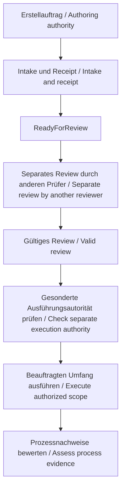

# Feature-Spezifikation: LH-00-Prozess / Feature Specification: LH-00 process

**Feature-Verzeichnis / Feature directory:** `specs/001-lh00-intake-process`

**Feature Branch:** `codex/lh00-process-spec` (ursprünglich auf `main` erstellt / originally created on main)

**Erstellt / Created:** 2026-09-29

**Status / Status:** Spezifiziert; Qualitätsprüfung siehe separate Checkliste / Specified; see separate quality checklist.

**Fachlicher Input / Domain input:** ausschließlich [intakes/LH-00.md](../../intakes/LH-00.md).

**Profil / Profile:** `show-commandtui400-de-en`. **Owner:** Thorsten Hindermann.

Diese Spezifikation beschreibt den zukünftigen LH-00-Prozess. Der ursprüngliche Specify-Auftrag
umfasst nur seine lokale Spezifikation, Qualitätsprüfung und Feature-Zuordnung.
Er umfasst keine Implementierung, Commits, Remote-Schreibzugriffe, weiteren
Lastenhefte oder Produktfunktionen aus LH-01–LH-07. Verbindliche Projektregeln
präzisieren Qualität und Grenzen; sie sind keine zusätzlichen fachlichen Intakes.

This specification describes the future LH-00 process. The original Specify request only
covers its local specification, quality check and feature selection. It includes
no implementation, commits, remote writes, further intakes or product features
from LH-01–LH-07. Binding project rules constrain quality and scope; they are
not additional domain intakes.

Der anschließende Auftrag erlaubt Commit, Push und einen Pull Request (PR), also
einen prüfbaren Änderungsvorschlag gegen `main`. Er erweitert den fachlichen Umfang
nicht. Der [Liefernachweis](checklists/governance.md) dokumentiert diese getrennte
Autorität und die zugehörigen README-/Statistik-Ergänzungen.

The subsequent request authorizes commit, push and a pull request (PR), a
reviewable change proposal against main. It does not expand domain scope.
The delivery evidence records this separate authority and the related README
and statistics updates.

Das vor Specify geprüfte [Receipt](../intake-authoring-receipts/lh-00.json) ist der
maschinenlesbare Herkunftsnachweis mit Prüfsummen. Das gesonderte
[Review-Ergebnis](../intake-review-result.json) steht auf `Ready` ohne offene
Befunde. Beide Validatoren wurden vor der Spezifikation erfolgreich ausgeführt;
Ziel- und Quellenbindungen stimmen. Identitäten und Prüfgrenzen stehen im
[Governance-Nachweis](checklists/governance.md). Diese Freigabe des Inputs ist
keine Abnahme des noch nicht umgesetzten Prozesses. Dieser Absatz dokumentiert
den Specify-Stand; aktuelle IDs, Bindungen und Ergebnis stehen im separaten Review
und [Preflight-Nachweis](checklists/preflight-20261005.md).

The receipt checked before Specify is the machine-readable provenance record with checksums.
The separate review result is Ready with no open findings. Both validators
passed before specification; target and source bindings match. Identities and
check boundaries are recorded in the governance evidence. Input readiness does
not accept the process, which has not yet been implemented. This paragraph
records the Specify checkpoint; current bindings/outcome are in the separate
review and preflight record.

**Zielgruppe und Begriffe / Audience and terms:** Projektverantwortliche, Autoren
und spätere Implementierende mit Grundkenntnissen von Dateien, Terminal und
PowerShell. Spec-Kit-Vorkenntnisse oder ein bestimmtes Ausbildungsjahr werden
nicht vorausgesetzt. Spec Kit unterstützt Anforderungen, Planung und Prüfungen.
Ein Intake ist ein fachliches Lastenheft; Authoring ist dessen Erstellung.
Ein Review ist eine separate Qualitätsprüfung. Ein Preset ist ein versioniertes
Regel- und Werkzeugpaket; eine Integration stellt Agentenkommandos bereit.
Eine Prüfsumme (Hash, hier SHA-256) erkennt Inhaltsänderungen. FR bezeichnet eine
Anforderung, AC ein Abnahmekriterium, SC ein Erfolgskriterium und US ein
Nutzungsszenario. Die ursprünglichen FR-00-/AC-00-IDs bleiben in der Zuordnung
unverändert. CR bezeichnet eine verbindliche Verfassungsanforderung.

Project owners, authors and later implementers need basic knowledge of files,
terminals and PowerShell. No prior Spec Kit knowledge or training year is
assumed. Spec Kit supports requirements, planning and checks. An intake states
domain requirements; authoring creates it. Review is a separate quality check.
A preset is a versioned package of rules and tools; an integration exposes agent
commands. A checksum (hash, SHA-256 here) detects content changes. FR identifies
a requirement, AC an acceptance criterion, SC a success criterion and US a user
story. Original FR-00/AC-00 identifiers remain unchanged in the mapping.
CR identifies a binding constitution requirement.

Ein Issue ist ein GitHub-Vorgang; ein Prompt ist ein Arbeitsauftrag als Text.
Policy bedeutet verbindliche Regel; Baseline die vereinbarte Ausgangsbasis.
Scope bezeichnet den Umfang, normativ eine verbindliche Aussage. Create erstellt
neu, Update ändert ein vorhandenes Dokument. Ein Branch ist eine Entwicklungslinie,
ein Commit speichert deren Stand; Remote bezeichnet ein entferntes Repository.
CEFR B2 ist das angestrebte Sprachniveau für verständliche Fachtexte. Ein Exitcode
ist der numerische Abschlussstatus eines Kommandos. WSL2 ist die Linux-Umgebung
innerhalb von Windows; nativ bezeichnet Windows selbst. Ein Schema legt die
Struktur maschinenlesbarer Daten fest. CI führt Prüfungen automatisiert aus.
Ein Framework ist ein technisches Anwendungsgerüst; Deployment dessen Bereitstellung.

An issue is a GitHub work item; a prompt is a written work request. A policy is
a binding rule; a baseline is the agreed starting point. Scope means the included
work, and normative means binding. Create makes a new document; Update changes
an existing one. A branch is a line of development; a commit records its state;
remote means a repository elsewhere. CEFR B2 is the intended language level for
readable domain prose. An exit code is the numeric completion status of a command.
WSL2 is the Linux environment within Windows; native means Windows itself.
A schema defines machine-readable data structure. CI runs checks automatically.
A framework is an application foundation; deployment makes it available for use.

## Nutzungsszenarien und Prüfungen / User Scenarios & Testing

P1 bedeutet notwendig für einen kontrollierten Einzelablauf; P2 ergänzt die
vollständige Prozessabnahme. Alle Szenarien lassen sich mit einem ausdrücklich
freigegebenen Beispiel oder vorhandenen Nachweisen einzeln prüfen. Beispiele
begründen keine Erstellung von LH-01–LH-07.

P1 means required for a controlled single-intake flow; P2 completes process
acceptance. Each story can be tested independently using an explicitly approved
fixture or existing evidence. Fixtures do not authorize creating LH-01–LH-07.

### US-01 – Ein Lastenheft nachvollziehbar erstellen / Create one traceable intake (Priority: P1)

Als Autor möchte ich die verfügbaren Werkzeuge, das Profil und ein benanntes
Issue verwenden, damit ein vollständiges Lastenheft mit nachweisbarer Herkunft
entsteht. Priorität P1: Das ist der zentrale Nutzen. **Unabhängiger Test:** Einen
freigegebenen Einzelauftrag gegen dokumentierte Kommandos und Pflichtinhalt prüfen.

As an author, I want to use documented tools, the profile and a named issue to
produce a complete intake with traceable sources. P1: this is the core benefit.
**Independent test:** Check one approved single-intake request against the
available commands and required content.

1. **Gegeben / Given:** benannte Quelle, freies Ziel, gültiges Profil und Erstellauftrag / a named source, unused target, valid profile and creation authority. **Wenn / When:** die dokumentierte Erstellung erfolgt / documented authoring runs. **Dann / Then:** entstehen genau das beauftragte zweisprachige Intake und sein Receipt; Quelle und Ziel sind identifizierbar / exactly the commissioned bilingual intake and its receipt exist, with identifiable source and target.
2. **Gegeben / Given:** fehlendes Pflichtfeld oder widersprüchliche Quelle / a missing required field or conflicting source. **Wenn / When:** Bereitschaft geprüft wird / readiness is checked. **Dann / Then:** bleibt der offene Punkt mit Owner und nächster Aktion sichtbar; kein unbegründetes `ReadyForReview` / the open point has an owner and next action; ReadyForReview is not claimed without grounds.

### US-02 – Anforderungen in beiden Sprachen verstehen / Understand both language tracks (Priority: P1)

Als Leser möchte ich denselben Umfang und dieselben Entscheidungen auf Deutsch
und Englisch ohne rein visuelle Information verstehen. P1: Verstehen ist
Voraussetzung für verlässliche Abnahme. **Unabhängiger Test:** Ein vorhandenes
Intake abschnittsweise vergleichen und Status, Abhängigkeiten und nächste Aktion
in seiner Textdarstellung auffinden.

As a reader, I want the same scope and decisions in German and English without
visual-only information. P1: understanding is needed for reliable acceptance.
**Independent test:** Compare an existing intake section by section and find its
status, dependencies and next action in the text representation.

1. **Gegeben / Given:** ein vollständiger Entwurf / a complete draft. **Wenn / When:** beide Sprachfassungen verglichen werden / both language tracks are compared. **Dann / Then:** stimmen normative Aussagen und IDs überein; DE steht zuerst, EN danach; Begriffe sind erklärt / normative statements and IDs match; DE comes first, then EN; terms are explained.
2. **Gegeben / Given:** ein Diagramm oder eine Statusübersicht / a diagram or status overview. **Wenn / When:** nur Text verfügbar ist / only text is available. **Dann / Then:** sind derselbe Ablauf, Blocker und nächste Schritt lesbar; fehlende assistive Prüfungen bleiben offen / the same flow, blockers and next step are readable; missing assistive checks remain open.

### US-03 – Inhalte sicher ändern und Herkunft erhalten / Change content safely and preserve provenance (Priority: P1)

Als Autor möchte ich vorhandene Ziele schützen und Änderungen belegen. P1:
Verlust oder unbemerkte Änderung macht Nachweise wertlos. **Unabhängiger Test:**
Ein freigegebenes Testziel mit gültigem Receipt prüfen, danach Inhalt verändern
und Create auf ein vorhandenes Ziel versuchen.

As an author, I want to protect existing targets and record changes. P1: loss
or unnoticed modification invalidates evidence. **Independent test:** Validate
an approved test target and receipt, then change its content and attempt Create
against an existing target.

1. **Gegeben / Given:** ein vorhandenes Ziel / an existing target. **Wenn / When:** Create darauf angewendet wird / Create targets it. **Dann / Then:** wird nichts überschrieben; der Ablauf nennt Update als gesondert zu beauftragende Aktion / nothing is overwritten; the process names Update as an action requiring its own authority.
2. **Gegeben / Given:** eine nachträgliche Ziel- oder Quellenänderung / a later target or source change. **Wenn / When:** Receipt oder Review geprüft wird / the receipt or review is checked. **Dann / Then:** wird die Bindung als veraltet oder ungültig erkannt; ein autorisiertes Update erhält Vorgänger und Identität / the binding is identified as stale or invalid; an authorized update preserves predecessor evidence and identity.

### US-04 – Prüfung und Ausführung getrennt freigeben / Authorize review and execution separately (Priority: P1)

Als Owner möchte ich Status, Prüfer und Freigabe getrennt sehen. P1: Ein gutes
Dokument darf keinen unbeauftragten Lauf auslösen. **Unabhängiger Test:**
Vorgegebene Authoring-, Review- und Berechtigungssituationen einzeln beurteilen.

As the owner, I want separate status, reviewer and authority records. P1: a good
document must not start unrequested work. **Independent test:** Assess individual
authoring, review and permission fixtures.

1. **Gegeben / Given:** `ReadyForReview` / ReadyForReview. **Wenn / When:** der nächste Schritt bestimmt wird / the next step is identified. **Dann / Then:** ist ein separates Review durch einen anderen Menschen oder Agenten als den Autor erforderlich / separate review by a human or agent other than the author is required.
2. **Gegeben / Given:** ein gültiges `Ready` oder `ReadyWithAcceptedRisks` mit menschlicher Risikoannahme, aber keine Ausführungsautorität / valid Ready or ReadyWithAcceptedRisks with human risk acceptance, without execution authority. **Wenn / When:** ein Folgeprompt gelesen oder ein Ziel auswählbar wird / a follow-up prompt is read or a target becomes eligible. **Dann / Then:** beginnen weder Implementierung noch Remote-Aktion automatisch / neither implementation nor a remote action starts automatically.

### US-05 – Bestand und Reihenfolge prüfen / Check inventory and order (Priority: P2)

Als Owner möchte ich Sammlung und Serienstatus gegen die verbindliche Reihenfolge
prüfen. Eine Collection ist eine verwaltete Dokumentensammlung; ein
Serienmanifest nennt Mitglieder, Abhängigkeiten und Status maschinenlesbar.
P2: erforderlich für die Prozessabnahme, getrennt von der Einzelerstellung.
**Unabhängiger Test:** Einen genehmigten Beispielbestand und seine Konfiguration
prüfen, einschließlich fehlender Mitglieder und widersprüchlicher Abhängigkeiten.

As the owner, I want to check the collection and series against the binding order.
A collection is a managed document inventory; a series manifest records members,
dependencies and status in machine-readable form. P2: required for process
acceptance, separate from single-intake creation. **Independent test:** Validate
an approved fixture inventory and its configuration, including missing members
and conflicting dependencies.

1. **Gegeben / Given:** die bestehende Reihenfolge und bereits erstellte Dokumente / the existing order and already created documents. **Wenn / When:** die Serie eingerichtet wird / the series is established. **Dann / Then:** bleiben IDs und Abhängigkeiten erhalten; vorhandene Issues und Intakes werden verlinkt, nicht vorhandene Intakes als fehlend kenntlich / IDs and dependencies are preserved; existing issues and intakes are linked, absent intakes are identified as absent.
2. **Gegeben / Given:** ein ungelöster Vorgänger oder ein ungültiges Mitglied / an unresolved predecessor or invalid member. **Wenn / When:** auswählbare Ziele ermittelt werden / eligible targets are determined. **Dann / Then:** erscheint der konkrete Blocker; `Eligible` beschreibt nur Auswahlfähigkeit und erteilt keine Ausführungsautorität / the specific blocker is shown; Eligible means selectable and grants no execution authority.

### US-06 – Vier Umgebungen getrennt nachweisen / Prove four environments separately (Priority: P2)

Als Owner möchte ich wissen, wo der vollständige PowerShell-Prozess tatsächlich
funktioniert. P2: lokale Teilprüfungen ersetzen die Gesamtprüfung nicht.
**Unabhängiger Test:** Vier Umgebungsnachweise gegen dieselbe fachliche
Prozessstrecke prüfen; ein fehlender Nachweis muss die Gesamtfreigabe verhindern.

As the owner, I want to know where the complete PowerShell process actually
works. P2: local partial checks do not replace full validation. **Independent
test:** Check four environment records against the same domain flow; a missing
record must prevent full acceptance.

1. **Gegeben / Given:** zwei Macs, natives Windows 11 und Ubuntu 24.04 unter WSL2 / two Macs, native Windows 11 and Ubuntu 24.04 under WSL2. **Wenn / When:** die Prozessstrecke geprüft wird / the process flow is tested. **Dann / Then:** hat jede Umgebung Versionen, Kommando, Ergebnis mit Exitcode und Grenzen oder einen sichtbaren Blocker / each environment records versions, command, result with exit code and boundaries, or a visible blocker.
2. **Gegeben / Given:** drei erfolgreiche Umgebungen und ein fehlender oder gescheiterter Nachweis / three successful environments and one missing or failed result. **Wenn / When:** volle Prozessabnahme bewertet wird / full process acceptance is assessed. **Dann / Then:** bleibt sie offen; Release-Prüfungen des Authoring-Presets ersetzen den fehlenden Projektnachweis nicht / it remains open; authoring-preset release checks do not replace missing project evidence.

Die gemeinsame Prozessstrecke umfasst die Fälle E01–E05 und E07 aus LH-00:
Einzelerstellung, Pflichtinhalt und Sprachen, textuelle/assistive Zugänge,
Receipt-Prüfung mit Drift-/Überschreibschutz, getrennte Status/Freigaben sowie
Collection-/Serienprüfung. Kontrollierte Änderungen verwenden das beauftragte
Update-Verfahren. Plattformunabhängige Übersetzungs- und zentrale Liefernachweise
aus E07 dürfen gemeinsam referenziert werden; plattformabhängige Resultate
bleiben getrennt. Ein Test darf nur seine freigegebenen Beispiele ändern.

The common process flow covers LH-00 cases E01–E05 and E07: single-intake creation,
required content and languages, text/assistive access, receipt validation with
drift/overwrite protection, separate states/authority and collection/series
validation. Controlled changes use the authorized Update procedure. Shared
references may cover platform-independent translation and central-delivery
evidence from E07; platform-dependent results remain separate. A test may only
change its approved fixtures.

### US-07 – Prozessabnahme begründet schließen / Close process acceptance with evidence (Priority: P2)

Als Owner möchte ich alle neun Abnahmekriterien, Übersetzungen und zentrale
Ausrichtung belegt sehen. P2: verhindert eine verfrühte Vollständigkeitsbehauptung.
**Unabhängiger Test:** Ein Abnahmepaket auf fehlende Übersetzung, ungeprüfte
Serienkonfiguration oder nur vorbereitete Registeränderung prüfen.

As the owner, I want evidence for all nine acceptance criteria, translations and
central alignment. P2: prevents premature completeness claims. **Independent
test:** Inspect an acceptance package with a missing translation, unvalidated
series configuration or only a prepared registry change.

1. **Gegeben / Given:** ein offener Übersetzungs- oder Registerpunkt / an open translation or registry item. **Wenn / When:** der Prozess abgenommen werden soll / process acceptance is requested. **Dann / Then:** bleiben Owner, Fälligkeit und Restarbeit sichtbar; Vorbereitung wird nicht als angewendete Änderung gewertet / owner, due point and remaining work stay visible; preparation is not counted as an applied change.
2. **Gegeben / Given:** aktuelle Nachweise für alle AC-00-001–009 / current evidence for all AC-00-001–009. **Wenn / When:** der Owner die Abnahme bewertet / the owner assesses acceptance. **Dann / Then:** sind Quelle, Verantwortliche, unabhängiges Review, Ergebnis und etwaige Grenzen nachvollziehbar; das Ergebnis autorisiert keine weiteren Intakes / sources, responsibilities, independent review, outcome and limitations are traceable; the result authorizes no further intakes.

### Grenzfälle / Edge Cases

| Fall / Case | Erwartung / Expected behavior |
|---|---|
| Nicht benannte, widersprüchliche oder unlesbare Quelle / Unnamed, conflicting or unreadable source | Kein stiller Quellenvorrang; offener Punkt mit konkretem Grund / No silent source precedence; explicit unresolved point. |
| Unsicherer Pfad, ungültiges UTF-8, Größenlimit oder unzulässige Webquelle / Unsafe path, invalid UTF-8, size limit or disallowed web source | Vor Zieländerung ablehnen gemäß unveränderter Authoring-Policy / Reject before target changes under the unchanged authoring policy. |
| Create auf vorhandenes Ziel, doppelte Identität / Create on an existing target, duplicate identity | Bestand schützen und Konflikt melden / Preserve inventory and report conflict. |
| Veralteter Hash, abgebrochenes Update / Stale hash, interrupted update | Keine gültige Bindung behaupten; Vorgänger erhalten und sichere Fortsetzung gesondert prüfen / Do not claim valid binding; preserve predecessor evidence and assess safe continuation separately. |
| Gleicher Autor und Prüfer / Same author and reviewer | Unabhängigkeitskriterium nicht erfüllt / Independence criterion not met. |
| Fehlendes Mitglied, Zyklus, abweichende Reihenfolge / Missing member, cycle, divergent order | Serie nicht als gültig oder Ziel als berechtigt darstellen; Blocker benennen / Do not report valid series or authorized target; name blockers. |
| Nur visuelle Information oder fehlende EN-Aussage / Visual-only information or missing EN statement | Textalternative bzw. normative Übersetzung vor Abnahme ergänzen / Complete equivalent text or normative translation before acceptance. |
| Fehlender Host, Hilfsmitteltest oder zentrale Freigabe / Missing host, assistive test or central authority | Offen bzw. blockiert mit Owner und nächster Aktion; kein Erfolg aus Abwesenheit / Open or blocked with owner and next action; absence is not success. |

## Anforderungen / Requirements

### Funktionale Anforderungen / Functional Requirements

Die folgenden FR-001–024 zerlegen ausschließlich LH-00 in prüfbare Verträge.
MUSS und MUST sind gleich verbindlich. Namen vorhandener Artefakte und Werkzeuge
sind Schnittstellen des Prozesses, keine Wahl einer neuen Produktarchitektur.

FR-001–024 below decompose only LH-00 into testable contracts. MUST has the same
force in both languages. Existing artifact and tool names are process interfaces,
not a choice of new product architecture.

| ID | Deutsch – MUSS | English – MUST |
|---|---|---|
| FR-001 | Verwendete Spec-Kit-Version, Erweiterungen und tatsächlich verfügbare Intake-Kommandos mit Prüfstand dokumentieren. | Document the Spec Kit version, extensions and actually available intake commands with their verification context. |
| FR-002 | Einen dokumentierten Weg von einem ausdrücklich benannten Issue zu genau dem beauftragten Intake anbieten. | Provide a documented route from an explicitly named issue to exactly the commissioned intake. |
| FR-003 | Das Profil `show-commandtui400-de-en` mit Ablage, Personenrollen, Status und Sprachregeln verbindlich anwenden. | Apply profile show-commandtui400-de-en with storage, human roles, status and language rules. |
| FR-004 | Owner, Autor, unabhängigen Prüfer und nächste Aktion für offene Entscheidungen bzw. Nachweise benennen. | Identify owner, author, independent reviewer and next action for unresolved decisions or evidence. |
| FR-005 | Das Bedienkonzept als Baseline referenzieren und Intake, technische Spezifikation sowie Implementierungsplan unterscheidbar ablegen. | Reference the interaction concept as the baseline and keep intake, technical specification and implementation plan distinguishable in storage. |
| FR-006 | Zweck, Ist-/Zielzustand, Scope, Nicht-Ziele, atomare Anforderungen, Qualität, Governance, Abhängigkeiten, Risiken, Artefakte, Nachweise, Abnahme, Annahmen, Entscheidungen und beide Folgeprompts im Intake enthalten. | Include purpose, current/target state, scope, non-goals, atomic requirements, quality, governance, dependencies, risks, artifacts, evidence, acceptance, assumptions, decisions and both follow-up prompts in the intake. |
| FR-007 | `docs/Lastenheft-Plan.md` als verbindliche Reihenfolge mit unveränderten Plan-IDs und Abhängigkeiten verwenden. | Use docs/Lastenheft-Plan.md as the binding order with preserved plan IDs and dependencies. |
| FR-008 | In der Übersicht Issues und Intakes jeweils nach ihrer Erstellung verlinken und fehlende Artefakte kenntlich machen. | Link issues and intakes in the overview after each is created and identify missing artifacts. |
| FR-009 | Normative Abschnitte DE zuerst und EN danach mit äquivalenten Aussagen und identischen FR-/AC-/OD-IDs liefern. | Deliver normative sections DE first and EN second with equivalent statements and identical FR/AC/OD IDs. |
| FR-010 | Texte ungefähr auf CEFR B2 halten, Fachbegriffe bei erster Verwendung erklären und keine Spec-Kit-Vorkenntnisse voraussetzen. | Keep prose around CEFR B2, explain domain terms on first use and assume no prior Spec Kit knowledge. |
| FR-011 | Status, Abhängigkeiten, Entscheidungen und nächste Aktionen vollständig in Text bereitstellen; hilfreiche Mermaid-Diagramme mit gleichwertiger Textalternative versehen. | Provide status, dependencies, decisions and next actions fully in text; supply equivalent text for useful Mermaid diagrams. |
| FR-012 | Anwendbare WCAG-2.2-AA-Kriterien sowie Tastatur-, Screenreader-, Braille- und Textbrowser-Prüfwege je betroffener Fläche erfassen, einschließlich offener Nachweise. | Record applicable WCAG 2.2 AA criteria and keyboard, screen-reader, Braille and text-browser check paths for each affected surface, including open evidence. |
| FR-013 | Jede relevante Level-2-Regel auf Quelle, Anforderung, Abnahme, Owner, Reviewer und Nachweisstatus abbilden; begründete N/A-Entscheidungen und offene Punkte sichtbar führen. | Map every relevant Level-2 rule to source, requirement, acceptance, owner, reviewer and evidence status; expose justified N/A decisions and open items. |
| FR-014 | Quellen- und Ziel-Prüfsummen im Receipt binden und Abweichungen bei erneuter Prüfung erkennen. | Bind source and target checksums in the receipt and detect mismatches on revalidation. |
| FR-015 | Create vor Überschreiben schützen; Änderungen nur als beauftragtes Update mit nachvollziehbarer Vorgängerbindung durchführen. | Protect Create against overwriting; perform changes only as an authorized Update with traceable predecessor binding. |
| FR-016 | Autorisiertes Archivieren oder Löschen mit Herkunftsnachweis und dauerhaftem Verweis auf den früheren Eintrag erhalten; keine Identität still wiederverwenden. | Preserve provenance and a permanent record of the former entry when archiving or deleting with authority; never silently reuse identity. |
| FR-017 | Authoring-, Review- und Umsetzungsstatus getrennt führen; `ReadyForReview` nur bei geklärten Authoring-Entscheidungen und gültigen Nachweisen ausweisen. | Track authoring, review and implementation states separately; report ReadyForReview only with resolved authoring decisions and valid evidence. |
| FR-018 | Review-Ergebnisse getrennt ausweisen: `Ready`, `ReadyWithAcceptedRisks`, `NeedsClarification`, `NeedsRemediation` oder `Rejected`; ein anderer Mensch oder Agent als der Autor muss prüfen, Risiken muss ein Mensch akzeptieren. Kein Ergebnis, `Eligible` oder Folgeprompt verleiht Ausführungs- oder Remote-Autorität. | Report separate review outcomes: Ready, ReadyWithAcceptedRisks, NeedsClarification, NeedsRemediation or Rejected; a human or agent other than the author must review, and a human must accept risks. No result, Eligible status or follow-up prompt grants execution or remote authority. |
| FR-019 | Den vollständigen projektspezifischen PowerShell-Prozess auf Mac A, Mac B, Windows 11 nativ und Ubuntu 24.04 unter WSL2 getrennt prüfen. | Test the complete project-specific PowerShell process separately on Mac A, Mac B, native Windows 11 and Ubuntu 24.04 under WSL2. |
| FR-020 | Je Umgebung Versionen, Kommando, Exitcode, Ergebnis und Grenzen oder einen sichtbaren Blocker erfassen; volle Prozessabnahme verlangt vier erfolgreiche Nachweise. | Record versions, command, exit code, outcome and boundaries or a visible blocker per environment; full process acceptance requires four successful records. |
| FR-021 | Die vier portablen Dokumentrollen und sechs Collection-Pfade konkret zuordnen; Bestandsmodus, kanonischen Index, Archiv und Zustandsübergänge festlegen und validieren. | Map the four portable document roles and six collection paths; define and validate inventory mode, canonical index, archive and state transitions. |
| FR-022 | Ein gültiges Serienmanifest aus bestehender Reihenfolge und ausdrücklich aufgenommenen vorhandenen Intakes bilden; IDs, Abhängigkeiten und Archivhistorie erhalten. | Build a valid series manifest from the existing order and explicitly included existing intakes; preserve IDs, dependencies and archive history. |
| FR-023 | Bestandsübersetzungen mit Owner, Fälligkeit und Prüfnachweis abschließen, bevor der Prozess vollständig abgenommen wird; historischen Kontext erhalten. | Complete existing-document translations with owner, due point and verification before full process acceptance; preserve historical context. |
| FR-024 | Zentrale Registerausrichtung mit angewendetem Nachweis vor Prozessabnahme belegen; vorbereitete Änderungen und lokale Prüfung getrennt ausweisen. | Evidence applied central registry alignment before process acceptance; distinguish prepared changes and local checks. |

### Verfassungsanforderungen / Constitution Requirements

Maßgeblich sind die identischen [Constitution-Kopien](../../constitution.md) und
[Spec-Kit-Kopie](../../.specify/memory/constitution.md), insbesondere die
Show-CommandTui400-Zeile des Level-2-Registers. Anwendbarkeit und Erfüllung
werden getrennt im [Governance-Nachweis](checklists/governance.md) bewertet.

The matching constitution copies, especially the Show-CommandTui400 Level-2
registry row, are binding. Applicability and fulfillment are assessed separately
in the governance evidence.

| ID | Vorgabe und Anwendung / Requirement and application |
|---|---|
| CR-001 | Level-2-Projektzeile verwenden; Konzeptphase, Sprache und Mindestversion offen / Use the Level-2 project row; concept phase, language and minimum version remain open. |
| CR-002 | `Programmierung #include<everyone>`, WCAG 2.2 AA soweit anwendbar; Textzugang und getrennte assistive Nachweise gemäß FR-011/012 / Apply the binding accessibility motto and relevant WCAG 2.2 AA criteria; text access and separate assistive evidence under FR-011/012. |
| CR-003 | DE/EN, B2, erklärte Begriffe; projektspezifisches Publikum ohne vorgegebenes Ausbildungsjahr gemäß Profil / DE/EN, B2, explained terms; the profile defines the project audience without a fixed training year. |
| CR-004 | Dieser Schritt ändert keine gemeinsame Guidance. Sein lokaler Arbeitsnachweis steht in den Checklisten; Statistikzahlen bleiben Git-gebunden. Chronologischer Ledger im Lieferpaket ergänzt / This step changes no shared guidance. Checklists record local work; statistics remain Git-bound. The delivery package updates the chronological ledger. |
| CR-005 | Primäre Produktsprache und MSL-Status bleiben `unknown`; MSL bezeichnet eine speichersichere Sprache. Dieser Schritt erzeugt keinen Programmcode; keine Ausnahme erfunden / Primary product language and memory-safe-language status remain unknown; this step produces no program code or invented exception. |
| CR-006 | NIST SSDF (sicherer Entwicklungsprozess) und CWE Top 25 (häufige gefährliche Schwächen) gelten; weitere Standards explizit bewerten / NIST SSDF (secure development practices) and CWE Top 25 (common dangerous weaknesses) apply; assess other standards explicitly. |
| CR-007 | OWASP ASVS, ein Prüfstandard für Webanwendungen: hier N/A, kein Web-/API-/Authentifizierungsdienst. Bei solchem Dienst Niveau und Prüfumfang festlegen / OWASP ASVS, a web verification standard: N/A here, no web/API/authentication service. Select level and scope if such a service is added. |
| CR-008 | Komponentenlisten SBOM, Schwachstellenbewertung VEX und Herkunftsmodell SLSA bei späteren auslieferbaren Artefakten prüfen; dieser Schritt erstellt keines / Assess software inventories (SBOM), vulnerability assessments (VEX) and provenance levels (SLSA) for later distributable artifacts; none is created in this step. |
| CR-009 | KI wird nur als Entwicklungswerkzeug verwendet, nicht als Produktlaufzeit. AI-SBOM als Inventar von KI-Laufzeitkomponenten hier N/A / AI is development tooling only, not product runtime. AI-SBOM, an inventory of AI runtime components, is N/A here. |
| CR-010 | Unvertraute Quelle, aktives Ziel und Review-/Ausführungsgrenze im Bedrohungsmodell betrachten; CAPEC bezeichnet Angriffsmuster. Zero Trust betrifft gegebenenfalls neue entfernte Dienste / Assess untrusted sources, active targets and review/execution boundaries in the threat model; CAPEC names attack patterns. Reassess Zero Trust for new remote services. |
| CR-011 | Sicherheitsnachweise verbleiben kanonisch unter `docs/security/`; diese lokale Specify-Bewertung steht zusätzlich im Feature-Nachweis / Security evidence remains canonical under docs/security; this local Specify assessment is additionally recorded in feature evidence. |
| CR-012 | Explizites Profil `project-statistics-fourteen-governance-presets` mit 14 Pins aus der Projektmatrix, keine Änderung des Flottenstandards / Use the explicit fourteen-preset project profile and its pinned matrix; no fleet-default change. |
| CR-013 | Dokumentationsauswirkung `UpdateRequired` gemäß folgendem Absatz; keine zweite Entscheidung / Documentation impact is UpdateRequired as detailed below; no second decision. |
| CR-014 | Plattformabhängige Prüfung zuerst lokal und sicher auf macOS; fehlende Linux-/Windows-Hosts nur durch passende isolierte Nachweise ergänzen. CI ersetzt nicht automatisch die vier projektspezifischen Umgebungen / Start platform checks locally and safely on macOS; use suitable isolated evidence for missing Linux/Windows hosts. CI does not automatically replace the four project environments. |

**Dokumentationsauswirkung / Documentation impact: `UpdateRequired`.**
Betroffen: Prozessspezifikation, Prüfchecklisten, README-Einstieg und Statistik-Ledger
für Owner, Autoren und spätere Implementierende. Kanonische Fachquelle ist LH-00; Owner ist Thorsten
Hindermann. Leserpfad: README bzw. aktive Feature-Zuordnung → Spezifikation → Checklisten →
verlinkter Intake und gebundene Nachweise. Dokumentklasse: Level-2-
Projektspezifikation; DE/EN in derselben Datei. Verteilung: `sourceOnly`, kein
Home-Runtime-Sync. Der lokale Nachweis prüft Struktur, Zuordnung und Links,
keinen plattformübergreifenden Beispielablauf. README-Einstieg und Statistik-Ledger
werden im selben Lieferpaket abgeglichen; Zahlen erzeugt der bestehende Renderer.
Reevaluation bei geändertem Input, Planung, Lieferung oder Nachweisumfang.

Affected documents are the process specification, its checklists, README entry
and statistics ledger for owners, authors and later implementers. LH-00 is the canonical domain source; Thorsten
Hindermann owns it. Reader path: README or active feature selection → specification →
checklists → linked intake and bound evidence. Document class: Level-2 project
specification; both languages share each file. Distribution is sourceOnly, with
no Home Runtime sync. Local checks cover structure, mappings and links, not a
cross-platform example flow. The same delivery package aligns README navigation
and the statistics ledger; the existing renderer generates metrics. Reassess on changed input,
planning, delivery or evidence scope.

### Zentrale Begriffe und Daten / Key Entities

| Entität / Entity | Inhalt und Beziehung / Content and relationship |
|---|---|
| Auftrag / Request | Benannte Quelle, Ziel, Profil, Umfang und erlaubte Aktion; Berechtigung getrennt vom Qualitätsstatus / Named source, target, profile, scope and allowed action; authority separate from quality status. |
| Intake / Intake | Eine Identität und zwei äquivalente Sprachfassungen mit FR/AC; referenziert Baseline und Issue / One identity and two equivalent language tracks with FR/AC; references baseline and issue. |
| Receipt / Receipt | Identität, Quellen-/Zielbindungen, Authoring-Status und gegebenenfalls Vorgänger; Prüfsummen erkennen Drift / Identity, source/target bindings, authoring status and predecessor where applicable; hashes detect drift. |
| Review / Review | Eigenes Ergebnis mit Input-Bindung, anderem Prüfer, Befunden und ggf. begründeter Risikoannahme / Separate result with bound input, another reviewer, findings and any justified risk acceptance. |
| Collection / Collection | Rollen Index, Reihenfolge, aktive Intakes und Baseline sind Dokumentfunktionen, keine Personen; Konfiguration ordnet Pfade zu / Index, order, active intakes and baseline are document functions, not people; configuration maps paths. |
| Serienmanifest / Series manifest | Mitglieder, Reihenfolge, Abhängigkeiten und Status; `Eligible` bedeutet auswählbar, nicht ausführungsberechtigt / Members, order, dependencies and status; Eligible means selectable, not authorized for execution. |
| Abnahmenachweis / Acceptance evidence | Kriterium, Quelle, Owner/Reviewer, Umgebung, Verfahren, Ergebnis und Grenzen / Criterion, source, owner/reviewer, environment, method, outcome and boundaries. |
| Archivverweis / Tombstone | Dauerhafter Verweis auf archivierte oder gelöschte Identität ohne Verlust der Herkunft / Permanent record of archived or deleted identity without losing provenance. |

## Erfolgskriterien / Success Criteria

### Messbare Ergebnisse / Measurable Outcomes

Diese Kriterien bewerten den späteren Prozess. Ihre Definition ist kein
Erfüllungsnachweis. Zahlen beschreiben Vollständigkeit und Ergebnisse; LH-00 gibt
keine Antwortzeit-, Durchsatz- oder Nutzerzahlvorgabe vor.

These criteria assess the future process. Defining them does not prove they are
met. Numbers describe completeness and outcomes; LH-00 sets no response-time,
throughput or user-count target.

| ID | Messbares Ergebnis / Measurable outcome |
|---|---|
| SC-001 | Ein ausdrücklich genehmigtes Beispiel-Issue führt über den dokumentierten Weg zu genau einem vollständigen Intake mit Receipt; alle Pflichtabschnitte sind vorhanden / One explicitly approved sample issue yields exactly one complete intake and receipt through the documented route, with every required section present. |
| SC-002 | 100 % der normativen Abschnitte und Anforderungs-/Abnahme-/Entscheidungs-IDs haben äquivalente DE/EN-Aussagen; Begriffs- und Lesbarkeitsreview findet keine unerklärten Fachbegriffe oder ungeklärte Bedeutungsabweichung / All normative sections and requirement/acceptance/decision IDs have equivalent DE/EN statements; terminology and readability review finds no unexplained domain terms or unresolved meaning difference. |
| SC-003 | Jeder Status, jede Abhängigkeit, Entscheidung und nächste Aktion ist ohne Diagramm oder Farbe bestimmbar; für jede betroffene Fläche sind A11Y-Anwendbarkeit und Prüfergebnis oder offener Nachweis verzeichnet / Every status, dependency, decision and next action is understandable without diagrams or color; every affected surface records accessibility applicability and a result or open evidence. |
| SC-004 | Beide installierten Receipt-Validatoren bestehen für gültigen Inhalt; die vereinbarte Negativprüfung lehnt veränderten Inhalt ab und Create verändert kein vorhandenes Ziel / Both installed receipt validators pass valid content; the agreed negative check rejects altered content and Create changes no existing target. |
| SC-005 | Alle geprüften Zustandsfälle trennen Authoring, anderes Review und Ausführungsautorität; kein geprüfter Fall startet eine nicht beauftragte Folgeaktion / All tested state cases separate authoring, another review and execution authority; no tested case starts an uncommissioned follow-up action. |
| SC-006 | Vier von vier Umgebungen bestehen die vollständige vorgeschriebene Prozessstrecke mit Versionen, Kommando, Exitcode und Grenzen vor voller Prozessabnahme / Four of four environments pass the complete required process with versions, command, exit code and boundaries before full process acceptance. |
| SC-007 | Collection und Serienmanifest validieren; alle vorhandenen zugehörigen Issues und Intakes sind verlinkt; keine Plan-ID, Abhängigkeit oder Archivherkunft geht verloren / Collection and series manifest validate; all existing related issues and intakes are linked; no plan ID, dependency or archive provenance is lost. |
| SC-008 | Alle für Prozessabnahme erforderlichen Bestandsübersetzungen und die zentrale Registerausrichtung sind abgeschlossen und belegt; keine bloße Vorbereitung zählt als Anwendung / All existing-document translations required for process acceptance and central registry alignment are completed and evidenced; preparation alone is not application. |
| SC-009 | Alle zwölf Quellanforderungen, neun Quell-Abnahmekriterien und relevanten Governance-Zeilen sind mit Owner, Reviewer und ehrlichem Nachweisstatus zugeordnet; kein fremder Produktumfang ist hinzugefügt / All twelve source requirements, nine source acceptance criteria and relevant governance rows are mapped with owner, reviewer and honest evidence status; no foreign product scope is added. |

**Nachverfolgbarkeit / Traceability.** Die E-IDs bezeichnen die Nachweisfälle im
Intake. AC-00-003 gilt zusätzlich übergreifend als Ausschluss fremder Funktionen;
AC-00-005 fordert die vollständige Governance-Zuordnung. Die jeweilige DE/EN-
Tabellenzeile hat dieselbe normative Bedeutung.

E identifiers refer to evidence cases in the intake. AC-00-003 also applies
across the feature to exclude foreign functions; AC-00-005 requires complete
governance mapping. Each bilingual table row has the same normative meaning.

| Quelle / Source | Spezifikation / Specification | Szenario / Story | Erfolg / Outcome | Quell-Abnahme / Source acceptance | Nachweis / Evidence |
|---|---|---|---|---|---|
| FR-00-001 | FR-001–002 | US-01 | SC-001 | AC-00-001 | E01 |
| FR-00-002 | FR-003–004 | US-01, US-04 | SC-001, SC-005 | AC-00-001–002, AC-00-007 | E01, E02 |
| FR-00-003 | FR-005–006 | US-01 | SC-001, SC-009 | AC-00-002–003 | E02 |
| FR-00-004 | FR-007–008 | US-05 | SC-007 | AC-00-009 | E07 |
| FR-00-005 | FR-009–010 | US-02 | SC-002 | AC-00-004 | E02 |
| FR-00-006 | FR-011–012 | US-02 | SC-003 | AC-00-005 | E03 |
| FR-00-007 | FR-013 | US-07 | SC-009 | AC-00-005 | E03 |
| FR-00-008 | FR-014–016 | US-03 | SC-004 | AC-00-006 | E04 |
| FR-00-009 | FR-017–018 | US-04 | SC-005 | AC-00-007 | E05 |
| FR-00-010 | FR-019–020 | US-06 | SC-006 | AC-00-008 | E06 |
| FR-00-011 | FR-021–022 | US-05 | SC-007 | AC-00-009 | E07 |
| FR-00-012 | FR-023–024 | US-07 | SC-008 | AC-00-009 | E07 |

## Annahmen und Abhängigkeiten / Assumptions

1. Fachliche Grundlage bleibt ausschließlich der geprüfte LH-00-Inhalt. Darin
   beschriebene frühere Reparatur-/Lieferautorität ist historisch; der damalige
   Auftrag erlaubte nur Specify. Die neue Lieferautorität steht im Liefernachweis. / The reviewed LH-00 content is the sole domain
   input. Earlier repair/delivery authority described there is historical; the
   original request authorized only Specify. New delivery authority is recorded separately.
2. Das bestehende Minimalprofil, Authoring 0.3.5 und Spec Kit 0.12.8 sind der
   dokumentierte Ausgangspunkt. Installation ist keine Prozessabnahme. Zwei
   Macs mit PowerShell 7.6.6.0 sind eine Owner-Angabe, kein hier erhobener
   Vier-Plattform-Nachweis. / The minimal profile, Authoring 0.3.5 and Spec Kit
   0.12.8 form the documented baseline. Installation is not acceptance. Two Macs
   with PowerShell 7.6.6.0 are owner-reported, not four-platform proof from this run.
3. LH-00 kommt vor allen weiteren Intakes. Die Reihenfolge und Abhängigkeiten
   bleiben ausschließlich im bestehenden Lastenheft-Plan maßgeblich; diese
   Spezifikation erteilt keine Erstellaufträge. / LH-00 precedes the remaining
   intakes. The existing intake plan remains the sole authority for order and
   dependencies; this specification grants no authoring requests.
4. Konkrete Collection-Pfade, Bestandsmodus `DirectoryStrict` (vollständiger
   Verzeichnisabgleich) oder `SeriesManifest` (zusätzliche eigenständige Intakes
   erlaubt), technische Umsetzung und erforderliche Skriptnamen werden bei der
   Planung anhand bestehender Schemas entschieden. Das verändert nicht die hier
   festgelegten Abnahmebedingungen. / Planning selects collection paths, inventory
   mode DirectoryStrict (full directory matching) or SeriesManifest (additional
   standalone intakes allowed), implementation details and necessary script names
   against existing schemas. This does not change the acceptance contract.
5. Bestandsübersetzungen und zentrale Ausrichtung haben bestehende offene
   Einträge in der Governance-Zuordnung. Thorsten Hindermann bleibt Owner;
   Abschluss vor voller Prozessabnahme. Änderungen zentraler Quellen brauchen
   ihren eigenen Auftrag. / Existing governance entries track translations and
   central alignment. Thorsten Hindermann remains owner; completion is due before
   full process acceptance. Central-source changes require their own authority.
6. TUI ist eine Terminal-Bedienoberfläche. TUI-Funktionen, Cmdlet-Suche, Formulare,
   Wertehilfe, Aufrufabschluss, Geräteprofile und Adapter sind ausgeschlossen.
   Produktsprache, Framework, Mindest-PowerShell-Version und technische
   Sitzungsintegration bleiben offen. / A TUI is a terminal user interface. TUI
   features, cmdlet search, forms, value assistance, invocation completion, device
   profiles and adapters are excluded. Product language, framework, minimum
   PowerShell version and session integration remain undecided.

## Mermaid und Spec-Kit-Abschlussbericht / Mermaid and Spec Kit completion report

Mermaid ist lesbarer Diagrammquelltext. Das Diagramm zeigt den Normalfall eines
späteren autorisierten Ablaufs, keine jetzt ausführbaren Kommandos. Fehler und
veraltete Nachweise führen zu sichtbaren Blockern und erneuter Prüfung.

Mermaid is readable diagram source. This diagram shows the normal path of a
later authorized flow, not commands to run now. Errors and stale evidence lead
to visible blockers and revalidation.

**Textalternative:** Ein Erstellauftrag erlaubt Intake und Receipt. Geklärte
Authoring-Entscheidungen und gültige Nachweise erlauben `ReadyForReview`. Ein
anderer Prüfer führt das gesonderte Review aus. Ein gültiges Review ersetzt keine
Ausführungsautorität. Erst deren gesonderte Prüfung erlaubt den beauftragten
Umfang. Anschließend wird Prozessabnahme anhand aller Nachweise beurteilt.
`NeedsClarification`, `Blocked`, Review-Befunde oder veraltete Bindungen bleiben
sichtbar, bis sie durch passende beauftragte Arbeit geklärt sind.

**Text alternative:** Authoring authority permits an intake and receipt.
Resolved authoring decisions and valid evidence permit ReadyForReview. Another
reviewer performs the separate review. A valid review does not replace execution
authority. Only a separate authority check permits the commissioned scope.
Process acceptance is then assessed against all evidence. NeedsClarification,
Blocked, review findings or stale bindings remain visible until resolved through
appropriately authorized work.

Dies ist ein einzelner Specify-Schritt, kein vollständiger Feature-Lauf;
`completion-report.md` ist deshalb nicht fällig. Nach einem später beauftragten
vollständigen Lauf gilt die bestehende Abschlussbericht-Regel.

This is a single Specify step, not a complete feature run; completion-report.md
is therefore not due. The existing completion-report rule applies after a later
commissioned full run.

## Anwendbarkeit autonomer Läufe / Autonomous-run Applicability

`N/A` für Specify und dessen Lieferung: kein autonomer Lauf und keine Änderung an
Delivery-Set-, Gate- oder Ergebnis-Schemas. Autorität: der ursprüngliche Specify-Auftrag
war lokal; der anschließende Auftrag erlaubt Commit, Push und PR. Kein autonomer
Lauf oder Merge ist beauftragt. Feature-Identität und akzeptierter Input
stehen oben. Mutable Freigabetokens: `N/A`, keine in diesem Schritt.
Die späteren stabilen Abnahmegates sind AC-00-001–009 mit den in der Zuordnung
festgelegten Umfängen; konkrete Kommandos und Plattformtokens müssen im Plan aus
verfügbaren Werkzeugen abgeleitet werden. Gate bedeutet eine Prüfung vor dem
nächsten erlaubten Schritt. Ein später separat autorisierter autonomer Lauf
würde seinen Zustand in `specs/001-lh00-intake-process/autonomous-run-state.json`
führen. Er benötigt gültige Input-Bindungen und eigene Delivery-Entscheidung;
neue Delivery-Entscheidungen verwenden Schema 2.0. Bei Stop, Unterbrechung oder
Drift gelten sichere Haltepunkte und erneute Validierung; Wiederaufnahme braucht
passende ausdrückliche Autorität. Retrospektive und Folgearbeiten erweitern den
Umfang nicht. Ein kausaler Abschlussnachweis wird bei tatsächlicher Reparatur
oder unterbrochener Lieferung relevant, nicht durch diesen Entwurf.

N/A for Specify and its delivery: no autonomous run or delivery-set, gate or result
schema change. The original Specify request was local; the subsequent request authorizes
commit, push and PR. No autonomous run or merge is commissioned. Feature identity and accepted input are stated above. Mutable approval
tokens are N/A; none exists in this step. Future stable acceptance gates are
AC-00-001–009 with mapped scopes; planning must derive concrete commands and
platform tokens from available tools. A gate is a check before the next permitted
step. A separately authorized autonomous run would use the feature-local
run-state path stated above. It needs valid input bindings and its own delivery
decision; new delivery decisions use schema 2.0. Stop, interruption or drift
requires a safe boundary and revalidation; resumption needs matching explicit
authority. Retrospectives and follow-ups do not expand scope. Causal closeout
becomes relevant for actual repair or interrupted delivery, not this draft.

## Anwendbarkeit der Agentenparität / Agent Parity Applicability

Gemeinsame Guidance, Vorlagen und Constitution werden durch diesen Schritt nicht
geändert. Bei späteren Prozessregeländerungen sind `AGENTS.md`, `CLAUDE.md`,
`GEMINI.md`, `.github/copilot-instructions.md` und
`.github/agents/copilot-instructions.md` identisch zu pflegen; beide Constitution-
Kopien bleiben synchron. Die fünf Integrationen sind `agy`, `opencode`, `claude`,
`copilot` und `codex`. Keine beabsichtigte Abweichung, keine Modellnamen in
Anforderungen. Projektvorlagen werden nur verwendet, nicht verändert.

This step changes no shared guidance, templates or constitution. Later shared
process-rule changes must keep all five listed guidance surfaces identical and
both constitution copies synchronized. The maintained integrations are agy,
opencode, claude, copilot and codex. No intentional deviation or model-specific
requirement is introduced. Project templates are used, not modified.

## Auditnachweise: Agentenparität / Audit Evidence Applicability

`Applicable`: [Governance-Checkliste](checklists/governance.md), G-AGENT.
Sie dokumentiert unveränderte Flächen und Reevaluation bei Regeländerung.

Applicable: the governance checklist, G-AGENT, records unchanged surfaces and
reassessment when shared rules change.

## Plattformübergreifende Anwendbarkeit / Cross-Platform Applicability

Dieser Schritt fügt kein Skriptwerkzeug hinzu. Ob für die spätere Prozessumsetzung
vorhandene Werkzeuge genügen oder Anpassungen nötig sind, ist `Open` für Plan.
Für neue oder geänderte Skriptwerkzeuge gelten Bash `*.sh` und PowerShell `*.ps1`
mit gleicher fachlicher Wirkung auf macOS, Linux und Windows. Bash erhält eine
Manpage unter `docs/man/`; PowerShell erhält DE/EN-Kommentarhilfe und einen Namen
aus genehmigtem Verb und Nomen. Konkreter Name und Manpage-Datei bleiben bis zur
Werkzeugentscheidung offen. Neue oder geänderte schreibende Skriptwerkzeuge benötigen `--dry-run` bzw.
`-WhatIf` mit gleicher Wirkung. Für unverändert verwendete Werkzeuge sind die
vorhandenen Hilfe-/Check-Modi maßgeblich. FR-019/020 verlangen zusätzlich
den projektspezifischen Vier-Umgebungs-Nachweis.

This step adds no script tool. Whether later implementation can use existing
tools or needs changes is Open for planning. New or changed script tools require
Bash and PowerShell variants with equivalent domain behavior on macOS, Linux
and Windows. Bash needs a man page under docs/man; PowerShell needs DE/EN
comment-based help and an approved Verb-Noun name. The concrete name and man-page
file remain open until tool selection. New or changed writing script tools require --dry-run and -WhatIf with
equivalent behavior. Existing help/check modes remain authoritative for tools
used without changes. FR-019/020 additionally require the four project
environment records.

## Auditnachweise: Plattformen / Audit Evidence Applicability

`Applicable`: G-PLATFORM im [Governance-Nachweis](checklists/governance.md).
Spätere E06-Protokolle müssen die vier Umgebungen getrennt zeigen. Lokale
Dokumentprüfung ist kein erfolgreicher PowerShell-End-to-End-Test.

Applicable: G-PLATFORM in the governance evidence. Future E06 records must show
all four environments separately. Local document checks are not successful
end-to-end PowerShell testing.

## Anwendbarkeit der Barrierefreiheit / Accessibility Applicability

A11Y bedeutet Barrierefreiheit. Betroffen sind Prozessdokumentation, Intake-Texte,
Status- und Fehlermeldungen des späteren Ablaufs. WCAG (Web Content Accessibility
Guidelines) 2.2 AA gilt soweit passend. Für Markdown und gerenderte Dokumente
sind Struktur und Reihenfolge (1.3.1/1.3.2), nicht nur Farbe (1.4.1), verständliche
Links/Überschriften (2.4.4/2.4.6) und Sprachkennzeichnung (3.1.1/3.1.2) zu prüfen;
Renderer-Unterstützung gesondert dokumentieren. Tastatur-/Fokusanforderungen
(2.1.1/2.1.2/2.4.3/2.4.7) betreffen den tatsächlichen Interaktions- und Lesepfad.
Native Terminalkriterien werden nach Anwendbarkeit bewertet, nicht pauschal als
Web-Konformität behauptet. Screenreader, Braille und Textbrowser erhalten eigene
Prüfnachweise oder sichtbare offene Punkte. DE/EN, B2 und Zielgruppe stehen oben;
Status und Diagrammalternative sind vollständig textuell. Codeblöcke tragen
Sprachangaben. Didaktische Codekommentare: `N/A`, keine neue Programmlogik.
Spätere Nachweise sind unter `docs/accessibility/` zu führen; diese lokale
Strukturprüfung ersetzt sie nicht.

A11Y means accessibility. Affected surfaces are process documentation, intake
text and status/error messages of the later flow. WCAG (Web Content Accessibility
Guidelines) 2.2 AA applies where suitable. For Markdown and rendered documents,
assess structure/order (1.3.1/1.3.2), non-color meaning (1.4.1), clear links/headings
(2.4.4/2.4.6) and language identification (3.1.1/3.1.2); record renderer support
separately. Keyboard/focus criteria (2.1.1/2.1.2/2.4.3/2.4.7) concern the actual
interaction and reading path. Assess native-terminal applicability without
claiming blanket web conformance. Screen-reader, Braille and text-browser checks
need separate evidence or visible open items. DE/EN, B2 and audience are defined
above; status and diagram alternatives are fully textual. Code blocks name their
language. Didactic code comments are N/A because no program logic is added.
Later evidence belongs under docs/accessibility; this local structure check does
not replace it.

## Auditnachweise: Barrierefreiheit / Audit Evidence Applicability

`Applicable`: G-A11Y im [Governance-Nachweis](checklists/governance.md).
Erfüllung für Prozessabnahme bleibt teilweise bzw. ungeprüft, bis reale
Lesepfade, Sprachen und Hilfsmittel geprüft sind.

Applicable: G-A11Y in the governance evidence. Process-acceptance fulfillment
remains partial or unassessed until actual reading paths, languages and assistive
tools are checked.

## Architekturanwendbarkeit / Architecture Applicability

Die Prozessarchitektur betrifft Kontext, Dokument-Schnittstellen, Zustände,
Nachvollziehbarkeit und technische Schulden durch offene Übersetzungen und
Sammlungsregeln. Ziele sind Verlustschutz, klare Autorität, Verständlichkeit und
Portabilität; US-02/03/04/06 sind konkrete Qualitätsszenarien. Die Produktlaufzeit
und ihr Deployment bleiben außerhalb des Umfangs. Für Plan sind Kontext,
Qualitätsszenarien und Entscheidungen zu Sammlung/Bestandsmodus unter
`docs/architecture/` zu erwarten. Ein ADR (Architecture Decision Record) hält eine
wichtige Architekturentscheidung fest; Bedarf an einem konkreten ADR wird bei
der Auswahl bewertet. Sicherheitsrelevante Grenzen werden nachfolgend behandelt.

Process architecture affects context, document interfaces, states, traceability
and technical debt from open translations and collection rules. Goals are loss
prevention, clear authority, comprehension and portability; US-02/03/04/06 are
concrete quality scenarios. Product runtime and deployment remain out of scope.
Planning should record context, quality scenarios and collection/inventory-mode
decisions under docs/architecture. An ADR (Architecture Decision Record) records
an important architecture choice; assess the need for a specific ADR when making
that choice. Security-relevant boundaries are addressed below.

## Auditnachweise: Architektur / Audit Evidence Applicability

`Applicable`: G-ARCH im [Governance-Nachweis](checklists/governance.md).
Kontext und Qualitätsziele sind spezifiziert; konkrete Architekturbelege folgen
mit Planung, keine vorweggenommene Framework-Entscheidung.

Applicable: G-ARCH in the governance evidence. Context and quality goals are
specified; detailed architecture evidence follows with planning, without
preselecting a framework.

## Anwendbarkeit sicherer Architektur / Architecture Governance Applicability

Vertrauensgrenzen: benannte externe Quelle → geprüfter Input; Entwurf → aktives
hashgebundenes Intake; Autor → anderer Reviewer; Review-Ergebnis → gesonderte
Ausführungsautorität; lokale Projektregel → zentral angewendete Registerregel.
Fachliche Quellen und Spezifikation sind zur Veröffentlichung bestimmt; lokale
Agentenzustände und Zugangsdaten sind nicht zu veröffentlichen. Hashes beweisen
Inhaltsbindung, nicht die Vertrauenswürdigkeit einer Quelle. Quelleninhalt darf
keine zusätzliche Berechtigung oder Befehlsausführung einschleusen.

Trust boundaries are named external source → validated input; draft → active
hash-bound intake; author → another reviewer; review result → separate execution
authority; local project rule → applied central registry rule. Domain sources
and the specification are intended for publication; local agent state and
credentials are not. Hashes prove content binding, not source trustworthiness.
Source content must not introduce extra authority or command execution.

Für diese Prozessgrenzen ist bei Plan ein Bedrohungsmodell unter
`docs/security/threat-model.md` zu erwarten. STRIDE ordnet Bedrohungsarten;
CIA betrachtet Vertraulichkeit, Integrität und Verfügbarkeit. Hohe Risiken
mit passenden CAPEC-Angriffsmustern verbinden. Eine Sicherheits-ADR (S-ADR) und
Abschnitt 8 des arc42-Architekturformats sind bei wesentlichen Entscheidungen
zu Quelle, Schreibschutz, Berechtigung oder Fehlerbehandlung zu aktualisieren.
Keine neue Hardware-/Laufzeitbeschränkung rechtfertigt hier eine Sprachwahl.
Zero Trust, BSI C3A (Cloud-Autonomie) und BSI C5 (Cloud-Kontrollen) sind für diese
lokale Spezifikationsänderung `N/A`; kein neuer entfernter Dienst oder
Cloud-Betrieb wird entworfen. Neue Dienste oder Providerabhängigkeiten lösen
Neubewertung aus. OWASP SAMM, ein Modell für sichere Entwicklungsprozesse,
bleibt ein anwendbarer Reifegradkontext; kein neues Assessment wird vorgetäuscht.

Planning should record a threat model for these process boundaries under
docs/security/threat-model.md. STRIDE groups threat types; CIA considers
confidentiality, integrity and availability. Link high risks to suitable CAPEC
attack patterns. Update a security ADR (S-ADR) and arc42 architecture section 8
for significant decisions on sources, write protection, authority or error
handling. No new hardware/runtime constraint justifies a language choice here.
Zero Trust, BSI C3A (cloud autonomy) and BSI C5 (cloud controls) are N/A for this
local specification change; no new remote service or cloud operation is designed.
New services or provider dependencies trigger reassessment. OWASP SAMM, a secure
development maturity model, remains applicable context; no new assessment is
claimed.

## Auditnachweise: sichere Architektur / Audit Evidence Applicability

`Applicable`: G-SECARCH im [Governance-Nachweis](checklists/governance.md).
Bedrohungsmodell, Maßnahmenprüfung und ggf. Entscheidungsnachweise bleiben für
Plan offen; Owner und Reviewer-Zuordnung sind dort festgehalten.

Applicable: G-SECARCH in the governance evidence. Threat modeling, mitigation
checks and any decision records remain open for planning, with owner and reviewer
assignment recorded there.

## Anwendbarkeit der Sicherheitsregeln / Security Governance Applicability

Primäre Sprache und MSL bleiben `unknown`; dieser Specify-Schritt erstellt
Markdown und Feature-Metadaten. Sprachspezifische sichere Programmierung ist
`N/A` für diesen Schritt, bei neuer Logik neu zu bewerten. NIST SSDF und CWE Top 25
sind `Applicable`: Quellenvalidierung, Pfad-/Überschreibschutz, Inhaltsbindung,
Berechtigungsgrenzen und keine Secrets in versionierbaren Artefakten.
Es werden keine Authentifizierung, Kryptografie oder Sicherheitsmechanismen
implementiert. Die Anforderung einer SHA-256-Bindung nutzt den bestehenden
Prozessvertrag und ist keine neue kryptografische Eigenentwicklung.

Primary language and memory-safety status remain unknown; this Specify step
creates Markdown and feature metadata. Language-specific secure coding is N/A
for this step and must be reassessed for new logic. NIST SSDF and CWE Top 25 are
Applicable: source validation, path/overwrite protection, content binding,
authority boundaries and no secrets in versionable artifacts. No authentication,
cryptography or security mechanism is implemented. SHA-256 binding uses the
existing process contract, not new custom cryptography.

ASVS: `N/A` ohne Web-/API-Dienst. SBOM, VEX und SLSA: `N/A` für diesen Schritt
ohne neues ausführbares Paket, Build oder Veröffentlichung. AI-SBOM: `N/A`, KI
nur Werkzeug. OpenSSF Scorecard (Prüfung von OSS-Projektpraktiken) und
Abhängigkeitsprüfung bleiben für das öffentliche Projekt anwendbar; dieser
Schritt nimmt keine neue Abhängigkeit auf und behauptet keinen aktuellen Score.
NIS2, CRA, EU AI Act und DORA sind regulatorische Prüfgebiete. Ihre
Projektanwendbarkeit bleibt offen gemäß bestehender Sicherheitsübersicht;
hier wird kein Markt-/Kundenrelease, KI-Produkt, Finanzdienst oder Cloud-Betrieb
ausgelöst. Das ist keine pauschale rechtliche Ausnahme.

ASVS is N/A without a web/API service. SBOM, VEX and SLSA are N/A for this step
without a new executable package, build or publication. AI-SBOM is N/A because
AI is tooling only. OpenSSF Scorecard (checks of OSS project practices) and
dependency review remain applicable to the public project; this step adopts no
new dependency and claims no current score. NIS2, CRA, EU AI Act and DORA are
regulatory assessment areas. Project applicability remains open under the
existing security overview; this step triggers no market/customer release, AI
product, financial service or cloud operation. This is no blanket legal exemption.

## Erwartete Sicherheitsnachweise / Security Evidence Expectations

Die bestehende [Sicherheitsübersicht](../../docs/security/README.md) bleibt
kanonischer Einstieg. Geplante, noch nicht durch diesen Schritt erstellte
Nachweise unter `docs/security/`: `security-checklist.md` und `threat-model.md`
für Planung und Abnahme; `msl-applicability.md` und
`secure-coding-language-rules.md` bei Sprach-/Skriptentscheidung;
`dependency-audit.md` bei Werkzeug-/Abhängigkeitsänderung;
`asvs-verification.md` bei Web-/API-Umfang;
`supply-chain-evidence.md` bei auslieferbaren Artefakten, mit AI-SBOM nur bei
KI-Laufzeit; `zero-trust-applicability.md`, `samm-assessment.md`,
`cloud-autonomy-applicability.md`, `cloud-compliance-assurance.md` und
`regulatory-applicability.md` bei jeweiligem Prüfanlass; CRA wird im regulatorischen
Nachweis bzw. begründet in `cra-applicability.md` behandelt. Neue Trust-Grenzen
verlangen begründete Maßnahmen und negative Tests vor Abnahme, keine bloße
Installationsevidence.

The existing security overview remains the canonical entry point. Planned
evidence under docs/security, not created by this step, includes the security
checklist and threat model for planning/acceptance; MSL and secure-coding rules
when choosing a language or script; dependency audit when tools/dependencies
change; ASVS evidence for web/API scope; supply-chain evidence for distributable
artifacts, with AI-SBOM only for AI runtime; and the listed Zero Trust, SAMM,
cloud and regulatory records when their assessment triggers occur. Address CRA
within regulatory evidence or a justified dedicated record. New trust boundaries
need justified mitigations and negative tests before acceptance, not mere
installation evidence.

## Auditnachweise: Sicherheit / Audit Evidence Applicability

`Applicable`: [Governance-Nachweis](checklists/governance.md) enthält für jede
relevante Prüfung Anwendbarkeit, Erfüllungsgrad, Begründung, Beleg, Owner,
Reviewer, Restrisiko, Reevaluation und Folgearbeit. N/A wird niemals als
bestandener Test gewertet. Die [Qualitätscheckliste](checklists/requirements.md)
prüft Spezifikationsreife; sie ersetzt weder Intake-Review noch Prozessabnahme.

Applicable: the governance evidence records applicability, fulfillment,
rationale, evidence, owner, reviewer, residual risk, reassessment and follow-up
for each relevant checkpoint. N/A never counts as a passed test. The quality
checklist assesses specification readiness; it replaces neither intake review
nor process acceptance.

## IAD010: Abnahmezeitpunkt / Acceptance timing

Die aktualisierte fachliche Quelle [LH-00](../../intakes/LH-00.md) legt fest:
Kernprozess mit isoliertem Beispiel auf dem benannten primären Mac nachweisen,
dann begrenzte Owner-Pilotfreigabe. LH-01 und danach LH-02 benötigen jeweils
separate Aufträge, gültige Intakes und unabhängige Reviews; sie laufen außerhalb
der automatischen Serienauswahl. LH-02 benötigt den fachlichen Abschluss von
LH-01. LH-00 bleibt offen. Prozessprobleme und Korrekturen im bestehenden
LH-00-Nachweis führen; Feature-Abnahmen getrennt halten.
Nach LH-02 und vor LH-03 müssen alle vier Plattformen, A11Y, Übersetzungen und
angewendete zentrale Registerausrichtung vollständig nachgewiesen sein.
AC-00-001–009 bleiben unverändert. Erst dann Owner-Abnahme und gegebenenfalls
Completed/Archiv mit eigener Autorität. Kein Feature-Lauf durch dieses Update.

The updated LH-00 source sets this timing: prove the core process with an isolated
example on the named primary Mac, then obtain limited owner pilot permission.
LH-01 and then LH-02 each need separate requests, valid intakes and independent
reviews; they run outside automatic series selection. LH-02 requires domain
completion of LH-01. LH-00 remains open. Keep process problems and fixes in existing
LH-00 evidence and feature acceptance separate. After LH-02 and before LH-03,
complete evidence for all four platforms, accessibility, translations and applied
central registry alignment. AC-00-001–009 remain unchanged. Only then may owner
acceptance and, with separate authority, Completed/archival follow. This update
starts no feature run.

## Governance-Abgleich IAD011 / Governance reconciliation IAD011

Unter FR-013 und CR-006 gelten die aktuelle Projektmatrix sowie Security 0.7.0
und Architecture 0.6.1. DS-GVO/KI-VO/CRA/NIS2/DORA getrennt für Beispielprodukt,
Entwicklungswerkzeuge und Organisation bewerten: Jurisdiktion, Rolle,
direkte/vertragliche Pflichten, Quelle, Owner, anderer Reviewer, Nachweis und
Follow-up festhalten; Unbekanntes bleibt Open. Ausbildung und Produkt-AI-SBOM
N/A sind keine Ausnahme. C5-Prüfung unterscheidet bei Anwendbarkeit Type 1,
Type 2 und Unknown; C3A bewahrt exakte Kontroll-IDs und SI-Auslegung. Das ergänzt
die bestehende Governance-Zuordnung ohne neue fachliche FR/SC oder Produktfunktion.
IAD010 bleibt verbindlich; Jahresreview und weitere Rollouts folgen der Constitution.

FR-013/CR-006 use the current project matrix and Security 0.7.0/Architecture 0.6.1.
Assess GDPR, EU AI Act, CRA, NIS2 and DORA separately for sample product, development
tooling and organisation. Record jurisdiction, role, direct/contractual duties,
source, owner, another reviewer, evidence and follow-up; unknown remains Open.
Education and product AI-SBOM N/A are no exemption. Distinguish C5 Type 1, Type 2
and Unknown when applicable and retain exact C3A control IDs/SI interpretation.
This refines existing governance without new domain FR/SC or product functions.
IAD010 remains binding; annual review and later rollouts follow the constitution.

## Quellenaktualisierung IAD012 / Source refresh IAD012

Die fachliche Quelle bleibt ausschließlich das aktualisierte LH-00. PR #26
bindet Authoring 0.3.7; [IAD012](../../docs/planning/lh00-v037-refresh-decisions.md)
aktualisiert den Intake nachvollziehbar und verlangt ein frisches Review durch
einen anderen Prüfer. FR-001–024, SC-001–009, CR und IAD010s Abnahmezeitpunkt
bleiben unverändert. Der Abgleich erfordert keine neue Spezifikation oder
Produktentscheidung. [Aktueller Preflight](checklists/preflight-20261005-v037.md)
führt Nachweise und Auftragsgrenzen getrennt. MergeAndSync gilt für dieses
Nachweispaket, nicht für eine Implementierung oder einen Folgeprompt.

The updated LH-00 remains the sole domain input. PR #26 pins Authoring 0.3.7;
IAD012 governs intake lineage and a fresh independent review. Preserve all
requirements, success/constitution criteria and staged acceptance. No new
specification or product decision is needed. The current preflight separates
evidence from authority. MergeAndSync delivers this preparation package only,
without implementation or follow-up execution.

## Quellenaktualisierung IAD013 und CI-Grenzen / Source refresh IAD013 and CI boundaries

[IAD013](../../docs/planning/lh00-macos15-refresh-decisions.md) aktualisiert den
fachlichen Intake nach PR #29/#30 mit neuem Receipt und anderem vollständigem
Review. Die bestehenden 24 FR, neun SC und sieben Stories bleiben unverändert.
Setup-CI verwendet hier Ubuntu 22.04, macOS 15 und Windows 2022; PowerShell-Analyse
und Maintenance TUI bleiben Linux-only. Gehostete Werkzeugprüfungen ersetzen weder
die vier projektspezifischen Prozessumgebungen noch A11Y- oder Produktabnahme und
setzen keine Produkt-Mindestversion. IAD012 und ältere Prüfungen behalten ihren
historischen Kontext. Ready allein startet keine Implementierung oder Pilotläufe.

IAD013 refreshes the intake after PR #29/#30 through a new receipt and complete
review by another agent. Preserve all twenty-four FR, nine SC and seven stories.
Setup CI here uses Ubuntu 22.04, macOS 15 and Windows 2022; PowerShell analysis and
Maintenance TUI remain Linux-only. Hosted tool checks replace neither the four
project process environments nor accessibility/product acceptance and select no
product minimum. Preserve historical IAD012 evidence. Ready alone starts no
implementation or pilot.
