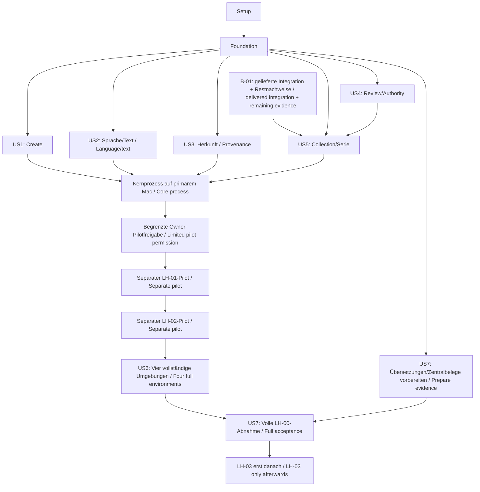

# Aufgaben: LH-00-Prozess / Tasks: LH-00 process

**Stand / Date:** 2026-10-01. **Basis / Base:** `b2e1008`.
**Owner:** Thorsten Hindermann. **Profil / Profile:** `show-commandtui400-de-en`.
**Eingaben / Inputs:** [spec.md](spec.md), [plan.md](plan.md), [research.md](research.md),
[data-model.md](data-model.md), [Collection-Vertrag](contracts/collection.md),
[Prozessvertrag](contracts/process.md), [quickstart.md](quickstart.md),
[LH-00](../../intakes/LH-00.md) und [IAD010](../../docs/planning/lh00-staged-acceptance-decisions.md).

Dieser Tasks-Auftrag erzeugt die Aufgabenliste. Jede spätere Umsetzung braucht
passende Autorität für ihren Schreibumfang. Remote-Lieferung, Releases, zentrale
Änderungen und Feature-Läufe aus LH-01–LH-07 werden dadurch nicht beauftragt.
Alle Checkboxen beschreiben noch auszuführende Arbeit; frühere Erfolge stehen
gesondert unten. LH-00 bleibt bis zur vollständigen Prozessabnahme offen.

This Tasks request produces the task list. Later execution needs authority matching
its write scope. It does not commission remote delivery, releases, central changes
or LH-01–LH-07 feature runs. Every checkbox describes future work; prior successes
are recorded separately below. LH-00 stays open until full process acceptance.

## Format und Arbeitsregeln / Format and working rules

`Tnnn` ist die eindeutige Aufgaben-ID. `[US1]` entspricht US-01 in der Spec;
entsprechend gelten US2–US7. `[P]` erlaubt Arbeit an unabhängigen Dateien, sobald
die genannten Vorgänger abgeschlossen sind. Ein Kandidat ist ein vorbereiteter
Stand vor seiner Veröffentlichung in der aktiven Ablage. Gemeinsame Dateien,
Receipts, Manifeste und Statistik haben jeweils genau einen Writer.

Tnnn is the unique task ID. US1 maps to specification story US-01, likewise US2–US7.
P permits work on independent files after the stated predecessors complete.
A candidate is a prepared state before publication into active storage. Shared
files, receipts, manifests and statistics each have one writer.

- Pfade in Aufgaben beziehen sich auf die Repositorywurzel. Geplante Dateien
  werden erst in ihrer Aufgabe angelegt; bestehende Werkzeuge werden wiederverwendet.
  / Task paths are repository-relative. Create planned files in their tasks and reuse existing tools.
- Änderungen gebundener Quellen zunächst isoliert vorbereiten, Vorgänger bytegenau
  archivieren und per `speckit-intake-update` nachvollziehen; anschließend frisches
  Review durch einen anderen Prüfer. Aktive Veröffentlichung und Hashbindungen
  seriell aktualisieren. / Stage bound-source changes in isolation, archive exact
  predecessor bytes, use intake-update and obtain a fresh review by another reviewer;
  publish and update bindings serially.
- Nachweise enthalten Quelle, FR/AC/E-ID, Owner, Autor, anderen Reviewer, Datum,
  Commit/Hashes, Befehl oder Prompt, Ergebnis, Grenzen und nächste Aktion.
  `Applicable`, `N/A` mit Grund oder `Open` mit Owner, Follow-up und Trigger sind
  für jeden Governance-Punkt erforderlich; Erfüllung ist eine getrennte Spalte.
  / Evidence records source, requirement/case IDs, owner, author, different reviewer,
  date, commit/hashes, command/request, outcome, limits and next action. Each checkpoint
  has Applicable, justified N/A or Open with owner/follow-up/trigger, separately from fulfillment.
- Die Spec verlangt positive und negative Prozessprüfungen. Dafür isolierte,
  getrennte Fixture-Kopien und vorhandene Validatoren nutzen; erwartete Abweisungen
  vor dem gültigen Ablauf prüfen. Kein zusätzlicher Testframework-Aufbau.
  / The specification requires positive and negative process checks. Use separate
  isolated fixtures and existing validators; check expected rejection before the valid flow.
- DE zuerst/EN danach, ungefähr B2, erklärte Begriffe, vollständig textuelle
  Zustände und Abhängigkeiten. Keine Produktsprache, Mindestversion oder TUI-Funktion
  festlegen. Leeres `Idle` bleibt ausgeschlossen. / German first, English second,
  about B2, explained terms and complete textual states/dependencies. Select no product
  language, minimum version or TUI function. Empty Idle remains excluded.
- Vor schreibenden Skripten Hilfe und vorhandenen Preview-Modus verwenden;
  ohne Preview nur im freigegebenen isolierten Bestand. Mac/Linux zuerst Bash,
  Windows zuerst PowerShell. / Inspect help and available preview before writes;
  without preview operate only in approved isolation. Bash first on Mac/Linux,
  PowerShell first on Windows.

## Vorhandener B-01-Nachweis / Existing B-01 evidence

Die Quellenkorrektur und neun native CI-Jobs wurden am 2026-10-01 geliefert.
Seit dem Pilot am 2026-10-03 sind Authoring 0.3.6, Review 0.2.4 und Sequencing
0.2.7 veröffentlicht, zentral gebunden und gezielt im Projekt installiert.
Projektlieferung: PR #21/#22; Quellen und Tags im Quellen-Lock. Die installierten
Konfigurations-Fixture-Suiten bestanden in Bash/PowerShell mit Zero-write-Parität.
[Zuordnung und Restumfang](../../docs/maintenance/lh00-b01-release-adoption.md)
verhindern doppelte Releases/Installation. T034–T036 bleiben bis zum vollständigen
Feature-Nachweis offen; die reale Serienaktivierung und Prozessabnahme sind nicht erfolgt.

Source fixes and nine native CI jobs were delivered on 2026-10-01. The 2026-10-03
pilot released, centrally pinned and installed Authoring 0.3.6, Review 0.2.4 and
Sequencing 0.2.7. PR #21/#22 and the source lock record delivery; installed
configuration fixtures passed in both shells with zero-write parity. Reuse
these facts rather than repeating release/installation. T034–T036 remain open
pending complete feature evidence; real series activation/acceptance has not occurred.

## Phase 1: Vorbereitung / Setup

**Ziel / Goal:** Aktuellen Input, Werkzeuge, Auftrag und isolierte Prüfgrenze festhalten.
Record current inputs, tooling, authority and the isolated test boundary.

- [x] T001 Vor Ausführung aktuelle Ziel-/Quellhashes, Receipt `specs/intake-authoring-receipts/lh-00.json`, Review `specs/intake-review-result.json`, Git-Stand und erlaubten Schreibumfang prüfen und in `specs/001-lh00-intake-process/checklists/tasks-validation.md` fortschreiben. / Before execution verify current bindings, receipt, review, Git state and authorized write scope; update the named evidence.
- [x] T002 Tatsächliche Spec-Kit-/Python-/Bash-/PowerShell-Versionen, 14 Presets und verfügbare Intake-Kommandos in `docs/Entwicklungsumgebung.md` erheben; historischen Installationsstand und aktuelle Prüfungen unterscheiden (FR-001). / Inventory actual versions, fourteen presets and intake commands, distinguishing historical installation from current checks.
- [x] T003 In `docs/validation/lh00/fixture-plan.md` ein ausdrücklich freigegebenes Beispiel-Issue, ein eigenes Test-Intake je isolierter Kopie, temporäre Repositorywurzeln, sichere Quellen, erlaubte Mutationen und Mac-A/B-Zuordnung festlegen; reale LH-00-Dateien bleiben außerhalb des Testbestands. / Define an approved sample issue, a separate test intake per isolated copy, temporary roots, safe sources, allowed mutations and Mac identity; keep real LH-00 files outside fixtures.
- [x] T004 `specs/001-lh00-intake-process/checklists/plan-governance.md` als aktuelle Ausführungszuordnung ergänzen: Owner Thorsten, benannter Autor und anderer Reviewer je Gate, AC/E-Verweise, offene Aktionen und bestehende Wiedervorlage 2026-10-12; historische Planbefunde erhalten. / Add current execution ownership, distinct reviewers, AC/case mapping and follow-ups while preserving dated planning evidence.

**Abschluss / Checkpoint:** T001–T004 sind Voraussetzung der folgenden Basisarbeit;
keine fehlende Host- oder Release-Evidence blockiert die Erstellung dieser Liste.
T001–T004 precede foundation work; missing host or release evidence does not block task generation.

## Phase 2: Gemeinsame Grundlagen / Foundation

**Ziel / Goal:** Sicherheits- und Architekturgrenzen vor Skriptübernahme und aktiver Migration belegen.
Prove security and architecture boundaries before script integration or active migration.

- [x] T005 [P] `docs/architecture/lh00-process.md` mit Kontext-, Baustein-, Laufzeit- und Deployment-Sicht des Dateiprozesses, Qualitätsszenarien US-02/03/04/06, Risiken und technischen Schulden ausarbeiten; keine Produktlaufzeit entwerfen. / Document file-process views, quality scenarios, risks and technical debt without designing the product runtime. Bei anwendbarem C5 Type 1/Type 2/Unknown und Zeitraum trennen; bei C3A die 30 Gruppen, exakten gewählten C/AC-IDs und SI-Auslegung bewahren. / For applicable C5 distinguish assurance type/period; preserve the C3A index, selected IDs and SI interpretation.
- [x] T006 Nach T005 die Entscheidung für vorhandene Dateiverträge, `SeriesManifest`, kontrollierte Migration und verworfene Alternativen in `docs/architecture/decisions/001-lh00-file-process.md` als ADR begründen. / After T005 record the file contracts, inventory mode, migration and rejected alternatives in an architecture decision record.
- [x] T007 [P] `docs/security/threat-model.md` und `docs/security/security-checklist.md` für Quellen, Pfade, aktive Dateien, Hashes, Reviewer und Ausführungsbefugnis pflegen: STRIDE/CIA, relevante CAPEC-Muster, SSDF und CWE-22/78/94/862, Schutzschichten und konkrete negative Fälle. / Document trust boundaries, relevant attack patterns, SSDF/CWE controls and negative cases in the threat model and security checklist.
- [x] T008 Nach T007 `docs/security/adr/s-adr-lh00-authority.md` und `docs/security/arc42-section-8-lh00.md` zu minimaler Befugnis, Eingabeprüfung, sicheren Fehlern, Logging und Abhängigkeiten erstellen; eigene Dienstauthentisierung/Kryptografie begründet N/A führen. / After T007 record authority and security concepts, including justified non-applicability of custom service authentication or cryptography.
- [x] T009 [P] `docs/security/msl-applicability.md` und `docs/security/secure-coding-language-rules.md` erstellen: Produkttechnik/MSL bleiben Open; Bash-/PowerShell-Regeln mit Quoting, StrictMode, `-NoProfile`, Bash 5+ als Ausführungsumgebung gemäß Wartungsvertrag, leerem Windows-HOME, enthaltenen Pfaden und keiner Auswertung fremder Inhalte festlegen. / Keep product technology/MSL open and define secure shell rules without inventing a product-language exception.
- [x] T010 [P] In `docs/security/dependency-audit.md` und `docs/security/supply-chain-evidence.md` vorhandene Pins, Herkunft/Hashes, Update-Automation und OpenSSF-Praktiken prüfen; SBOM/VEX/SLSA und AI-SBOM im Lieferkettennachweis zuordnen; ASVS in `docs/security/asvs-verification.md`, Zero Trust in `docs/security/zero-trust-applicability.md`, BSI C3A in `docs/security/cloud-autonomy-applicability.md`, C5 in `docs/security/cloud-compliance-assurance.md` und Regulatorik in `docs/security/regulatory-applicability.md` mit Gründen/Triggern bewerten und in `docs/security/README.md` verlinken. N/A nicht als Pass und Open nicht als rechtliche Ausnahme behandeln. / Audit tooling provenance and update practices; record each standard's applicability, rationale and reassessment trigger without claiming a score, legal exemption or product certification. DS-GVO/KI-VO/CRA/NIS2/DORA je Beispielprodukt, Entwicklungswerkzeuge und Organisation mit Jurisdiktion, Rolle, direkten/vertraglichen Pflichten, Quelle, Owner, anderem Reviewer, Evidence und Follow-up getrennt erfassen; unbekannt bleibt Open, Ausbildung/AI-SBOM N/A sind keine Ausnahme. / Assess regulatory scope separately for product, tooling and organisation, recording duties and evidence; unknown remains Open, with no education/AI-SBOM exemption.
- [x] T011 Den Secure-Development-Kontext nach `.specify/presets/secure-development-assurance-governance/templates/secure-development-evidence-contract.md` für `docs/security/secure-development/<YYYY-MM-DD>-lh00-process/` festlegen; vor Umsetzung reale Baseline-Bindung und `evidence-matrix.md` herstellen, Deltas mit Änderungen führen, Closure/Image-Impact erst am passenden Gate erzeugen. / Establish a real dated assurance context, baseline binding and evidence matrix; create deltas with changes and defer closure/image-impact to their proper gates.
- [x] T012 Ergebnisse T005–T011 in `specs/001-lh00-intake-process/checklists/plan-governance.md` durch einen anderen Prüfer bewerten lassen; relevante offene Schutzmaßnahmen vor ihrer Mutation schließen, akzeptierte Restrisiken ausschließlich menschlich belegen. / Have another reviewer assess foundation evidence; resolve relevant safeguards before mutation and require human acceptance for residual risks.

**Abschluss / Checkpoint:** Foundation gilt für alle Stories. Gelieferte B-01-Releases
und Installation werden wiederverwendet; verbleibende Lifecycle-/Review-/Owner-Nachweise
sind ein Vorgänger nur der Serienaktivierung in US5. US1–US4 können nach ihren
eigenen Startchecks mit Einzelintake-Werkzeugen voranschreiten.
Foundation precedes every story. Reuse delivered releases/installation; remaining
lifecycle/review/owner evidence gates US5 series activation. US1–US4 can progress
with standalone tools after their own start checks.

## Phase 3: US1 – Nachvollziehbar erstellen / Traceable creation (P1, MVP)

**Ziel / Goal:** Ein benanntes Issue führt zu genau einem vollständigen Intake samt Receipt.
One named issue yields exactly one complete intake and receipt.
**Unabhängige Prüfung / Independent test:** E01/E02, FR-001–006, SC-001;
freigegebene Einzelkopie mit freiem Ziel sowie fehlendem Pflichtinhalt prüfen.
Check one approved isolated target and incomplete/conflicting-input cases.

- [x] T013 [P] [US1] Die fehlenden `.specify/scripts/powershell/common.ps1` und `.specify/scripts/powershell/check-prerequisites.ps1` aus dem belegten Spec-Kit-0.12.8-Paket isoliert mit `.specify/scripts/bash/common.sh` und `.specify/scripts/bash/check-prerequisites.sh` vergleichen und gezielt integrieren; Herkunft und Hashes in `docs/cross-platform/lh00-parity.md` erfassen. / Compare and narrowly import the two same-version PowerShell scripts against their Bash counterparts, preserving provenance.
- [x] T014 [US1] Nach T013 `.specify/scripts/powershell/create-new-feature.ps1`, `.specify/scripts/powershell/setup-plan.ps1` und `.specify/scripts/powershell/setup-tasks.ps1` gegen die gleichnamigen Bash-Gegenstücke prüfen und übernehmen; Init-Optionen und fünf Integrationen erhalten, keinen produktiven Feature-Lauf als Probe starten. / Import the remaining three scripts after isolated parity checks, preserving initialization choices and integrations.
- [x] T015 [US1] Beide Aufrufwege und bilinguale PowerShell-Kommentarhilfe in den übernommenen `.specify/scripts/powershell/*.ps1` sowie `docs/man/lh00-process.1.md` dokumentieren. Nur bei belegter Wrapper-Lücke `scripts/test-lh00-process.sh` und `scripts/test-lh00-process.ps1` gemeinsam mit Advanced Function `Test-Lh00Process`, geprüftem `Get-Verb Test` und gleicher Dry-run/WhatIf-Wirkung ergänzen; andernfalls begründetes N/A in `docs/cross-platform/lh00-parity.md`. / Document both invocation paths and help; add the paired approved-verb wrapper only for a demonstrated gap, otherwise record N/A.
- [x] T016 [P] [US1] In `.specify/memory/intake-authoring-profile.md`, `docs/intake-governance.md` und `docs/Entwicklungsumgebung.md` den begrenzten Issue→Create→Receipt-Weg, Personenrollen, Ablage, Baseline und sämtliche FR-006-Pflichtabschnitte einschließlich beider Folgeprompts konkretisieren; gebundene Änderungen als Kandidat für T032 vorbereiten. / Specify the bounded authoring route, roles, storage, baseline and all required content; stage bound-source changes for T032.
- [x] T017 [US1] Erst nach den belegten Abweisungen aus T018 im freigegebenen Bestand E01 mit tatsächlich ausgeführtem `speckit-intake-create` prüfen und `docs/validation/lh00/create.md` führen: genau ein DE/EN-Test-Intake und Schema-2.0-Receipt, Quellen-/Zielbindung, Status ReadyForReview, keine Folgeaktion. / Only after T018 proves expected rejections, run approved isolated creation and record exact outputs, provenance, authoring status and absence of downstream execution.
- [x] T018 [US1] Fehlende Pflichtfelder, widersprüchliche bzw. unlesbare Quellen und unvollständiges Profil in separaten Kopien prüfen; in `docs/validation/lh00/create.md` konkreten Blocker, Owner und nächste Aktion statt unbegründetem ReadyForReview belegen. / Check incomplete or conflicting inputs separately and record blockers rather than unjustified readiness.

**Abschluss / Checkpoint:** US1 ist das kleinste demonstrierbare Inkrement;
seine Einzelerstellung erfüllt noch nicht die spätere Pilotfreigabe.
US1 is the smallest demonstrable increment; creation alone does not grant pilot permission.

## Phase 4: US2 – Beide Sprachen und Textzugang / Both languages and text access (P1)

**Ziel / Goal:** Normativer Inhalt und nächste Schritte sind in DE/EN gleich verständlich.
Normative content and next actions remain equally understandable in both languages.
**Unabhängige Prüfung / Independent test:** E02/E03, FR-009–012, SC-002/003;
ein feststehendes Test-Intake abschnittsweise sowie ohne Diagramm/Farbe lesen.
Compare a frozen fixture section by section and without diagram or color.

- [x] T019 [US2] DE/EN-Äquivalenz, Reihenfolge, etwa B2 und Erstgebrauchserklärungen in `.specify/memory/intake-authoring-profile.md` und `docs/Entwicklungsumgebung.md` korrigieren; gleiche FR-/AC-/OD-IDs und unveränderten Umfang bewahren, Änderungen für T032 vorbereiten. / Correct language equivalence and first-use explanations while preserving IDs and scope; stage changes for T032.
- [x] T020 [US2] In `docs/intake-governance.md` und `docs/Lastenheft-Plan.md` Rollen, alle Zustandsachsen, Abhängigkeiten, Entscheidungen und nächste Aktionen vollständig textuell erklären; hilfreiche Mermaid-Quellen mit gleichwertiger Alternative pflegen, sonst Nichtanwendung begründen. / Provide complete textual rules and equivalent alternatives for useful diagrams; justify omission where appropriate.
- [x] T021 [P] [US2] In `docs/accessibility/lh00-process.md` betroffene Markdown-/CLI-/Renderer-Flächen, WCAG-2.2-AA-Anwendbarkeit, Tastatur, Fokus, Screenreader, Braille und Textbrowser zuordnen; strukturelle Ergebnisse belegen und praktische Lücken mit Owner/Trigger für T050 offen halten. / Map accessibility surfaces and criteria, evidence structural results and keep assistive field gaps visible for T050.
- [x] T022 [P] [US2] Einen anderen Leser den eingefrorenen Teststand auf Pflichtinhalt, normative DE/EN-Gleichheit, B2-Verständlichkeit und Textalternative prüfen lassen; Befunde und Korrekturkontrolle in `docs/validation/lh00/language-review.md` dokumentieren. / Have another reader check frozen content, language equivalence and text alternatives and record findings and rechecks.

**Abschluss / Checkpoint:** Dokumentqualität ist belegt; T050 bleibt Voraussetzung
vollständiger praktischer A11Y-Abnahme. Document quality is evidenced; T050 remains
required for full practical accessibility acceptance.

## Phase 5: US3 – Sicher ändern und Herkunft erhalten / Safe changes and provenance (P1)

**Ziel / Goal:** Create schützt Bestand; Update/Delete erhalten Identität und Herkunft.
Create protects existing content; update/deletion preserve identity and provenance.
**Unabhängige Prüfung / Independent test:** E04, FR-014–016, SC-004;
unveränderte, manipulierte und bereits vorhandene Testziele sowie Update/Rollback prüfen.
Check valid, tampered and existing targets and authorized update/recovery.

- [x] T023 [US3] Den konkreten Update-, Delete-, Archiv- und Wiederaufnahmeweg in `docs/intake-governance.md` anhand bestehender Skills/Schemas beschreiben; Versionierungsarchiv, Completed-Facharchiv und Tombstone unterscheiden und Änderungen für T032 vorbereiten. / Document existing lifecycle operations, distinguishing version archives, domain completion archives and tombstones.
- [x] T024 [US3] Erst nach den belegten Abweisungen aus T025 in einer eigenen Fixture-Kopie echte Quell-/Zielhashes berechnen und beide Receipt-Validatoren mit tatsächlicher PASS-Ausgabe ausführen; UTF-8/BOM/LF-Regeln und Exitcodes in `docs/validation/lh00/hash-positive.md` belegen. / Only after T025 proves expected rejections, calculate real hashes and prove paired positive receipt validation and normalization in a separate fixture.
- [x] T025 [P] [US3] In separaten Kopien Inhaltsdrift, Create auf vorhandenem Ziel, Pfadausbruch/Symlink, ungültiges UTF-8, Größenlimit und unzulässige Quellen prüfen; Vorher-/Nachherbytes und erwartete Abweisung in `docs/validation/lh00/provenance-negative.md` festhalten. / Prove expected rejection and unchanged protected bytes for tampering, overwrite, containment, encoding, size and source failures.
- [x] T026 [US3] Einen ausdrücklich beauftragten Update-Fall ausführen; erhaltene Intake-ID, neue Receipt-/Operations-ID, bytegenaue Vorgänger, Supersedes-Bindung und ungültig gewordenes altes Review in `docs/validation/lh00/update.md` nachweisen. / Execute an approved update and evidence preserved identity, new operation/receipt, exact archives, lineage and review invalidation.
- [x] T027 [P] [US3] An einer separaten freigegebenen Fixture den logischen Delete-Fall mit Archiv und Tombstone prüfen; Herkunft erhalten, Identität nicht wiederverwenden und kein Completed vortäuschen; `docs/validation/lh00/delete.md` führen. / Check logical deletion in a separate fixture with permanent provenance and without claiming domain completion.
- [x] T028 [US3] Eine kontrollierte Unterbrechung/Validierungsstörung im isolierten Update-Fall provozieren; Journal gegen Dateien abgleichen, vollständigen Rollback oder gesperrtes NeedsRepair und separate Wiederaufnahmeautorität in `docs/validation/lh00/recovery.md` belegen. / Prove safe rollback or blocked repair state and explicit resume authority after an isolated partial failure.

## Phase 6: US4 – Review und Ausführung trennen / Separate review and execution (P1)

**Ziel / Goal:** Anderer Reviewer, Qualitätsstatus und Befugnis bleiben unterscheidbar.
Distinct reviewer identity, quality status and execution authority remain separate.
**Unabhängige Prüfung / Independent test:** E05, FR-003/004/017/018, SC-005;
alle fünf Review-Ausgänge und fehlende Ausführungsbefugnis anhand konkreter Fälle bewerten.
Assess five review outcomes and missing execution authority using concrete cases.

- [x] T029 [US4] In `docs/intake-governance.md` Authoring ReadyForReview, alle fünf Review-Ergebnisse und getrennte Umsetzungsautorität erklären; menschliche Risikoannahme, Reviewer-Benennungszeitpunkt und passende Aufträge festhalten, als T032-Kandidat führen. / Explain authoring status, all review outcomes, appointments, human risk acceptance and separate execution authority.
- [x] T030 [US4] Einen anderen Agenten oder Menschen das freigegebene Test-Intake mit `speckit-intake-review` vollständig prüfen lassen; Result/Report, aktuelle Bindungen und Reviewer-Unabhängigkeit in `docs/validation/lh00/review.md` nachweisen. / Obtain a complete independent fixture review and evidence its result, bindings and distinct reviewer.
- [x] T031 [US4] ReadyForReview ohne Review, veraltetes Ready, Eligible ohne Auftrag und unbelegte Risikoannahme in `docs/validation/lh00/authority-negative.md` prüfen; keine nicht beauftragte Folgeaktion und keine agentenseitige Risikoakzeptanz zulassen. / Verify that stale/missing review, selection status or unaccepted risk never authorizes downstream work.
- [x] T032 [US4] Die in T016/T019/T020/T023/T029 vorbereiteten gebundenen Quellenänderungen seriell über `speckit-intake-update intakes/LH-00.md` mit neuen Receipt-/Operations-IDs, erhaltenem Intake-ID und bytegenauen Archiven publizieren; anschließend ausdrücklich beauftragtes frisches Review durch einen anderen Prüfer in `specs/intake-review-result.json` und `specs/intake-review-report.md` erstellen. / Publish the staged bound-source update with lineage and obtain a separately commissioned fresh independent review of the real intake.
- [x] T033 [US4] In `docs/validation/lh00/review.md` passende Erstellung-/Änderung-/Review-/Umsetzungsaufträge, benannte Rollen, nächste Aktionen und noch offene Freigaben gegen die aktuellen Bindungen abgleichen; keine freien Projektstatus in Schemafelder schreiben. / Reconcile actual authority and identities with current evidence without adding status values to schemas.

## Phase 7: US5 – Bestand und Serie / Inventory and series (P2)

**Ziel / Goal:** Konfiguration, Index und Ein-Mitglied-Serie validieren, einschließlich Active.
Validate configuration, index and one-member series including the running state.
**Unabhängige Prüfung / Independent test:** E07, FR-007/008/021/022, SC-007;
isolierten gültigen Bestand und fehlende Dateien/Hashes/Zyklen/mehrere Eligible prüfen.
Validate an isolated collection and reject missing files, invalid hashes, cycles and multiple candidates.

- [x] T034 [US5] Bereits gelieferte Source-PRs, neun native CI-Jobs und veröffentlichte Patch-Releases (B-01: Authoring 0.3.6; aktuell 0.3.7) / Review 0.2.4 / Sequencing 0.2.7 aus Quellen-Lock, Pilotnachweis und D-09 in `docs/maintenance/lh00-b01-release-adoption.md` zusammenführen; echte IDs/Tag-Commits/Hashes prüfen, keine erneuten Releases oder Flottenrollouts. / Consolidate and verify delivered source/CI/release identities, preserving historical Authoring 0.3.6 and current 0.3.7 adoption, without publishing again or rolling out the fleet.
- [x] T035 [US5] Nach T034 bereits gelieferte kanonische Level-0-Pins und `scripts/config/spec-kit-project-statistics-governance-presets.json` gegen den Quellen-Lock prüfen und angewendete zentrale/Projektlieferung in `docs/maintenance/lh00-b01-release-adoption.md` belegen; Änderungen nur bei echter neuer Abweichung und passendem gesondertem Auftrag. / Verify delivered central/project pins against the source lock; reuse applied evidence and require separate authority for any new change.
- [x] T036 [US5] Nach T035 die bereits gezielte Installation und exakte 14-Preset-Matrix/fünf Integrationen mit Check-only bestätigen; vorhandene Fixture-Ergebnisse übernehmen, fehlende vollständige Lifecycle-/Negativnachweise gegen alle drei installierten Collection-Kopien in Bash/PowerShell ergänzen: Ready/Eligible→Active/Active mit N/A→Completed/Archiv. Ein anderes Review und Owner-Entscheid zu B-01 in `docs/maintenance/lh00-b01-release-adoption.md` belegen. Nur bei echter Installationsabweichung und gesondertem Auftrag Hilfe/Vorschau sowie gezielte Reparatur verwenden. / Verify the delivered installation, reuse fixtures, complete missing paired lifecycle/negative evidence and obtain separate review/owner closure; no unconditional reinstall.
- [x] T037 [US5] Nach T036 einen vollständigen Kandidaten gemäß `contracts/collection.md` vorbereiten: `requirements/intake-governance-config.json`, `requirements/RequirementsIndex.md`, `requirements/baseline/README.md`, Collection-Verzeichnisse und `.specify/memory/intake-series-policy.json`; SeriesManifest, vier Rollen, sechs eindeutige Pfade, bestehende Namen und fehlende LH-01–LH-07 im Index erhalten. / Prepare the exact collection candidate with explicit roles, paths, inventory mode and missing-intake markers.
- [x] T038 [US5] `specs/intake-series/lh00-process/manifest.json`, `receipt.json`, `operation.json` und ein reales Journal unter `requirements/intake-governance-operations/` vorbereiten: echte Serien-ID, nur vorhandenes LH-00 als Primary/Eligible, Ready, ein Root, keine Kanten, tatsächliche Hashes und Vorher-/Nachher-/Rollbackbindungen. / Prepare real single-member series evidence and a migration journal without invented identities or future members.
- [x] T039 [US5] Alle drei Collection-Validatoren sowie Sequencing-Manifest/-Receipt-Validatoren gegen den isolierten Kandidaten in Bash und PowerShell ausführen; fehlende Datei, Hashdrift, Pfadausbruch/Alias, falsche Reihenfolge, Zyklus und mehrere Eligible abweisen; Ergebnisse in `docs/validation/lh00/collection.md` dokumentieren. / Prove paired candidate validation and rejection of invalid inventory/dependency cases before live publication.
- [x] T040 [US5] Nach T039 und explizitem Migrations-/Serienauftrag Konfiguration, Index, Manifest, Receipt, Journal und notwendige Referenzen zusammen publizieren; Ready/Eligible korrekt bootstrappen, Active nur bei tatsächlichem autorisiertem Beginn setzen, keinen realen LH-00-Abschluss aus Fixture-Tests ableiten; `docs/validation/lh00/collection.md` fortschreiben. / Publish the approved coherent candidate, record genuine lifecycle transitions and keep fixture completion separate from real LH-00 acceptance.
- [x] T041 [US5] Gebundene Policy-/Profil-/Quellenänderungen der Migration über `specs/intake-authoring-receipts/lh-00.json` mit autorisiertem Update nachvollziehen und frisches unabhängiges Review in `specs/intake-review-result.json` herstellen; erst danach wieder gültige Auswahl-/Ausführungsgates behaupten. / Preserve intake lineage and obtain fresh review after bound migration changes before using downstream gates.
- [x] T042 [US5] `speckit-intake-series-next` lesend prüfen und `requirements/RequirementsIndex.md` mit `docs/Lastenheft-Plan.md` abgleichen: genaue Blocker, keine gestartete Arbeit, korrekte Gesamt-/Serienanzahl, erhaltene Archivherkunft; LH-01/LH-02-Piloten außerhalb der Serie und LH-03 hinter voller LH-00-Abnahme führen. / Check read-only selection, inventory and pilot exclusion without weakening binding edges or starting work.

**Abschluss / Checkpoint:** Releases, Pins und Installation sind geliefert.
Fehlende aktuelle Lifecycle-/Review-/Owner-Nachweise blockieren nur die reale
Serienaktivierung; sie erfordern keine pauschale Neuinstallation. US1–US4 und
vorbereitbare Dokumentationsarbeit bleiben nach ihren eigenen Gates nutzbar.
Empty Idle bleibt ausgeschlossen. / Reuse delivered integration; remaining
lifecycle/review/owner proof gates real series activation, not all standalone work.

## Phase 8: US6 – Kernprozess und vier Umgebungen / Core process and four environments (P2)

**Ziel / Goal:** Zunächst begrenzte Mac-Pilotfreigabe, später vollständige vierfache Prozess-Evidence.
First obtain limited Mac pilot permission, later complete evidence on all four environments.
**Unabhängige Prüfung / Independent test:** E06, FR-019/020, SC-006;
fehlender vierter Nachweis verhindert volle Abnahme, aber ersetzt nicht die Pilotregel.
A missing fourth record prevents full acceptance; the separate pilot rule still applies.

- [x] T043 [US6] `docs/cross-platform/lh00-parity.md` mit dem installierten `script-parity-checklist-template.md` vervollständigen: fünf Basisskriptpaare, Hilfe/Cmdlet, sichere Eingaben, tatsächliche Exit-/JSON-Parität, Preview-Nullschreibnachweis; passende Secret-/Homogenitäts-/Preset-/PowerShell-Checks aus `quickstart.md` für die vorgenommenen Änderungen vor Pilotbewertung ausführen. / Complete script parity and applicable repository checks for changed surfaces before pilot assessment.
- [x] T044 [US6] Nach US1–US5 den Kernprozess E01/E02/E04/E05/E07 auf dem eindeutig benannten primären Mac mit isoliertem Beispiel vollständig ausführen; tatsächliches Ergebnis in `docs/validation/lh00/mac-a.md` oder `docs/validation/lh00/mac-b.md` mit Versionen, Prompts, Commit-/Payload-/Entscheidungshashes, Änderungen und Grenzen belegen. / Prove the core flow on the named primary Mac and record exact tool/action evidence and limits.
- [x] T045 [US6] Einen anderen Prüfer T044 bewerten und Thorsten die begrenzte Pilotfreigabe in `docs/validation/lh00/acceptance.md` entscheiden lassen; fehlende Vollabnahme offen halten, LH-01/LH-02 nur als separat zu beauftragende Einzelpiloten mit gültigen Intakes und unabhängigem Review nennen. / Obtain independent assessment and an owner decision on limited pilot permission, keeping full acceptance and pilot commissioning distinct.
- [ ] T046 [US6] Erst nach nachgewiesenem Abschluss der separat beauftragten LH-01-/LH-02-Piloten die stabilisierte vollständige Strecke E01–E05/E07 auf Mac A ausführen und `docs/validation/lh00/mac-a.md` ergänzen; vorherige Kernprüfung als Teilnachweis erhalten. / After the two commissioned pilots complete, run the stabilized full flow on Mac A, preserving prior partial evidence.
- [ ] T047 [P] [US6] Unter denselben Voraussetzungen wie T046 die vollständige Strecke auf Mac B mit eigenem isolierten Bestand durchführen und `docs/validation/lh00/mac-b.md` mit tatsächlichen Host-/Tool-/Hilfsmittel-/Hashbindungen führen. / Run the same full flow on Mac B in separate isolation and record actual environment and evidence bindings.
- [ ] T048 [P] [US6] Unter denselben Voraussetzungen wie T046 auf nativem Windows 11 PowerShell zuerst, funktionierendes `python3`, Basisskripte und E01–E05/E07 vollständig prüfen; `docs/validation/lh00/windows-11.md` führen, eine CI-Probe nicht als diesen End-to-end-Nachweis ausgeben. / Prove the full native Windows flow and its actual prerequisites; do not substitute a CI smoke result.
- [ ] T049 [P] [US6] Unter denselben Voraussetzungen wie T046 Ubuntu 24.04 unter WSL2 als eigene Umgebung prüfen, Bash-/PowerShell-Gegenprüfung und E01–E05/E07 belegen; `docs/validation/lh00/ubuntu-wsl2.md` führen, natives Linux-CI nur als Teilnachweis referenzieren. / Prove the distinct WSL2 environment with paired-shell evidence; native Linux CI remains partial evidence only.
- [ ] T050 [US6] Nach den Hostprüfungen tatsächliche Tastatur-/Fokus-, Screenreader-, Braille- und Textbrowser-Ergebnisse je betroffener Fläche/Umgebung in `docs/accessibility/lh00-process.md` konsolidieren; `docs/cross-platform/lh00-parity.md` gegen alle vier vollständigen Protokolle prüfen. Fehlende Geräte/Teilstrecken bleiben Blocked, unerwartetes Verhalten Failed; nur vollständige erfolgreiche Fälle erfüllen SC-006. / Consolidate real assistive/platform evidence; missing prerequisites block and unexpected behavior fails full acceptance.

**Pilotgrenze / Pilot boundary:** Nach T045 kann LH-00 für die externen Pilotaufträge
unterbrochen werden. Prozessprobleme und ihre Korrekturen bleiben im bestehenden
LH-00-Nachweis; Feature-Abnahmen werden in den jeweiligen Feature-Läufen geführt.
T046–T050 liegen nach LH-02 und vor LH-03. After T045, LH-00 can wait for separately
commissioned pilots; record process issues here and feature acceptance in those
feature runs. T046–T050 follow LH-02 and precede LH-03.

## Phase 9: US7 – Vollständige Abnahme schließen / Close full acceptance (P2)

**Ziel / Goal:** Alle neun AC, FU01–FU07 und angewendete zentrale Ausrichtung belegen.
Evidence all nine AC, translation follow-ups and applied central alignment.
**Unabhängige Prüfung / Independent test:** FR-013/023/024, SC-008/009;
fehlende Übersetzung, unvalidierte Serie oder bloßer Registerpatch verhindern volle Abnahme.
Missing translations, invalid series or a merely prepared patch prevent full acceptance.

- [ ] T051 [P] [US7] FU01 als isolierten Sprachkandidaten für `docs/Bedienkonzept.md` bearbeiten: vollständigen englischen Zugang zum deutschen fachlichen Inhalt erstellen und Bedeutungsabgleich dokumentieren; keine neue Produktfunktion einführen, gebundene Veröffentlichung erst T057. / Prepare the complete concept translation without new requirements; defer bound publication to T057.
- [ ] T052 [P] [US7] FU02 in `docs/Repository-Einstellungen.md` vorbereiten: aktuelle Remote-Einstellungen lesend abgleichen, vollständige EN-Fassung und Prüfstand ergänzen; historische Werte kennzeichnen und keine Repository-Einstellung ändern. / Prepare bilingual repository-setting documentation from read-only verification without changing settings.
- [ ] T053 [P] [US7] FU03 in `docs/security/README.md` vollständig DE/EN pflegen und auf aktuelle LH-00-Evidence statt pauschaler Produktfreigabe verweisen; mit T010-Anwendbarkeit konsistent halten und für T057 bereitstellen. / Prepare the complete security language partner and consistent applicability without claiming product acceptance.
- [ ] T054 [P] [US7] FU04 für `docs/maintenance/intake-authoring-v035.md` beurteilen; historische Bytes/Entscheidungen erhalten, bei Bedarf erläuterten Sprachpartner `docs/maintenance/intake-authoring-v035.en.md` ergänzen und Ergebnis in `docs/intake-governance.md` dokumentieren. / Preserve historical evidence and add a contextual translation partner only as needed, documenting the outcome.
- [ ] T055 [US7] FU05 mit eigener zentraler Änderungsautorität tatsächlich in der kanonischen Level-0-Quelle umsetzen lassen; anschließend `constitution.md`, `.specify/memory/constitution.md`, betroffene Templates und fünf Guidance-Flächen abgleichen und angewendete Commit-/Sync-Evidence in `docs/intake-governance.md` belegen. Ein vorbereiteter Patch erfüllt FR-024 nicht; kein Flottenrollout ableiten. / Obtain separately authorized applied central registry alignment, synchronize affected local policy surfaces and record real evidence without implying a fleet rollout.
- [ ] T056 [US7] FU06 in `docs/issue-publication.md` und `docs/intake-governance.md` gegen die aktuellen Issues 1–8 und vorhandenen Intakes prüfen; fehlende Intakes sichtbar lassen, Unterschiede und erforderliche separat beauftragte Publikation dokumentieren. / Reconcile current published issues and existing intakes, preserving absent-intake markers and separate publication authority.
- [ ] T057 [US7] Gebundene Übersetzungs-/Register-/Guidance-Kandidaten über `speckit-intake-update intakes/LH-00.md` konsistent und mit Vorgängerarchiven publizieren; `specs/intake-authoring-receipts/lh-00.json`, frisches unabhängiges `specs/intake-review-result.json` und betroffene Serienreceipts/Manifesthashes gemeinsam aktuell halten. / Publish bound candidates with governed lineage, fresh independent review and coherent series evidence.
- [ ] T058 [US7] `docs/security/security-checklist.md`, `docs/architecture/lh00-process.md`, `docs/security/samm-assessment.md` und den dated Secure-Development-Kontext aus T011 zum tatsächlichen Änderungssatz unabhängig prüfen: Schutzmaßnahmen, Deltas, Matrix, passende Image-Impact-/Closure-Evidence, Restpunkte und Ausnahmen nach Presetvertrag; keine formale Freigabe aus Installation ableiten. / Independently close actual architecture/security evidence and assurance gates under their contract, preserving proof boundaries and open product decisions.
- [ ] T059 [US7] Nach LH-02 und T050/T057/T058 in `docs/validation/lh00/acceptance.md` AC-00-001–009, alle 24 Spec-FR, zwölf Quell-FR, SC-001–009 und FU01–FU07 mit Quelle, Owner, anderem Reviewer und Ergebnis vollständig zuordnen; Thorsten vollständige Prozessabnahme vor LH-03 entscheiden lassen, jedes fehlende Pflichtresultat offen halten. / After LH-02 and complete evidence obtain the owner's full acceptance decision before LH-03; missing mandatory results keep acceptance open.
- [ ] T060 [US7] Nur nach tatsächlicher voller Abnahme und eigenem Archiv-/Statusauftrag LH-00 in `requirements/intakes/archive/` überführen und `specs/intake-series/lh00-process/manifest.json`, Receipt, Index und Referenzen mit erhaltener Identität/Historie aktualisieren; Completed ohne Eligible, keine pauschale Template-Umbenennung oder logische Löschung. Ohne Auftrag N/A für die ausgeführte Archivaktion in `docs/validation/lh00/acceptance.md` vermerken. / Archive only with full acceptance and matching authority, preserving identity and membership; otherwise record that archival was not executed.

## Phase 10: Abschluss und gemeinsame Prüfungen / Polish and shared checks

**Ziel / Goal:** Leserpfad, Parität, Nachweise und spätere Lieferung konsistent schließen.
Close navigation, parity and evidence consistently with any separately authorized delivery.

- [ ] T061 `README.md`, `docs/Entwicklungsumgebung.md` und `specs/001-lh00-intake-process/quickstart.md` auf die tatsächlich vorhandenen Prozessartefakte, Aufgaben und Abnahmegrenzen ausrichten; genau UpdateRequired mit Zielgruppe, Owner, Quelle, Sprache, sourceOnly-Verteilung und Reevaluation in `specs/001-lh00-intake-process/checklists/tasks-validation.md` fortschreiben. / Align actual reader paths and record one complete documentation-impact decision.
- [ ] T062 `AGENTS.md`, `CLAUDE.md`, `GEMINI.md`, `.github/copilot-instructions.md` und `.github/agents/copilot-instructions.md` bytegleich prüfen; bei gemeinsamen Regeländerungen alle fünf, beide Constitutions und betroffene `.specify/templates/` gemeinsam aktualisieren. Das installierte Agent-Parity-Checklist in `docs/agent-parity/lh00-parity.md` mit fünf Integrationen führen; Routingänderung begründet N/A dokumentieren, Status vor Implementierung dennoch lesend prüfen; RefreshRequired nicht als Aligned ausgeben. / Verify all five guidance files and integrations, synchronizing affected rules/templates atomically and recording mutation non-applicability while checking current routing status before implementation; RefreshRequired is not Aligned.
- [ ] T063 Für die seit dem letzten Nachweis geänderten Flächen die passenden Prüfungen aus `quickstart.md` durchführen: exakte 14-Preset-Matrix, Secret-Scan, Homogenität, `scripts/tests/test_spec_kit_agent_surface_parity.py`, PowerShell-Analyse, Links und Diff; Ergebnisse mit Grenzen in `specs/001-lh00-intake-process/checklists/tasks-validation.md` festhalten und passende unveränderte Evidence wiederverwenden. / Run applicable checks for newly changed surfaces, reuse valid unchanged evidence and record precise outcomes and limits.
- [ ] T064 Beim passenden separat autorisierten Lieferpaket den chronologischen Ledger in `docs/project-statistics.md` mit dem vorhandenen Renderer pflegen: 80/100 für Konzept/Scripting, Gesamtstatistik zuletzt, Zahlen Git-gebunden, keine aktive Arbeitszeit erfinden; 125 erst bei tatsächlicher C#/.NET-Entscheidung bewerten. / Maintain the ledger through its renderer with authorized delivery, preserving Git-bound metrics and current reference rates.
- [ ] T065 `specs/001-lh00-intake-process/tasks.md` samt Spec/Plan/Verträgen auf Abdeckung, Reihenfolge, fremden Umfang, offene Gates und tatsächlich erledigte Checkboxen prüfen; Abschluss im bestehenden `docs/validation/lh00/acceptance.md` bündeln. `specs/001-lh00-intake-process/completion-report.md` und vollständigen Chatbericht erst nach vollständig abgeschlossenem Feature-Lauf erstellen; Tasks-Generierung allein löst das nicht aus. / Check final consistency and real completion; create the feature completion report only for a fully completed feature run.

## Abhängigkeiten und Ausführungsreihenfolge / Dependencies and execution order

Die Phasen bilden Arbeitsgruppen, nicht pauschale Sperren für jede spätere Arbeit.
Setup → Foundation ist für alle Stories verbindlich. Jede Prüfung benutzt einen
freigegebenen eingefrorenen Bestand; Live-Publikation bleibt seriell.

Phases group work rather than blocking every later preparatory action. Setup →
Foundation is mandatory for all stories. Checks use approved frozen fixtures;
live publication stays serial.

| Gruppe / Group | Vorgänger / Prerequisites | Freigegebener Fortschritt / Permitted progress |
|---|---|---|
| Setup | aktueller passender Auftrag / current matching authority | T001–T004 |
| Foundation | T001–T004 | T005/T007/T009/T010 unabhängig; T006 nach T005, T008 nach T007, T011 nach T007/T010; T012 zuletzt / initial independent work, dependent decisions, then review |
| US1 | Foundation | T013/T016 parallel vorbereiten; T014 nach T013, T015 nach T013/T014; nach dokumentiertem Weg T018→T017 / prepare independent candidates, then integrate and prove rejection before valid creation |
| US2 | Foundation; vorhandener eingefrorener Intake / existing frozen intake | T019/T020 seriell; T021/T022 nach stabilen Texten parallel / stable content before independent reviews |
| US3 | Foundation; eigener gültiger Fixture-Receipt, etwa US1 / own valid fixture receipt | T023→T025→T024→T026→T028; T027 eigene Kopie / prove rejection before positive validation, then update/recovery; separate delete fixture |
| US4 | Foundation; prüfbarer Fixture-Stand / reviewable fixture | T029/T030, dann T031; T032 nach allen genannten Quellkandidaten, T033 zuletzt / independent review and serial bound publication |
| US5 | Foundation, aktuelle echte Input-Bindung aus US4; T034–T036 vor Serienarbeit / current real input and installed fix | Vorbereiten T034; T037→T038→T039→T040→T041→T042 erst nach bestätigter Integration / series work after adoption |
| Kernfreigabe / Core permission | US1–US5, T043 | T044→T045: primärer Mac, begrenzte Owner-Pilotentscheidung / primary Mac and limited owner decision |
| Externe Einzelpiloten / External pilots | T045 + jeweils eigener Auftrag/Intake/Review / individual authority/input/review | LH-01 fachlich abschließen → LH-02 fachlich abschließen; außerhalb der Serienauswahl / outside series selection |
| Volle US6 / Full US6 | LH-02-Abschluss, stabiler korrigierter Prozess / completed pilots, stabilized process | T046/T047/T048/T049 unabhängige Hostkopien; T050 danach / separate host proof, then consolidation |
| US7-Vorbereitung / US7 preparation | Foundation und bekannte Baseline / known baseline | T051–T054 sprachliche Kandidaten parallel; T055/T056 bei passender Autorität, T057 ein Writer / independent candidates and serial publication |
| Volle Abnahme / Full acceptance | LH-02, volle US6, T057/T058; aktuelle finale Hashbindungen / current final bindings | T059 vor LH-03; T060 nur mit eigener Status-/Archivautorität / full owner decision, optional authorized archival |
| Abschluss / Polish | betroffene Stories und aktueller Änderungssatz / relevant completed stories and changes | T061–T065; keine automatische Lieferung / no automatic delivery |

Ändert T057 später Inhalte eines bereits geprüften Prozesspfads, dessen betroffene
Host-/Sprach-/A11Y-Nachweise vor T059 gezielt erneuern. Reine plattformunabhängige
Übersetzungs- oder Zentralbelege dürfen alle Hosts gemeinsam referenzieren.

If T057 changes a tested process path, refresh affected host/language/accessibility
evidence before T059. Platform-independent translation/central records may be shared.

**Textalternative:** Setup und Foundation gehen allen Stories voraus. US1–US4
lassen sich mit eigenen Beispielen prüfen; US5 braucht zusätzlich den installierten
B-01-Fix und aktuelle Review-Bindungen. Der Kernprozess aus US1–US5 auf dem primären
Mac führt zur begrenzten Pilotentscheidung. Separat beauftragtes LH-01 kommt vor
LH-02. Erst danach folgen vier vollständige Umgebungsnachweise und volle LH-00-Abnahme;
Übersetzungen und Zentralbelege können vorher vorbereitet werden. LH-03 wartet auf
diese volle Abnahme und weiterhin auf LH-02. Kein Diagrammknoten erteilt Autorität.

**Text alternative:** Setup and Foundation precede every story. US1–US4 can use
their own fixtures; US5 additionally requires the installed B-01 fix and current
review bindings. The core flow on the primary Mac supports limited pilot permission.
Separately commissioned LH-01 precedes LH-02. Four full environment records and
full LH-00 acceptance follow; translation/central evidence can be prepared earlier.
LH-03 waits for full acceptance and still for LH-02. No graph node grants authority.

## Parallelbeispiele / Parallel examples

Diese Beispiele sind Möglichkeiten bei später passender Beauftragung, kein Auftrag
zum Agentenstart. Nur unabhängige eingefrorene Eingaben lesen; ein Writer integriert
die Ergebnisse und publiziert alle gemeinsamen Bindungen.

These are options under later matching authority, not requests to start agents.
Read frozen independent inputs and have one writer integrate and publish bindings.

| Story | Gleichzeitig möglich / Parallel option | Serielle Grenze / Serial boundary |
|---|---|---|
| US1 | T013 Skriptvergleich und T016 Profilkandidat / script comparison and profile candidate | common.ps1 vor übriger PS-Integration; Receipt-Veröffentlichung T032 / common script before consumers, serial publication |
| US2 | T021 A11Y-Struktur und T022 Sprachreview des stabilen Stands / structural and language review | Vorher T019/T020 abschließen; keine Quellenänderung während Review / stable input first |
| US3 | T025 negative Kopien und T027 unabhängiger Delete-Fall / independent negative and delete fixtures | T024 erst nach T025; T026 nach T024/T025; T028 braucht Update-Kandidat / positive validation after rejection, then update and recovery |
| US4 | Zustandsfälle aus T031 in getrennten Kopien lesend beurteilen / assess independent authority cases | Ein Writer für T029/T032/T033; kein zusätzliches P für gemeinsame Reports / shared reports remain serial |
| US5 | Die sechs Shell-/Collection-Prüfungen aus T039 können unabhängige unveränderliche Kopien lesen / checks can read separate frozen copies | Ein Writer für Journal, Manifest, Receipt, Index und Publication / lifecycle artifacts remain serial |
| US6 | T046–T049 auf vier eigenen Host-/Fixture-Beständen / independent host fixtures | Alle warten auf LH-02 und stabilen Stand; T050 sammelt danach / pilots first, consolidation later |
| US7 | T051–T054 unterschiedliche Sprachkandidaten / different translation candidates | T057 und alle Receipt-/Review-/Guidancebindungen ein Writer / serial binding publication |

## Umsetzungsschritte und MVP / Implementation strategy and MVP

1. **Kleinstes demonstrierbares Inkrement:** Setup + Foundation + US1. Ein
   benanntes Beispiel erzeugt einen vollständigen Intake samt Receipt; das ist
   ein MVP (kleinster nutzbarer Umfang), noch keine Pilotfreigabe.
2. **Kontrollierter Kern:** US2–US4 ergänzen Sprachen, Herkunft und unabhängiges
   Review. Gelieferte B-01-Adoption wiederverwenden und nur fehlende Nachweise ergänzen. US5 nach
   bestätigter Installation umsetzen; T043–T045 liefern die begrenzte Mac-Pilotentscheidung.
3. **Begrenzte Pilotstrecke:** LH-01 und LH-02 separat beauftragen, jeweils eigenes
   Intake/Review und fachlichen Abschluss belegen. LH-00 bleibt offen; Prozessprobleme
   dort sammeln und korrigieren. Diese Liste enthält keine Produktaufgaben dieser Piloten.
4. **Volle Abnahme:** Nach LH-02 US6 vollständig ausführen, US7-Evidence schließen
   und Owner-Abnahme vor LH-03 entscheiden lassen. Archivierung nur passend autorisiert.
5. **Lieferung:** Dokumentation, Parität und Statistik im jeweiligen später
   autorisierten Lieferpaket abschließen; kein pauschaler Commit-/Push-/Merge-Auftrag.

1. Smallest demonstrable increment: Setup + Foundation + US1, producing one traceable
   intake/receipt; this MVP does not grant pilot permission.
2. Controlled core: add language, provenance and independent review through US2–US4;
   reuse B-01 adoption and complete remaining evidence, then implement US5 and obtain limited Mac permission.
3. Pilot route: separately commission LH-01/LH-02 with individual intake/review and
   domain completion. Keep LH-00 open, record process problems here and add no pilot product tasks.
4. Full acceptance: after LH-02 complete US6/US7 and obtain owner acceptance before
   LH-03; archive only with matching authority.
5. Delivery: finish docs, parity and statistics within separately authorized delivery.

## Anforderungsabdeckung / Requirement coverage

| Quelle / Source | Spec-FR | Story | Aufgaben / Tasks | AC / SC / Fall / Case |
|---|---|---|---|---|
| FR-00-001 | FR-001–002 | US1 | T002, T013–T018 | AC-00-001; SC-001; E01 |
| FR-00-002 | FR-003–004 | US1/US4 | T004, T016, T029–T033 | AC-00-001/002/007; SC-001/005; E01/E02/E05 |
| FR-00-003 | FR-005–006 | US1 | T016–T018 | AC-00-002/003; SC-001/009; E02 |
| FR-00-004 | FR-007–008 | US5 | T037–T042 | AC-00-009; SC-007; E07 |
| FR-00-005 | FR-009–010 | US2 | T019, T022 | AC-00-004; SC-002; E02 |
| FR-00-006 | FR-011–012 | US2/US6 | T020–T022, T046–T050 | AC-00-005; SC-003/006; E03/E06 |
| FR-00-007 | FR-013 | US7 | T004–T012, T058–T059 | AC-00-005; SC-009; E03 |
| FR-00-008 | FR-014–016 | US3 | T023–T028 | AC-00-006; SC-004; E04 |
| FR-00-009 | FR-017–018 | US4 | T029–T033 | AC-00-007; SC-005; E05 |
| FR-00-010 | FR-019–020 | US6 | T043–T050 | AC-00-008; SC-006; E06 |
| FR-00-011 | FR-021–022 | US5 | T034–T042 | AC-00-009; SC-007; E07 |
| FR-00-012 | FR-023–024 | US7 | T051–T060 | AC-00-009; SC-008; E07 |

AC-00-003 begrenzt alle Aufgaben auf LH-00. CR-001–014 sind durch T001–T012,
T015, T021, T034–T036, T050, T055 und T058–T065 abgedeckt. Produkttechnik/MSL
bleiben Open, Dienst-/Cloud-/KI-Laufzeitpunkte begründet N/A soweit dieser Scope
sie nicht einführt. Regulatorische Projektfragen behalten ihre dokumentierten
Trigger; kein rechtlicher Schluss wird aus dieser Liste gezogen.

AC-00-003 bounds every task to LH-00. The listed foundation/integration/acceptance
tasks cover CR-001–014. Product technology/MSL stay Open; service/cloud/runtime-AI
points use justified N/A when absent. Regulatory questions keep their recorded
triggers; this task list makes no legal determination.

## Zusammenfassung und Prüfgrenze / Summary and validation boundary

| Gruppe / Group | Anzahl / Count | IDs |
|---|---:|---|
| Setup | 4 | T001–T004 |
| Foundation | 8 | T005–T012 |
| US1 | 6 | T013–T018 |
| US2 | 4 | T019–T022 |
| US3 | 6 | T023–T028 |
| US4 | 5 | T029–T033 |
| US5 | 9 | T034–T042 |
| US6 | 8 | T043–T050 |
| US7 | 10 | T051–T060 |
| Abschluss / Polish | 5 | T061–T065 |
| Gesamt / Total | **65** | T001–T065 |

`UpdateRequired`, Owner Thorsten; Klasse Level-2-Aufgabenplanung, DE/EN in dieser
Datei, `sourceOnly`, kein Home-Sync. Leserpfad: Spec/Plan → Tasks → Verträge/
Quickstart → Evidence. Reevaluation bei geänderten Inputs, Tools, Autorität oder
Abnahmegrenzen. Die aktuelle lokale Struktur-/Abdeckungsprüfung steht in
[tasks-validation.md](checklists/tasks-validation.md). Dieser Einzelbefehl erzeugt
weder Umsetzung noch einen Feature-Abschlussbericht. Extension-Hooks sind im
aktuellen Repository nicht konfiguriert.

Documentation impact is UpdateRequired, owned by Thorsten: Level-2 task planning,
German/English in one source-only file, no Home sync. Reader path: spec/plan → tasks
→ contracts/quickstart → evidence. Reassess after changed inputs, tools, authority
or acceptance boundaries. The linked checklist records local structure/coverage
validation. This single command neither implements tasks nor completes the feature;
no extension hooks are configured in the current repository.

## Aktuelle Vorbereitung IAD012 / Current preparation IAD012

PR #26 hat Authoring auf 0.3.7 gehoben. Der historische B-01-Pilot 0.3.6 und seine
neun Source-CI-Jobs behalten ihren damaligen Kontext. T034 prüft die aktuelle
Authoring-Bindung 0.3.7 zusätzlich zur historischen Korrektur; T035/T036 verwenden
den aktuellen Lock und die unverändert vollständige 14er-Matrix. Keine erneuten
Releases oder Installationen. [IAD012](../../docs/planning/lh00-v037-refresh-decisions.md)
umfasst Update, anderes Review, gezielten Abgleich und Lieferung dieser Vorbereitung.
[Neuer Preflight](checklists/preflight-20261005-v037.md) ergänzt historische
Berichte. Alle 65 Tasks bleiben offen; T018→T017, T025→T024, Foundation und
IAD010s gestufte Abnahme bleiben erhalten. Kein Feature-Lauf oder Serienstart.

PR #26 adopted Authoring 0.3.7. Preserve the historical 0.3.6 B-01 pilot and its
nine source-CI jobs. T034 verifies current adoption alongside that history;
T035/T036 use the current lock and complete fourteen-preset matrix without new
release or installation. IAD012 commissions update, another reviewer, targeted
reconciliation and delivery of preparation only. The fresh preflight supplements
historical reports. All sixty-five tasks, negative-before-positive prerequisites,
Foundation and staged acceptance remain intact. No feature or series is started.

## Vorbereitung IAD013 nach Actions-Änderung / Preparation IAD013 after Actions changes

[IAD013](../../docs/planning/lh00-macos15-refresh-decisions.md) beauftragt ausschließlich
Intake-Update, anderes vollständiges Review, gezielten Abgleich/Analyze, Startchecks
und Nachweislieferung. Alle 65 Task-IDs, offenen Checkboxen und 17 Parallelmarker
bleiben erhalten. [Aufgabenvalidierung](checklists/tasks-validation.md) führt den
aktuellen Nachweis; datierte Vorgänger bleiben historisch. T001 prüft bei eigenem
Implementierungsauftrag nochmals die frischen Bindungen und den erlaubten Umfang.
Aktuelle Setup-CI: Ubuntu 22.04, macOS 15, Windows 2022; PowerShell-Analyse und
Maintenance TUI sind hier Linux-only. Diese Werkzeugnachweise schließen weder T045
noch die späteren T046–T050/T059 ab. T034–T036 übernehmen gelieferte B-01-Nachweise
mit korrektem historischen Kontext; keine erneuten Releases oder Installationen.

IAD013 commissions only an intake update, complete separate review, targeted
reconciliation/Analyze, start checks and evidence delivery. Preserve all sixty-five
task IDs, open checkboxes and seventeen parallel markers. The task-validation record
holds current proof; dated predecessors remain historical. T001 rechecks fresh
bindings and scope under its own implementation request. Current setup CI uses
Ubuntu 22.04, macOS 15 and Windows 2022; PowerShell analysis and Maintenance TUI here
remain Linux-only. These tool checks complete neither T045 nor later T046–T050/T059.
T034–T036 consume delivered B-01 evidence in its historical context, without new
releases or installations.

## Abschluss des ersten Inkrements, 2026-10-06 / First increment checkpoint

T001–T018 sind lokal ausgeführt, T018 vor T017. T002/T010/T016 liefern bewusst
isolierte Governance-Kandidaten; ihre aktive Veröffentlichung bleibt T032 und
erfordert normalen Intake-Update sowie anderes Review. Foundation-Review T012,
Skriptparität und isoliertes E01/E02 stehen in der Aufgabenvalidierung.
T001–T018 are locally complete, with rejections before creation. Bound governance
edits remain candidates until T032; marking preparation complete does not claim
active publication. Task validation links independent review and isolated tests.

T019–T065 bleiben offen. Dieses Inkrement erlaubt weder Pilotfreigabe T045 noch
volle LH-00-Abnahme oder reale Serienaktivierung. Keine Commits oder Lieferung.
Later tasks remain open; this increment grants no pilot or final acceptance.

### Lokaler Ausführungsstand T019–T045 / Local execution status

2026-10-06, Mac A (MacBook Air M2, 2023): T019–T035 und T037–T042 sowie
T044 abgeschlossen. T036 bleibt wegen des angefragten menschlichen
B-01-Owner-Entscheids offen. Die technische Installation, Lifecycle-Suites
und unabhängige B-01-Prüfung sind bestanden. T037–T042 wurden unter dem
ausdrücklichen Auftrag als lokale Vorbereitung und Ready/Eligible-Bootstrap
ausgeführt; die noch offene T036-Abnahme erlaubt keinen tatsächlichen Active-
Übergang. Das ist eine dokumentierte Ausnahme von der vollständigen
T036-vor-T037-Reihenfolge, keine automatische Aufhebung der Abnahme. T043
bleibt wegen Statistik-/Homogenitätsdrift offen. T044 belegt den tatsächlich
ausgeführten isolierten Mac-Kernprozess; die offene T043-Prüfung verhindert
die Pilotfreigabe, nicht das Festhalten dieses bereits vorhandenen Teilnachweises.
T045 behält unabhängige Bewertung und menschliche Pilotentscheidung getrennt.
Keine T046+-Aufgabe, kein Featurepilot und keine Lieferung ausgeführt.

The local run completes T019–T035, T037–T042 and the isolated T044 proof.
T036 still requires the requested owner decision after successful technical
checks and separate review. Local preparation and Ready bootstrap proceeded
under the explicit task-scope request; this documented sequencing exception
does not permit real activation or waive acceptance. T043 remains open for
statistics/homogeneity drift, which blocks pilot permission rather than recording
the existing technical Mac proof. T045 retains separate review and human
permission. Later acceptance tasks, feature pilots and delivery remain untouched.

### Autorisierte Lieferung / Authorized delivery

2026-10-06: Nach dem oben datierten lokalen Stand nimmt Thorsten B-01 ausdrücklich
als behoben ab; T036 ist abgeschlossen. Der neue Auftrag DeliveryMode MergeAndSync
mit Admin-Bypass autorisiert das vorhandene lokale T001–T045-Paket samt
Statistikbereinigung und Lieferung. T043 wird erst nach erfolgreichen Prüfungen
geschlossen; T045 bleibt eine gesonderte menschliche Pilotentscheidung.
After the dated local state, Thorsten explicitly accepts B-01 as fixed. The new
MergeAndSync request authorizes delivery and statistics correction. T043 requires
passing checks; T045 remains separate human pilot permission.
[Aktueller Liefernachweis / Current delivery evidence](../../docs/validation/lh00/delivery.md).

T043 ist nach Renderer/Check-only, Homogenität und den übrigen Lieferprüfungen
jetzt abgeschlossen. Homogenität Exit 0, nur historische STATS-Warnung; Statistik
CURRENT. Nach diesem Nachweiscommit wird die generierte Statistik aus dem dann
sauberen Stand abschließend gerendert und vor PR-Merge erneut geprüft.
T001–T044 sind abgeschlossen (44/65); T045 bleibt ausdrücklich offen.
T043 now passes statistics, homogeneity and scoped delivery checks. Render once
more from the clean evidence commit and verify final PR gates. T001–T044 are
complete; T045 remains separate human pilot permission.

## Begrenzte Pilotfreigabe, 2026-10-07 / Limited pilot permission

Thorsten Hindermann erteilt ausdrücklich die begrenzte Pilotfreigabe gemäß T045.
Die vorhandene andere Bewertung und bestandenen B-01-/Liefergates sind im
[Abnahmeprotokoll](../../docs/validation/lh00/acceptance.md) mit dem
[Owner-Entscheid](../../docs/validation/lh00/pilot-owner-decision.json) verknüpft.
T045 ist abgeschlossen: T001–T045 erledigt, 45/65 insgesamt; T046–T065 offen.
Die älteren datierten Pending-/Failed-Aussagen bleiben historische Nachweise.

Thorsten explicitly grants limited pilot permission under T045. The linked
acceptance and owner record connect the existing distinct assessment and passed
prerequisite gates. T001–T045 are complete, 45/65 overall; T046–T065 remain open.
Earlier dated pending/failed statements are preserved as historical evidence.

LH-01 und danach LH-02 benötigen jeweils eigene Aufträge, gültige Intakes und
unabhängige Reviews; LH-02 setzt den fachlichen Abschluss von LH-01 voraus.
Keine reale Serienaktivierung oder Pilotdurchführung durch diese Dokumentation.
Vollabnahme bleibt nach LH-02 und vor LH-03 einschließlich aller Plattform-/A11Y-,
Übersetzungs- und Registernachweise offen.

LH-01 and then LH-02 each need their own requests, valid intakes and independent
reviews; LH-02 requires domain completion of LH-01. This record starts no real
series activation or pilot execution. Full acceptance remains open after LH-02,
before LH-03, including platform, accessibility, translation and registry proof.
