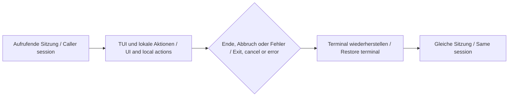

# Feature-Spezifikation: LH-01 — TUI-Grundlage / Feature specification: LH-01 — TUI foundation

**Erstellt / Created:** 2026-10-07. **Status:** technische Planung und begrenzte automatisierte Machbarkeit abgeschlossen; praktische Abnahme offen; keine Produktimplementierungsfreigabe / technical planning and bounded automated feasibility complete; practical acceptance open; no product implementation authorization.
**Feature:** `002-lh01-tui-foundation`. **Git-Branch / Git branch:** `main` (kein neuer Branch / no new branch).
**Profil / Profile:** `show-commandtui400-de-en`. **Owner:** Thorsten Hindermann. **Autor / Author:** Codex `/root`.
**Fachlicher Input / Domain input:** ausschließlich [LH-01](../../intakes/LH-01.md).

## Historische Specify-Eingangsprüfung und Geltungsbereich / Historical Specify input and scope

Vor Erstellung wurden der [Receipt](../intake-authoring-receipts/lh-01.json)
`59f3e085-f12e-4a6e-8347-8a7c11b7c65a` und das [unabhängige Review](../intake-reviews/lh-01/report.md)
`dd62a398-16bc-4382-a4bb-5916cef9dfc2` maschinell als aktuell geprüft.
Das damalige Review genau dieses Intakes war Ready ohne offene Befunde oder angenommene
Risiken; Prüfer war `/root/lh01_independent_review`, nicht der Autor.
Zielbindung: `c16726a57928553c131df49e0f3e6f96ffa417e6e931402d975436232e07343a`.
31 Receipt-Quellen sind gebunden; dies ist Herkunftsprüfung, keine Produktabnahme.
Die historischen Authoring-Status-/Folgeprompttexte im Intake werden nicht als
aktuelles Review oder neue Ausführungsautorität ausgegeben. Constitution und
installierte Vorlagen liefern Governance, keine weiteren fachlichen Features.

The historical receipt and distinct-agent review were validated before initial writing.
That review bound exactly the initial intake and was Ready and has no open findings or accepted
risks. Its reviewer differs from this author. The hash above binds the target;
31 sources provide provenance, not product acceptance. Historical authoring status
and follow-up text remain historical. Constitution and installed templates govern
this specification without adding domain scope from other documents or issues.

Diese Spezifikation umfasst die Textoberfläche im bestehenden Terminal, Start und
Rückkehr in der aufrufenden PowerShell-7-Sitzung, Aktionsverträge, Tastatur,
Hilfe/Fokus/Status, Größenänderung und sichere Wiederherstellung. Kontextverträge
für spätere Aktionen werden beschrieben; fehlende Folgefunktionen bleiben sichtbar
nicht verfügbar. Testbeispiele dürfen keine fertigen Folgefeatures vortäuschen.
Nicht enthalten sind Suche/Modulauflösung (LH-02), Parameterformular (LH-03),
Wertehilfe/Completion/Validierung (LH-04), Aufrufvorschau/-übernahme/-ausführung
(LH-05), Geräteprofile (LH-06) und Geräteadapter (LH-07). Keine Desktop-GUI,
5250-Emulation, Ersatzshell oder versteckte Hintergrundsitzung.

Scope is the terminal UI, same-session entry/return, action contracts, keyboard,
help/focus/status, resizing and safe restoration. Later action contracts expose
unavailable features honestly; fixtures never claim completed later functionality.
Exclude search/module resolution, parameter forms, completion/validation,
invocation preview/transfer/execution, device profiles and adapters from LH-02–07.
No desktop GUI, 5250 emulation, replacement shell or hidden background session.

### Zielgruppe und Begriffe / Audience and terms

Für Owner, Lastenheft-Autoren und spätere Implementierende. Grundkenntnisse von
Dateien, Terminal und PowerShell genügen; Spec-Kit-Kenntnisse oder ein bestimmtes
Ausbildungsjahr werden nicht vorausgesetzt. Spec Kit unterstützt Anforderungen
und technische Planung. Ein Intake ist ein fachliches Lastenheft; ein Receipt
bindet Quellen und Inhalt mit einer SHA-256-Prüfsumme, beweist aber keine
fachliche Richtigkeit. FR bedeutet Anforderung, AC Abnahme, QG Qualitätsregel,
OD offene technische Entscheidung. Gleiche IDs in DE/EN bezeichnen dieselbe Sache.

Eine TUI ist eine Textoberfläche im Terminal. Ein Cmdlet ist ein PowerShell-Befehl.
Ein Runspace ist der Ausführungskontext von PowerShell; Host bezeichnet die
Anwendung, die Sitzung und Ein-/Ausgabe bereitstellt. Fokus ist das aktive
Bedienelement. MSL bedeutet speichersichere Sprache. A11Y steht für
Barrierefreiheit; CEFR B2 für verständliche technische Sprache ohne Spezialwissen.

The audience is the owner, intake authors and later implementers. Basic file,
terminal and PowerShell knowledge is enough; no Spec Kit experience or training
year is assumed. Spec Kit supports requirements and planning. An intake states
requirements; a receipt binds sources and content using SHA-256, without proving
correctness. FR, AC, QG and OD identify requirements, acceptance, quality and
technical decisions; both languages use the same IDs. A TUI is a terminal text
interface. A cmdlet is a PowerShell command; a runspace is its execution context,
and a host provides the session and I/O. Focus identifies the active control.
MSL means memory-safe language; A11Y accessibility; B2 plain technical language.

### Standards und Fachbegriffe / Standards and technical terms

Die folgenden Kurzdefinitionen erklären die danach verwendeten Begriffe;
sie ändern weder Anforderungen noch Anwendbarkeit. Die gebundene Constitution
und Governance-Zuordnung bleiben maßgeblich. / These short definitions explain
terms used below, without changing requirements or applicability. The bound
constitution and governance mapping remain authoritative.

- **NIST SSDF:** Rahmen für sichere Softwareentwicklung des US-Instituts NIST; er ordnet Vorbereitung, Schutz, Entwicklung und Reaktion auf Sicherheitsprobleme.
- **CWE Top 25:** Priorisierte Liste verbreiteter Software-Sicherheitsfehler; CWE bedeutet gemeinsamer Katalog von Fehlertypen.
- **WCAG 2.2 AA:** Richtlinien für barrierefreie Inhalte, Version 2.2, Konformitätsstufe AA; hier nur auf passende Kriterien je Oberfläche angewendet.
- **Mermaid:** Textnotation für Diagramme; deren vollständige Textalternative bleibt auch ohne grafische Darstellung nutzbar.
- **Screenreader / Braille:** Ein Screenreader liest zugängliche Inhalte vor; eine Braillezeile gibt sie als ertastbare Punktschrift aus. Ein Textbrowser zeigt Dokumente als Text.
- **CI:** Automatische Prüfungen im Entwicklungsablauf; grüne Läufe belegen nur tatsächlich ausgeführte Checks.
- **ADR / S-ADR:** Protokoll einer Architekturentscheidung; ein S-ADR dokumentiert eine Sicherheitsentscheidung mit Begründung und Grenzen.
- **arc42:** Gliederungsvorlage für Architekturdokumentation; Abschnitt 8 bündelt übergreifende Konzepte, hier auch Sicherheit.
- **Interop:** Zusammenspiel unterschiedlicher Laufzeiten oder Schnittstellen; dabei gelten eigene Sicherheitsgrenzen.
- **OWASP SAMM:** Modell zur Bewertung und Verbesserung sicherer Entwicklungsprozesse der Sicherheitsorganisation OWASP.
- **CAPEC:** Katalog typischer Angriffsmuster zur Ergänzung eines Bedrohungsmodells, also der Beschreibung möglicher Angriffe und Schutzmaßnahmen.
- **OpenSSF Scorecard:** Werkzeug der Open Source Security Foundation zur Bewertung von Sicherheitspraktiken in offenen Softwareprojekten.
- **ASVS:** OWASP-Katalog prüfbarer Anwendungssicherheitsanforderungen; Anwendbarkeit richtet sich nach dem tatsächlichen Dienstumfang.
- **HTTP / API:** HTTP ist ein Protokoll für Webkommunikation; eine API ist eine programmatisch nutzbare Schnittstelle.
- **SBOM / AI-SBOM:** Software-Stückliste von Komponenten; AI-SBOM ergänzt gegebenenfalls Angaben zu KI-Komponenten. KI/AI bedeutet künstliche Intelligenz.
- **Cloud / BSI C3A / C5:** Cloud bezeichnet extern bereitgestellte IT-Dienste. BSI ist das deutsche Bundesamt für Sicherheit in der Informationstechnik. C3A bewertet selbstbestimmte Cloudnutzung und Anbieterabhängigkeiten; C5 beschreibt Kriterien zur Absicherung von Cloud-Diensten.
- **Zero Trust:** Sicherheitsansatz ohne pauschales Vertrauen allein aufgrund von Standort oder Zugehörigkeit; Zugriffe werden entsprechend ihrer Anforderungen geprüft.
- **Provenance / Abhängigkeitsaudit:** Herkunftsnachweis für Software und deren Erstellung beziehungsweise Prüfung verwendeter Komponenten und ihrer Risiken.
- **SDK / Remapping / Fixture:** Ein SDK ist ein Paket zur Entwicklung für eine bestimmte Schnittstelle. Remapping ändert Tastenbelegungen; eine Fixture ist ein festgelegtes isoliertes Testbeispiel.

- **NIST SSDF:** A secure-development framework from the US institute NIST, covering preparation, protection, production and response to security problems.
- **CWE Top 25:** A prioritized list of common software weaknesses; CWE is a shared catalogue of weakness types.
- **WCAG 2.2 AA:** Accessibility guidelines version 2.2 at level AA, applied here only to relevant criteria for each surface.
- **Mermaid:** Text notation for diagrams; equivalent complete text remains usable without graphical rendering.
- **Screen reader / Braille:** A screen reader speaks accessible content; a Braille display presents tactile dots. A text browser presents documents as text.
- **CI:** Automated development checks; passing runs prove only the checks actually performed.
- **ADR / S-ADR:** An architecture decision record; a security ADR records a security decision, rationale and limits.
- **arc42:** An architecture documentation outline; section 8 groups cross-cutting concepts, including security here.
- **Interop:** Cooperation between runtimes or interfaces, requiring explicit security boundaries.
- **OWASP SAMM:** A model from the OWASP security organisation for assessing and improving secure-development processes.
- **CAPEC:** A catalogue of typical attack patterns that supports threat modeling, the description of attacks and protection measures.
- **OpenSSF Scorecard:** A tool from the Open Source Security Foundation for assessing open-source security practices.
- **ASVS:** An OWASP catalogue of testable application-security requirements; applicability depends on actual service scope.
- **HTTP / API:** HTTP is a web communication protocol; an API is a programmatic interface.
- **SBOM / AI-SBOM:** A software component inventory; AI-SBOM adds information about AI components where applicable. AI means artificial intelligence.
- **Cloud / BSI C3A / C5:** Cloud means externally provided IT services. BSI is Germany's Federal Office for Information Security. C3A assesses autonomous cloud use and provider dependence; C5 defines cloud-security assurance criteria.
- **Zero Trust:** A security approach without blanket trust based only on location or membership; access is checked against its requirements.
- **Provenance / dependency audit:** Evidence of software origin and production, or assessment of used components and their risks.
- **SDK / remapping / fixture:** An SDK is a development kit for an interface; remapping changes key bindings; a fixture is a defined isolated test example.

## Nutzerszenarien und Prüfung / User scenarios and testing

### US-01 — In derselben Sitzung starten und zurückkehren / Start and return in the same session (P1)

Als PowerShell-Nutzer öffne ich die TUI im bestehenden Terminal und kehre ohne
verdeckte neue Sitzung zurück. Priorität P1: Ohne verlässliche Sitzungs- und
Terminalgrenzen ist die Grundlage nicht sicher nutzbar. Unabhängiger Test:
E01-01/E01-04 mit synthetischem Kontext, ohne Suche oder Parameterformular.

As a PowerShell user I open the UI in the current terminal and return without a
hidden replacement session. P1 because session and terminal integrity are essential.
Test independently with synthetic context under E01-01/E01-04, without later features.

1. **Gegeben** dokumentierte synthetische Variable, Funktion, Arbeitsort und Sitzungseinstellung, **wenn** ich öffne und regulär schließe, **dann** bleiben Sitzungsidentität und zulässiger Kontext erhalten; sichtbare Scope-Grenzen werden benannt. / **Given** recorded synthetic caller context, **when** I open and close normally, **then** identity and allowed context remain, with documented visibility boundaries.
2. **Gegeben** geänderte Eingabemodi/Cursor während der TUI, **wenn** ich abbreche oder ein behandelbarer Fehler auftritt, **dann** ist die Shell wieder bedienbar und der vorherige Terminalzustand wiederhergestellt. / **Given** UI input/cursor changes, **when** cancelled or a handled error occurs, **then** the shell is usable and prior terminal state restored.
3. **Gegeben** umgeleitete Streams oder eine ungeeignete Host-/Terminalkombination, **wenn** der Start versucht wird, **dann** gilt der nach OD-01-001 belegte sichere Vertrag; kein stiller Sessionersatz. / **Given** redirected streams or an unsuitable host/terminal, **when** entry is attempted, **then** the evidenced OD-01-001 safe contract applies without silent session substitution.

### US-02 — Aktionen vollständig per Tastatur erreichen / Reach actions entirely by keyboard (P1)

Als Nutzer erreiche ich Hilfe, Navigation, Aktualisieren, Zurück und Beenden
über erkennbare Aktionen. Priorität P1: Die Textoberfläche muss ohne Maus nutzbar
sein. Unabhängiger Test: E01-02 mit isolierter Liste/Feldansicht; spätere
Formularaktionen bleiben sichtbar nicht verfügbar.

As a user I reach help, navigation, refresh, back and exit through clear actions.
P1 because the UI must work without a mouse. E01-02 uses an isolated list/field
fixture; later form actions stay visibly unavailable.

1. **Gegeben** gültiger Kontext, **wenn** ich Tab/Umschalt+Tab oder Pfeil-/Bildtasten nutze, **dann** folgt der Fokus nachvollziehbar, ohne Zielbefehlsausführung. / **Given** valid context, **when** navigating, **then** focus follows a predictable order without target-command execution.
2. **Gegeben** eine nicht übertragene Funktionstaste, **wenn** ich die sichtbare Ersatzaktion nutze, **dann** wirkt dieselbe fachliche Aktion; Hilfe, Zurück und Beenden bleiben erreichbar. / **Given** an intercepted function key, **when** using its visible alternative, **then** the same action occurs and help/back/exit stay reachable.
3. **Gegeben** unbekannte oder unverfügbare Aktion, **wenn** sie ausgelöst wird, **dann** ist Nichtverfügbarkeit textuell erkennbar und es erfolgt keine fachliche Nebenwirkung. / **Given** an unknown or unavailable action, **when** requested, **then** its state is clear in text and it causes no domain effect.
4. **Gegeben** lokaler Bearbeitungsstand, **wenn** Enter bestätigt, F5 aktualisiert oder Esc/F12 zurückführt, **dann** gelten getrennte Kontextverträge und der Stand bleibt erhalten; Enter führt keinen Zielbefehl aus. / **Given** local edits, **when** confirming, refreshing or going back, **then** separate contracts preserve state and Enter executes no target command.

### US-03 — Zustand und Grenzen zugänglich verstehen / Understand accessible state and limits (P1)

Als Nutzer mit Tastatur, Screenreader oder Braille erkenne ich Fokus, verfügbare
Aktionen, Hilfe, Beschäftigtzustand und Fehler als Text. Priorität P1: Zugang
ist Teil der Grundlage. Unabhängiger Test: E01-03/E01-05 mit benannten Hilfsmitteln
und dem vereinbarten Terminal, ohne Folgefeatures.

As a keyboard, screen-reader or Braille user I understand focus, available actions,
help, busy state and errors in text. P1 because access is part of the foundation.
Test E01-03/E01-05 with named assistive tools and terminals, without later features.

1. **Gegeben** ausgeblendete Farbbedeutung, **wenn** Fokus oder Zustand wechselt, **dann** bleiben Aktionsname, Fokus, Status und Fehler verständlich. / **Given** no colour cues, **when** focus/state changes, **then** action, focus, status and errors remain understandable.
2. **Gegeben** Verkleinern/Vergrößern des Fensters, **wenn** ich weiter navigiere, **dann** bleiben lokale Werte und Fokuszuordnung erhalten. / **Given** window resize, **when** navigating, **then** local values and focus identity remain.
3. **Gegeben** eine nicht bedienbare Fenstergröße, **wenn** Darstellung nicht möglich ist, **dann** wird dies textuell erklärt und sichere Rückkehr ist per Tastatur erreichbar. / **Given** unusable dimensions, **when** rendering is unavailable, **then** text explains the limit and keyboard exit remains reachable.

### Randfälle / Edge cases

Abgefangene Funktionstasten, Ersatzbelegungen ohne erreichbare Beenden-Aktion,
ungültiger Aktionskontext, wiederholtes Zurück auf oberster Ebene, Resize während
Bearbeitung, fehlende Terminalfähigkeiten, umgeleitete Streams, Steuerzeichen in
synthetischen Anzeigetexten und behandelbare Fehler gehören in E01-01–06.
Kein Randfall legitimiert automatische Codeauswertung, Import, Netzabfrage oder
Ausführung. Verhalten bei externem Prozessabbruch/Hostausfall ist eine ausdrücklich
zu dokumentierende Wiederherstellungsgrenze, keine erfundene Garantie.

Cover intercepted keys, unreachable exit after remapping, invalid action context,
back at the root, resizing during edits, missing terminal capabilities, redirected
streams, synthetic display control characters and handled errors under E01-01–06.
None permits automatic evaluation, import, network access or execution. External
termination/host failure is a documented restoration limit, not a claimed guarantee.

## Anforderungen / Requirements

### Funktionale Anforderungen / Functional requirements

Die folgenden Zeilen erhalten Inhalt und IDs des Intakes; DE/EN sind Übersetzungen
desselben Vertrags. / These lines preserve the intake requirements and IDs; both
languages describe the same contract.

- **FR-01-001:** macOS, Linux und Windows mit geeigneten Terminals einschließlich Windows Terminal berücksichtigen; keine Desktop-GUI voraussetzen.
- **FR-01-002:** Ein gemeinsames Aktionsmodell für Tastatur und optionale Geräte definieren.
- **FR-01-003:** F1 Hilfe, F3 Beenden, F4 kontextbezogene Eingabehilfe, F5 Aktualisieren, F9 alle Parameter, F10 weitere Parameter, F11 Details sowie F12/Esc Zurück vorsehen.
- **FR-01-004:** Funktionstasten remappbar machen und sichtbare Alternativen anbieten; Eingabe, Auswahl und Ausführung als getrennte Aktionen modellieren.
- **FR-01-005:** Terminalzustand bei regulärem Ende, Abbruch und Fehler wiederherstellen; Resize und zu kleine Fenster behandeln.
- **FR-01-006:** Das Einstiegscmdlet an die aufrufende PowerShell-Sitzung binden; bei Rückkehr die Sitzungsidentität erhalten und Grenzen des sichtbaren Aufruferkontexts dokumentieren. Kein unbemerkter Ersatz durch eine zweite Sitzung.
- **FR-01-007:** Tab/Umschalt+Tab für Felder, Pfeil-/Bildtasten für Listen und Enter zum kontextbezogenen Bestätigen anbieten; Esc/F12 führt eine Ebene zurück und erhält den lokalen Bearbeitungsstand. Enter wechselt nicht still zum nächsten Feld und führt keinen Zielbefehl aus.
- **FR-01-008:** Aktionsname, Verfügbarkeit, Fokus, Beschäftigtzustand und Fehler vollständig textuell erkennbar machen; eine sichtbare kontextbezogene Legende und tastaturbedienbare Alternativen für nicht übertragene Funktionstasten bereitstellen.
- **FR-01-009:** Auswählen, Bearbeiten, Bestätigen, Aktualisieren, Zurück und spätere Ausführung als getrennte fachliche Aktionen mit gültigem Kontext führen; unbekannte oder aktuell unverfügbare Aktionen dürfen keine Wirkung auslösen.
- **FR-01-010:** Resize und zu kleine Fenster ohne Verlust des lokalen Bearbeitungsstands behandeln; bei nicht bedienbarer Darstellung verständlich informieren und eine tastaturbedienbare sichere Rückkehr zur Shell anbieten.
- **FR-01-011:** Bei regulärem Schließen, Nutzerabbruch und behandelbarem Fehler veränderte Terminal-/Eingabemodi und sichtbaren Cursor wiederherstellen; verbleibende Grenzen bei externem Prozessabbruch oder Hostausfall ausdrücklich dokumentieren.

- **FR-01-001:** Support macOS, Linux and Windows with suitable terminals, including Windows Terminal; do not require a desktop GUI.
- **FR-01-002:** Define a shared action model for the keyboard and optional devices.
- **FR-01-003:** Provide F1 help, F3 exit, F4 contextual input assistance, F5 refresh, F9 all parameters, F10 more parameters, F11 details and F12/Esc back.
- **FR-01-004:** Allow function-key remapping and show alternatives; model input, selection and execution as separate actions.
- **FR-01-005:** Restore terminal state after normal exit, cancellation and failure; handle resize and windows that are too small.
- **FR-01-006:** Bind the entry cmdlet to the calling PowerShell session, preserve session identity on return and document caller-scope visibility boundaries; never silently substitute a second session.
- **FR-01-007:** Provide Tab/Shift+Tab for fields, arrow/page keys for lists and Enter for contextual confirmation; Esc/F12 returns one level while retaining local editing state. Enter neither silently moves fields nor executes a target command.
- **FR-01-008:** Expose action name, availability, focus, busy state and errors in text; provide a visible contextual legend and keyboard alternatives for function keys the terminal does not transmit.
- **FR-01-009:** Separate selection, editing, confirmation, refresh, back and future execution into context-bound domain actions; unknown or unavailable actions must have no effect.
- **FR-01-010:** Handle resize and small windows without losing local editing state; explain an unusable display and provide keyboard-operated safe return to the shell.
- **FR-01-011:** Restore changed terminal/input modes and cursor visibility on normal exit, user cancellation and handled error; document limits for external process termination or host failure.

### Tasten- und Aktionsvertrag / Key and action contract

| Eingabe / Input | Wirkung / Effect | Grenze / Boundary |
|---|---|---|
| F1 | Kontexthilfe / contextual help | Hilfe bleibt per Tastatur zugänglich / keyboard-accessible help |
| F3 | TUI verlassen / exit UI | Keine Zielbefehlsausführung / no target execution |
| F4 | Kontextbezogene Hilfe/Formular / contextual assistance/form | Spätere fachliche Bearbeitung gehört LH-02–04 / later domain handling belongs to LH-02–04 |
| F5 | Aktualisieren, Eingaben erhalten / refresh, retain inputs | Kein Reset oder versteckter Import / no reset or hidden import |
| F9 / F10 | Alle / weitere Parameter / all / more parameters | Nur im passenden Formularkontext; LH-03 / only in form context, LH-03 |
| F11 | Fachliche/technische Details umschalten / toggle domain/technical details | Kein universeller Ausführungsbefehl / no universal execution action |
| F12 / Esc | Eine Ebene zurück / back one level | Bearbeitungsstand erhalten / retain local state |
| Tab / Shift+Tab | Nächstes/vorheriges Feld / next/previous field | Fokusfolge nachvollziehbar / predictable focus order |
| Pfeil / Bild / arrow / page keys | Listennavigation / list navigation | Keine automatische Auswahl-/Ausführungswirkung / no implicit confirmation/execution |
| Enter | Kontextbezogene Auswahl/Bestätigung / contextual confirmation | Keine automatische Zielausführung / no automatic target execution |

Konkrete Ersatzbelegung, Aktionsmenütaste und Terminalmatrix werden in OD-01-001
belegt. Remapping muss eine weiterhin erreichbare Hilfe-/Zurück-/Beenden-Aktion
und die sichtbare Legende erhalten. Optionale Geräte nutzen später denselben
Aktionsvertrag; die Geräteanbindung selbst gehört nicht zu LH-01.

OD-01-001 establishes actual alternate bindings, action-menu key and terminal
matrix. Remapping keeps help/back/exit reachable and updates the legend. Later
optional devices share this action contract; device connectivity is outside LH-01.

### Qualitätsregeln / Quality rules

- **QG-01-001:** DE zuerst/EN danach, ungefähr CEFR B2; gleiche Bedeutung und IDs, Begriffe bei erster Verwendung erklären.
- **QG-01-002:** Alle anwendbaren Zeilen G01–G12 der Governance-Zuordnung übernehmen, Nachweisfälle zuordnen und N/A begründen. NIST SSDF und CWE Top 25 bleiben anwendbar.
- **QG-01-003:** WCAG 2.2 AA soweit passend; Tastatur, Screenreader, Braille und Textbrowser sowie Status-/Fehlertext berücksichtigen. Fokus, Tastenalternativen, zu kleines Terminal und Rückkehr zur Shell werden ohne Maus sowie mit Screenreader/Braille geprüft; nicht ausgeführte Fälle bleiben offen.
- **QG-01-004:** Risiken, Datenschutz, Zustandsverlust, Plattformgrenzen und Fehlerpfade prüfbar erfassen. Behauptete Nachweise mit Quelle, Version, Ergebnis und Grenze belegen; keine Frameworkentscheidung erfinden.
- **QG-01-005:** Hilfreiche Abläufe mit Mermaid und gleichwertiger Textalternative beschreiben; Nichtanwendung begründen. Authoring-, Review-, Prozess- und Produktabnahme getrennt halten.

- **QG-01-001:** German first, English second, about CEFR B2; matching meaning and IDs, with terms explained on first use.
- **QG-01-002:** Apply all relevant G01–G12 governance rows, assign evidence cases and justify N/A. NIST SSDF and CWE Top 25 remain applicable.
- **QG-01-003:** Apply relevant WCAG 2.2 AA criteria; consider keyboard, screen readers, Braille, text browsers and status/error text. Test focus, key alternatives, a small terminal and shell restoration without a mouse and with screen-reader/Braille access; unexecuted cases remain open.
- **QG-01-004:** Make risks, privacy, state loss, platform limits and failure paths testable. Support claimed evidence with source, version, outcome and boundary; invent no framework decision.
- **QG-01-005:** Describe useful flows with Mermaid and equivalent text; justify omission. Keep authoring, review, process and product acceptance separate.

### Constitution-Anforderungen und Governance / Constitution requirements and governance

Alle G01–G12 bleiben anwendbar. Applicable heißt anwendbar; Open heißt Nachweis
ausstehend; N/A heißt begründet nicht anwendbar. Kein Status bedeutet Produkt-PASS.
Owner ist Thorsten, technische Nachweise erstellt der später beauftragte Autor;
ein anderer Prüfer bewertet sie. Alle offenen Nachweise werden vor Umsetzung oder
vor der jeweils genannten Abnahme erneut bewertet.

All G01–G12 remain applicable. Applicable, Open and justified N/A indicate scope
and evidence state, never product success. Thorsten owns decisions; the later
commissioned technical author produces proof and a distinct reviewer assesses it.
Revisit open proof before implementation or its specified acceptance gate.

| Intake-Zeile / Intake row | Spezifikationsvertrag / Specification contract | Nachweis / Evidence |
|---|---|---|
| G01 | DE/EN, B2, gleiche IDs, Begriffe / matching readable bilingual IDs and terms | QG-01-001; AC-01-005; E01-07 |
| G02 | Tastatur, Screenreader, Braille, Textpfad / assistive access | A11Y-Matrix unten / matrix below; E01-03/05/07 |
| G03 | SSDF/CWE, Eingabe-/Fehlergrenzen / secure input and errors | FR-01-006/009/011; E01-01/04/06 |
| G04 | macOS/Linux/Windows; echte Plattformbelege / actual platform proof | FR-01-001; AC-01-002; E01-01/02/04/05 |
| G05 | Parität bei Guidanceänderung; Leserpfad / future guidance parity, reader path | Agent-Parität / agent parity; E01-07 |
| G06 | Aktueller Receipt und unverändertes Intake / current receipt, unchanged intake | Eingangsprüfung / input verification |
| G07 | Anderes Ready-Review; getrennte Freigaben / distinct Ready review, separate permissions | Eingangsprüfung; QG-01-005 / input check |
| G08 | Einzelpilot; keine Serienaktivierung / standalone pilot, no series activation | Abhängigkeiten unten / dependencies below |
| G09 | Ledger/Renderer erst bei autorisierter Lieferung / statistics at authorized delivery | Dokumentationsauswirkung unten / impact below |
| G10 | Mermaid mit vollständiger Textalternative / equivalent text alternative | Ablauf unten; E01-07 / flow below |
| G11 | Scopebezogene Sicherheits-/Rechtsbewertung / scoped security and legal assessment | Sicherheitsmatrix unten; E01-06 / security matrix below |
| G12 | Historische CI bleibt Werkzeugnachweis / tooling CI stays historical tooling proof | Alle Produktnachweise Open; AC-01-005 / product proof Open |

Die Template-Kontrollen CR-001–014 werden damit abgedeckt: Level-2-Kontext G01/G04,
A11Y/DEEN G01/G02, Statistik/Parität G05/G09, Sprache/MSL technisch entschieden unter OD-01-002,
Standards/Evidence G03/G11, genau eine Dokumentationsentscheidung unten und
macOS-first mit getrennten Plattformbelegen. Das projektspezifische 14er-Profil
bleibt die vorhandene Ausnahme zur generischen Template-Matrix. Beim ursprünglichen
Specify erfolgten keine Installation oder Governanceänderung; die spätere lokale
Ausrichtung T014 steht im aktuellen Startnachweis. Unbekannte Sprache verhindert keine Spezifikation,
aber verlangt belegte Planung vor Produktimplementierung.

Template controls CR-001–014 are covered through the mapped Level-2 context,
accessibility/language, statistics/parity, open language decision, standards/evidence,
one documentation-impact decision and macOS-first platform proof. The installed
fourteen-preset project profile remains the existing exception to generic template
defaults. Initial Specify performed no installation or governance change; later
local T014 alignment is recorded in the readiness evidence. An unknown language permits
specification but requires evidenced planning before product implementation.

Die 14er-Matrix wird nur als vorhandene Governance referenziert: Security,
Secure Development Assurance, Architecture, iSAQB Architecture, A11Y und
Cross-Platform betreffen die geplanten Qualitäts-/Nachweise; Agent Parity bei
späteren gemeinsamen Änderungen, Model Routing bei der Ausführungsplanung;
Intake Authoring/Review binden den Eingang, Sequencing erhält den Einzelpilotweg;
Autonomous und Parallel Autonomous sind für diesen Einzel-Specify-Lauf N/A;
Project Statistics bleibt auf spätere autorisierte Ledger-/Lieferarbeit begrenzt.
Alle Versionen bleiben gemäß gebundener Projektmatrix erhalten. Bei anderem
Laufmodus oder geänderter Governance neu bewerten; keine Preset-Kommandos daraus
automatisch ausführen.

The existing fourteen-preset matrix supplies governance only. Security, Assurance,
Architecture, iSAQB, A11Y and Cross-Platform govern planned quality/evidence;
Agent Parity applies to future shared changes and Model Routing to execution
planning. Intake Authoring/Review bind the input, Sequencing preserves the pilot;
Autonomous and Parallel Autonomous are N/A for this single Specify command.
Project Statistics awaits authorized ledger/delivery work. Versions remain unchanged;
reassess changed governance/run modes without automatic follow-up execution.

### Fachliche Daten und Zustände / Key entities and states

- **Sitzungskontext:** Identität, sichtbarer Aufruferkontext und dokumentierte Scope-Grenzen; keine private Variablenausgabe in Evidence. / **Session context:** identity, visible caller context and documented scope boundaries; no private variable dumps.
- **Aktion:** Name, zulässiger Kontext, Verfügbarkeit und getrennte Wirkung; Tastatur/optionale Geräte teilen denselben Vertrag. / **Action:** name, valid context, availability and separate effect; keyboard/future devices share its contract.
- **Tastenbelegung:** Zuordnung zur Aktion und sichtbare Ersatzbelegung, mit erreichbarer Hilfe/Zurück/Beenden. / **Key binding:** action mapping and visible alternative with reachable help/back/exit.
- **Ansichtszustand:** lokaler Bearbeitungsstand, Fokus, Hilfe/Legende, Status/Fehler und bedienbare Größe. / **View state:** local edits, focus, help/legend, status/errors and usable dimensions.
- **Terminalzustand:** vor dem Start aufgezeichnete veränderte Modi und Cursorzustand, bei Rückkehr wiederherzustellen. / **Terminal state:** prior affected modes/cursor state restored on return.
- **Prüfnachweis:** benannte Plattform/Host/Terminal/Hilfsmittel, Versionen, synthetischer Fall, Erwartung, Ergebnis, Prüfer und Grenzen; bis zum echten Test Open. / **Evidence:** named environment/tools, versions, synthetic case, expectation/outcome, reviewer and limits; Open until tested.

## Erfolgskriterien / Success criteria

### Bestehende Abnahmekriterien / Preserved acceptance criteria

- **AC-01-001:** Die fachlichen Abläufe sind ohne Maus und Zusatzgerät erreichbar.
- **AC-01-002:** Ein Machbarkeitsnachweis dokumentiert Eingabe, Resize, Abbruch und Wiederherstellung auf allen drei Plattformen.
- **AC-01-003:** Die aktuelle Sitzung bleibt erhalten; Architekturentscheidung benennt Runspace-, Host- und Terminalgrenzen.
- **AC-01-004:** Fokus, Tastenalternativen, zu kleines Terminal und Rückkehr zur Shell werden ohne Maus sowie mit Screenreader/Braille geprüft; nicht ausgeführte Fälle bleiben offen.
- **AC-01-005:** Beide Sprachfassungen und die Anforderungs-/Governance-Zuordnung sind vollständig; offene Produktnachweise werden nicht als bestanden dargestellt.

- **AC-01-001:** All domain flows are accessible without a mouse or an additional device.
- **AC-01-002:** A feasibility proof documents input, resize, cancellation and restoration on all three platforms.
- **AC-01-003:** The current session is retained; the architecture decision identifies runspace, host and terminal boundaries.
- **AC-01-004:** Test focus, key alternatives, a small terminal and shell restoration without a mouse and with screen-reader/Braille access; unexecuted cases remain open.
- **AC-01-005:** Both language tracks and the requirement/governance mapping are complete; open product evidence is not presented as passed.

AC-01-003 umfasst den begründeten OD-01-002-Sprach-/MSL-Entscheid mit
Machbarkeitsgrenzen vor Implementierung. Alle Produktkriterien bleiben Open.
Die folgende messbare Konkretisierung ändert keine Schwellen des Intakes.

AC-01-003 includes evidenced language/MSL choice and feasibility limits before
implementation. All product criteria remain Open. The measurable coverage below
does not change intake thresholds.

| Messbarer Erfolg / Measurable outcome | Vollständige Prüfung / Complete verification | Zuordnung / Mapping |
|---|---|---|
| Alle definierten LH-01-Aktionen ohne Maus erreichbar; keine unbekannte/unverfügbare Aktion bewirkt Ausführung / all defined actions accessible, no unintended effects | Jede Aktion, gültiger/ungültiger Kontext und Ersatzbelegung; null unbeabsichtigte Zielausführungen / every action/context/alternative, zero unintended executions | AC-01-001; E01-02/06 |
| Sitzung und Terminal bei jedem regulären Ende, Abbruch und behandelbaren Fehler erhalten / preserve session and restore terminal for all supported exits | Synthetischer Vorher/Nachher-Vergleich in jeder vereinbarten Umgebung / synthetic before/after in every agreed environment | AC-01-002/003; E01-01/04 |
| Größenänderung erhält alle lokalen Testwerte; unbedienbare Größe erlaubt Rückkehr / resize retains all fixture values; unusable size allows exit | Verkleinern/vergrößern und erneute Navigation / shrink/grow and navigate again | AC-01-002/004; E01-05 |
| Aktionen, Fokus, Status und Fehler ohne ausschließliche Farb-/Positionsinformation zugänglich / accessible actions/focus/state/errors without colour/position alone | Jede benannte Screenreader-/Braille-/Tastaturkombination; ungetestete Kombination bleibt Open / each named combination; untested stays Open | AC-01-004; E01-03 |
| DE/EN vollständig gleichwertig; alle 23 FR/AC/QG/OD-IDs und 12 Governance-Zeilen zugeordnet / equivalent languages, all 23 IDs and 12 governance rows covered | E01-07, Begriffe/Links/Textalternativen und unverfälschte Nachweisstände / terms/links/text alternatives and honest proof state | AC-01-005; QG-01-001–005 |

Es gibt keine fachlich bestätigte Zeit-/Leistungsgrenze im Intake; diese
Spezifikation erfindet keine Millisekunden-, Nutzerzahl- oder Erfolgsquoten.
Sie misst vollständige Fallabdeckung, erhaltenen Zustand und null unerlaubte
Wirkungen. Werkzeug-CI ersetzt keine dieser Produkt-/Hilfsmittelprüfungen.

No confirmed latency/load threshold exists in the intake. Do not invent timing,
user-count or satisfaction targets. Measure complete case coverage, state retention
and zero unauthorized effects. Tooling CI substitutes for none of these product tests.

## Annahmen, Abhängigkeiten und offene Entscheidungen / Assumptions, dependencies and open decisions

LH-00 T001–T045 und die dokumentierte T045-Ownerfreigabe erlauben den begrenzten
Einzelpilot. LH-00 bleibt offen; LH-01 steht außerhalb automatischer Serienauswahl.
Dieser Spezifikationslauf aktiviert nichts. LH-02 benötigt eigenen Auftrag,
gültigen Intake/Review und belegten fachlichen Abschluss von LH-01. Volle
LH-00-Prozessabnahme folgt nach LH-02 vor LH-03 mit Mac A/B, Windows 11,
Ubuntu/WSL2, praktischer A11Y, Übersetzungen und angewendeter Registerausrichtung.

Delivered LH-00 core tasks and owner-granted T045 permit the limited standalone
pilot. LH-00 stays open and LH-01 outside automated series selection. This run
activates nothing. LH-02 requires its own authority, current intake/review and
LH-01 domain completion. Full LH-00 acceptance remains after LH-02/before LH-03,
including four environments, accessibility, translations and registry alignment.

- **OD-01-001 — Decided:** Framework, minimale PowerShell-Version, Terminalmatrix und Verhalten bei umgeleiteten Streams festlegen. Im technischen Plan zusätzlich konkrete Host-/Runspace-Integration, sichere Nichtinteraktivitätsbehandlung und Ersatzbelegung/Aktionsmenütaste belegen. Owner Thorsten; Autor des späteren technischen Plans, anderer Reviewer; fällig vor Produktimplementierung.
- **OD-01-002 — Decided:** Primäre Implementierungssprache und MSL-Bewertung im technischen LH-01-Plan mit Architektur-/Machbarkeitsnachweis festlegen. C# ausdrücklich prüfen; keine Ableitung aus RiderProjects, Wartungs-.NET oder SDK-Beispielen. Runtime/.NET-Version, Framework, PowerShell-Minimum und Sitzung getrennt entscheiden. Owner Thorsten; späterer technischer Autor/Reviewer; fällig vor Produktimplementierung. Bei anderer als MSL-Sprache die Constitution-Begründungspflicht erfüllen.

- **OD-01-001 — Decided:** Decide framework, minimum PowerShell, terminal matrix and redirected-stream behavior. Later planning also evidences host/runspace integration, safe non-interactive behavior, alternate keys and action-menu key. Thorsten owns the decision; future technical author and distinct reviewer provide proof before implementation.
- **OD-01-002 — Decided:** Record primary language/MSL in technical LH-01 planning with architecture/feasibility. Explicitly assess C#; RiderProjects, maintenance .NET and SDK samples make no choice. Decide runtime/framework/PowerShell/session integration separately. Thorsten owns it; future author/reviewer supply evidence before implementation. A non-MSL choice needs constitution-required justification.

Die ursprünglichen Entscheidungsaufträge oben behalten IDs und fachlichen Umfang.
Aktuelle technische Auflösung: [getrennte Entscheidungen](feasibility/decisions.md)
im Plan mit experimenteller Evidence und anderem Review. C#14 managed, .NET10,
PowerShellminimum7.6.4, Terminal.Gui2.5.0 dotnet-Treiber und In-process-Session
sind gewählt. Praktische Nachweise gemäß
[Ownergrenzen](feasibility/owner-validation-boundaries.md) bleiben ungeprüft;
AC-/QG-Anforderungen werden dadurch nicht als erfüllt erklärt.

The original decision tasks above retain IDs/domain scope. Linked separate
planning decisions resolve them with experimental evidence and distinct review:
managed C#14, .NET10, minimum PS7.6.4, Terminal.Gui2.5.0 dotnet and in-process
session. Owner-limited practical proof remains untested; AC/QG are not declared met.

Risiken: Aufrufersichtbarkeit, abgefangene Tasten, unzugängliche Vollbilddarstellung,
Terminalzustandsverlust, unerlaubte Aktionswirkung und unvollständige Plattformbelege.
Gegenmaßnahmen sind E01-01–07 und die belegten OD-Entscheidungen. Keine Risikoannahme.
Die Eingangsprüfung ist zeitpunktbezogen; vor jedem Folgelauf erneut prüfen.

Risks are caller visibility, intercepted keys, inaccessible full-screen output,
lost terminal state, unintended action effects and incomplete platform proof.
Cases E01-01–07 and evidenced decisions provide mitigations, with no accepted risks.
Input freshness is point-in-time and must be checked again before the next run.

## Ablauf und Textalternative / Flow and text alternative

Textalternative: Die aufrufende Sitzung öffnet die TUI. Lokale Aktionen verändern
nur ihren gültigen Kontext. Ende, Abbruch und behandelbarer Fehler führen über
Terminalwiederherstellung zurück in dieselbe Sitzung. Externer Prozessabbruch und
Hostausfall bleiben dokumentierte Grenzen. Der Pilotweg ist separat oben erklärt.

Text alternative: the caller opens the UI; local actions affect only their valid
context. Exit, cancel and handled failure restore the terminal and return to the
same session. External termination and host failure have documented limits.
The standalone pilot dependencies are described separately above.

## Historische Specify-Grenze für Autonomous / Historical Specify autonomous boundary

N/A für autonomes Ausführen, Delivery-Set, Gate-Tokens, Run-State, Resume und
Retrospektive: nur Specify beauftragt, keine Änderungen an Orchestrierungsverträgen.
Erneut bewerten erst bei eigenem Autonomous-Auftrag. Konkrete Laufautorität:
aktueller Nutzerauftrag, lokale Spezifikation mit Checkliste und Feature-Zeiger;
keine Commits, Pushes, Remote-Writes, Serienmutation oder Umsetzung. Keine
Completion-Report-Datei, weil dies kein vollständig abgeschlossener Feature-Lauf ist.

Autonomous execution, delivery sets, gate tokens, run state/resume and retrospective
are N/A: only Specify is commissioned, without orchestration changes. Reevaluate
on separate autonomous authority. Current authority covers local specification,
quality checklist and feature pointer only. No implementation, delivery or series
mutation. A standalone Specify phase does not create a feature completion report.

## Historische Specify-Grenze für Agent-Parität / Historical Specify agent parity boundary

N/A für Änderungen an gemeinsamer Guidance, Constitution, Vorlagen oder Routing:
der Lauf erstellt ausschließlich Feature-Spezifikation und zugehörige Prüfliste.
Bei späteren gemeinsamen Regeländerungen alle fünf Flächen synchron pflegen:
AGENTS.md, CLAUDE.md, GEMINI.md, .github/copilot-instructions.md und
.github/agents/copilot-instructions.md. Heute keine Abweichung oder Aktualisierung.

Shared guidance, constitution, templates and routing changes are N/A for this
feature-local run. Future shared rule changes update all five named surfaces in
parallel. No intentional deviation or shared update is created today.

## Cross-Platform-Anwendbarkeit / Cross-platform applicability

Applicable: spätere Produkt-TUI in PowerShell 7 auf macOS, Linux und Windows,
einschließlich Windows Terminal. Cmdletname aus Intake: `Show-CommandTui400`;
keine Schnittstellensignatur wird jetzt festgelegt. Mac A ist MacBook Air M2 (2023)
und erster Entwicklungsort, Mac B weitere macOS-Umgebung; Windows 11 nativ und
Ubuntu 24.04 unter WSL2 getrennt nachweisen. Die konkrete Host-/Terminalmatrix und
PowerShell-Mindestversion bleiben OD-01-001. AC-01-002 verlangt Machbarkeit auf
allen drei Plattformen vor Produktimplementierung; kein Frameworkversprechen genügt.

Applicable: future PowerShell 7 UI on macOS/Linux/Windows, including Windows
Terminal. Intake cmdlet name is Show-CommandTui400; signature remains unspecified.
Develop macOS-first on identified Mac A, then evidence Mac B, native Windows 11
and Ubuntu 24.04/WSL2 separately. OD-01-001 resolves hosts/terminals and minimum
version. All three platforms require feasibility before product implementation.

N/A für neue Bash-/PowerShell-Wartungsskriptpaare, man-Page eines Bash-Werkzeugs
und --dry-run/-WhatIf-Parität: LH-01 ist Sitzungs-TUI, kein neues Wartungsskript.
Es führt keinen Zielbefehl aus. Bilinguale Cmdlet-/Bedienhilfe bleibt anwendbar.
Erneut bewerten, wenn der Plan zusätzliche skriptförmige Werkzeuge oder schreibende
Befehle vorschlägt; solche Werkzeuge benötigen passende eigene Autorität.

New maintenance script pairs, a Bash tool man-page and dry-run/WhatIf parity are
N/A for the session UI, which executes no target command. Bilingual cmdlet/usage
help remains applicable. Reevaluate if later planning proposes script-shaped tools
or writing commands, requiring matching authority.

## Barrierefreiheit / Accessibility applicability

Betroffen sind TUI, Hilfe/Legende, Fokus-/Status-/Fehlertexte sowie diese Markdown-
Dokumentation. DE/EN mit B2-Erklärungen; volle Textalternative ohne Diagrammrendering.
WCAG 2.2 AA wird auf passende Oberflächenkriterien bezogen, nicht als pauschale
Terminalzertifizierung behauptet. Folgende Matrix legt Prüfung und N/A-Grenzen fest;
der konkrete praktische Nachweis bleibt Open in `docs/accessibility/`.

Affected surfaces are UI, help/legend, focus/status/error text and Markdown.
Use readable DE/EN and full text access without rendered diagrams. Apply relevant
WCAG 2.2 AA criteria by surface rather than claim blanket terminal certification.
The matrix defines tests and scope; actual evidence under docs/accessibility stays Open.

| Oberfläche / Surface | Kriterien / Criteria | Prüfschritt / Test | Status und Grenze / State and limit |
|---|---|---|---|
| TUI-Navigation / navigation | 2.1.1, 2.1.2, 2.4.3 | Alle Aktionen, Ersatzbelegung, Hilfe/Zurück/Beenden, Fokusfolge ohne Maus / all actions and focus paths without mouse | Applicable; E01-02/03; Open |
| Fokus/Legende / focus/legend | 2.4.7, 2.4.11, 1.4.1 | Fokus sichtbar und nicht verdeckt, bei Resize; Bedeutung ohne Farbe / visible unobscured focus on resize, no colour-only meaning | Applicable; E01-03/05; Open |
| Fehler/Zustand / errors/state | 3.3.1, 3.3.3, 4.1.2, 4.1.3 | Textliche Fehler, zugängliche Namen/Rollen/Zustände soweit Host unterstützt; Hilfsmittel ohne erzwungenen Fokuswechsel / accessible error/status semantics within host support | Applicable; E01-03/06; Hostgrenzen in OD-01-001 belegen / evidence host limits; Open |
| TUI-Kontrast / UI contrast | 1.4.3 | Benannte Farb-/Terminalkonfiguration messen, Bedeutung zusätzlich textuell / assess named terminal colours plus text | Applicable soweit Darstellung kontrolliert; nicht pauschal N/A / where rendering is controlled; Open |
| Dokumentation / documentation | 1.1.1, 1.3.1, 2.4.2, 2.4.6, 3.1.1/3.1.2 | Vollständige Textalternative, Überschriften/Links und Sprachabschnitte, Textbrowser lesen / text alternative, headings/links/languages, text-browser reading | Applicable; E01-07; Sprachmarkup soweit Renderer unterstützt / language markup within renderer support |
| Nur Mauszielgrößen / pointer-only sizes | 2.5.8 | Kein zusätzliches Zeigegerät erforderlich / no pointer requirement | N/A für reine Tastatur-TUI; bei Zeigeroberfläche neu bewerten / keyboard-only UI; revisit pointer surface |

Screenreader und Braille müssen mit benannten Kombinationen praktisch geprüft
werden. Textausgabe allein genügt nicht. Ein HTML-/DOM-spezifischer Mechanismus (Web-Markup bzw. Dokumentobjektmodell)
ist N/A für reine Terminaldarstellung; erforderliche funktionale Zugänglichkeit
bleibt anwendbar. Codekommentare sind in diesem codefreien Specify-Lauf N/A;
bei späterer nichttrivialer Logik Gründe/Grenzen gemäß Governance erklären.

Named screen-reader/Braille combinations need practical tests; plain text alone
is insufficient. HTML/DOM-specific mechanisms (web markup/document object model) are N/A for terminal rendering,
without removing functional access requirements. Code comments are N/A in this
code-free phase; later non-trivial code explains rationale and limits.

## Architektur-Anwendbarkeit / Architecture applicability

Applicable für Systemkontext, Schnittstellen, Laufzeit, Plattform-/Qualitätsgrenzen
und sichere Rückkehr. Architekturziele sind Sitzungsidentität, vorhersehbare Aktionen,
zugängliche Zustände und sichere Wiederherstellung. US-01–03 bilden Qualitätsszenarien.
Vor Umsetzung erwartet: technische Entscheidungen unter `docs/architecture/`,
allgemeine ADRs für OD-01-001/002 und klare Trennung von Sprache, Runtime,
Framework, PowerShell-Minimum, Session/Host/Terminal. ADR bedeutet begründetes
Entscheidungsprotokoll. Historischer Specify-Stand: noch kein gewählter Architekturentwurf
oder Machbarkeitsprototyp. Aktuell liegen die getrennten technischen Entscheidungen
und der unabhängig geprüfte isolierte Machbarkeitsaufbau vor; deren Grenzen stehen
in `feasibility/decisions.md`. Die genannten Architektur-ADRs und Startnachweise
bleiben vor Produktimplementierung zu erstellen.

Applicable to context, interfaces, runtime, platform/quality boundaries and safe
return. Goals are identity, predictable actions, accessible state and restoration;
US-01–03 are quality scenarios. Before implementation expect architecture evidence
and separate ADR decisions under docs/architecture. Record language, runtime,
framework, PowerShell minimum and session/host/terminal independently. At the
historical Specify stage, no architecture choice or feasibility prototype existed.
Separate choices and an independently reviewed isolated setup now exist, bounded
by feasibility/decisions.md. Formal architecture ADRs and readiness evidence still
precede product implementation.

## Sichere Architektur / Architecture governance applicability

Vertrauensgrenzen: Terminalereignisse → Aktionsvertrag; aufrufende Sitzung →
zugelassener Kontext; lokale Anzeigewerte → Terminal; spätere Aktion → mögliches
Folgefeature. Öffentliche Hilfe ist öffentlich; echter Sitzungskontext kann privat
sein, daher Nachweise synthetisch/lokal. Keine Sitzungsdaten persistent speichern,
verdeckte Netzabfrage, Text als Code auswerten oder Zielbefehl durch Navigation,
Remapping oder Refresh auslösen. Steuerzeichen sicher anzeigen, Ereignisse und
Kontext validieren. Behandelbare Fehler müssen sichere Rückkehr ermöglichen.

Trust boundaries are terminal events to actions, caller session to allowed context,
display data to terminal and future action to later feature. Help is public; actual
session data may be private, so proof uses synthetic local data. No hidden storage,
network query, code evaluation or target execution through navigation/remapping/
refresh. Validate inputs/context and handle control characters and errors safely.

Applicable/Open vor Implementierung: scopebezogenes Bedrohungsmodell, arc42-
Sicherheitskonzepte, S-ADRs in `docs/security/adr/`, Prüfung unsicherer Grenzen/Interop,
CAPEC-Muster und SAMM-Einstufung. Als Governance-Methode sind STRIDE
(Kategorien möglicher Bedrohungen) und CIA (Vertraulichkeit, Integrität und
Verfügbarkeit) im späteren Nachweis zu berücksichtigen. Bedrohungsanalyse bewertet mögliche Angriffe
und Schutz, keine neuen Produktfunktionen. Kein verteiltes/Cloudprodukt:
Zero Trust und C3A/C5 für Produktbetrieb N/A; bei Remote-/Cloud-/Providerabhängigkeit
neu bewerten. Cloudnutzung von Werkzeugen/Organisation getrennt prüfen; diese
Spezifikation erteilt keine Rechts-, Cloud-, Audit- oder Zertifikatsfreigabe.

Applicable/Open before implementation: scoped threat model, arc42 security concepts,
security ADRs under docs/security/adr, unsafe-boundary review and CAPEC/SAMM
assessment. Later evidence considers the governance method STRIDE (threat
categories) and CIA (confidentiality, integrity, availability). No distributed/cloud product is introduced, so product Zero Trust and
C3A/C5 are N/A; revisit remote/cloud/provider scope. Assess tooling/organisation
separately. No legal, cloud, audit or certification approval is granted.

## Sicherheits-Governance / Security governance applicability

Primärsprache und MSL sind im technischen Plan unter OD-01-002 entschieden:
managed C#14. MSL bedeutet speichersichere Sprache für eigenen managed Code;
native Grenzen werden separat bewertet. Nach Entscheidung gelten
die passenden sicheren Sprach-/Frameworkregeln und Interop-Grenzen. Eine Nicht-MSL-
Wahl braucht die Constitution-Begründung mit konkretem Zwang. Owner Thorsten,
Planungsautor/anderer Reviewer, fällig vor Implementierung, erneut bei Runtime-wechsel.

Primary language/MSL is selected under OD-01-002: managed C#14, with separate
assessment of native boundaries. Apply language/framework rules and unsafe-interface review after
selection. A non-MSL choice needs the constitution rationale naming its constraint.
Thorsten owns it; planning author/distinct reviewer provide proof before implementation
and revisit on runtime changes.

SBOM ist eine Komponentenliste, VEX eine Aussage zur Betroffenheit durch bekannte
Schwachstellen; Provenance belegt Herkunft, SLSA beschreibt Buildintegrität.

SBOM inventories components; VEX states known-vulnerability impact, provenance
records origin and SLSA concerns build integrity.

DS-GVO bezeichnet die Datenschutz-Grundverordnung, KI-VO die Verordnung über
künstliche Intelligenz, CRA den Cyber Resilience Act, NIS2 Regeln zur
Cybersicherheit und DORA Regeln zur digitalen Resilienz im Finanzsektor.
Diese Bezeichnungen legen keine Anwendbarkeit oder rechtliche Entscheidung fest.

GDPR concerns personal-data protection, the AI Act artificial intelligence,
CRA cyber resilience, NIS2 cybersecurity and DORA digital operational resilience
in finance. These names establish no applicability or legal decision.

| Standard / Standard | Zustand und Begründung / State and rationale | Erwarteter Nachweis und Trigger / Expected proof and trigger |
|---|---|---|
| NIST SSDF, CWE Top 25 | Applicable; sicherer Entwicklungsprozess und Fehlertypen / secure development and weakness review | `docs/security/` Checkliste; E01-06; vor Umsetzung / checklist before implementation |
| OWASP ASVS | N/A: kein Web-/HTTP-/API- oder Authdienst / no web/API/auth service | Scopebewertung, neu bei solchem Dienst / revisit new service |
| SBOM, VEX, Provenance, SLSA | Open für reale Abhängigkeiten/Lieferung; heute nur Spezifikation / actual dependency/delivery proof deferred | `docs/security/supply-chain-evidence.md`, `dependency-audit` und betroffene Komponenten; vor Build/Lieferung / before build/distribution |
| AI-SBOM | N/A für Produkt: keine KI-Komponente; Agent nur Entwicklungswerkzeug / no product AI; development tool only | Neu bei KI-Modell/-Dienst/-Runtime im Produkt / revisit product AI |
| OpenSSF Scorecard | Applicable für öffentliche Repository-/Liefergrenzen; Nachweis Open / public repository scope, proof Open | Supply-chain-/Lieferbewertung; vor autorisierter Lieferung / before authorized delivery |
| CAPEC, SAMM | Applicable für Bedrohungs-/Prozessbewertung; konkrete Auswahl Open / threat/process assessment, selection Open | Threat Model und `docs/security/samm-assessment.md`; vor Umsetzung / before implementation |
| Zero Trust, BSI C3A/C5 | N/A für lokales Produkt ohne Cloud-/Remote-Dienst / local product without remote/cloud service | `docs/security/` Scopeentscheidung; neu bei verteiltem/Cloudbetrieb / revisit distributed/cloud scope |
| DS-GVO, KI-VO, CRA, NIS2, DORA | Open; Produkt/Werkzeuge/Organisation und direkte/vertragliche Pflichten getrennt / separate product/tooling/organisation and direct/contractual duties | Bestehendes `docs/security/regulatory-applicability.md`; Thorsten benennt geeigneten Prüfer, Frist vor betroffener Nutzung/Lieferung / qualified assessment before affected operation/delivery |

Diese Planungsvorgaben sind keine aktuellen Produktnachweise. Regulatorische Open-
Punkte nennen später Rollen, Jurisdiktion, Datenzweck/-empfänger, Regionen,
Speicherbegrenzung/Löschung, Tool-/Produkt-KI-Grenze und gegebenenfalls Lieferanten,
Wiederherstellung und Exit. Unbekannte Daten bleiben unbekannt; Ausbildung oder
AI-SBOM N/A sind keine pauschale Ausnahme. Security führt die Entscheidung;
Architecture verwendet sie für Datenflüsse und Schutz.

These are future proof expectations,
not current product evidence. Regulatory assessment records roles/jurisdiction,
data purpose/recipients/regions, retention/deletion, tool/product AI boundaries and
applicable supplier/recovery/exit concerns. Unknown stays Open; education or N/A
AI-SBOM grants no blanket exemption. Security owns applicability; architecture
references it rather than inventing a second legal decision.

Für spätere Nachweise gelten die Standardorte unter `docs/security/`:
`msl-applicability.md`, `security-checklist.md`, sprachbezogene Secure-Coding-Regeln,
`dependency-audit.md`, `asvs-verification.md`, `supply-chain-evidence.md`,
`zero-trust-applicability.md`, `samm-assessment.md`,
`cloud-autonomy-applicability.md`, `cloud-compliance-assurance.md` und
`regulatory-applicability.md`. Anwendbarkeit und N/A-Trigger folgen der Matrix;
kein erwarteter Dateiname behauptet eine heute vorhandene Produktprüfung.
Bereits gebundene zentrale Anwendbarkeitsnachweise erhalten ihren Kontext.

Future evidence uses default docs/security locations for MSL, security checklist,
language rules, dependencies, ASVS, supply chain, Zero Trust, SAMM, cloud autonomy/
assurance and regulatory applicability, as named above. The matrix controls scope
and N/A triggers. Expected filenames claim no existing product verification;
retain the context of already-bound applicability records.

## Audit-Nachweise und Rückverfolgbarkeit / Audit evidence and traceability

Heute: Receipt-/Review-Frische, Anforderungsübernahme und Qualitätscheckliste.
Später: alle E01-01–07 aus dem Intake mit Versionen, Umgebung, Befehl/Fixture,
Prüfer, Erwartung/Beobachtung, Exitcode und Grenzen. Produkt-, Plattform- und
praktische A11Y-Nachweise bleiben Open. Benötigte Pfade in `docs/security/`,
`docs/architecture/` und `docs/accessibility/` sind Erwartungen für spätere Aufträge,
keine heute erzeugten Dateien. Vorläufige Dateinamen dürfen im Plan konkretisiert
werden; Sicherheits-ADRs bleiben zwingend in `docs/security/adr/`.

Today records freshness, requirement transfer and the quality checklist. Later
E01-01–07 record exact versions, environment, command/fixture, reviewer, expected/
observed outcome, exit code and limits. Product/platform/assistive evidence stays
Open. Named security/architecture/accessibility paths are future proof expectations,
not files created now. Planning may refine filenames; security ADR location is fixed.

| Intake-Nachweis / Intake evidence | Spezifikation / Specification | Abnahme / Acceptance |
|---|---|---|
| E01-01 Sitzung / session | US-01; FR-01-006; Session/Scope-Entscheid / decision | AC-01-003 |
| E01-02 Aktionen / actions | US-02; FR-01-002–004/007–009; Tastenvertrag / key contract | AC-01-001/002 |
| E01-03 Fokus/Text / focus/text | US-03; FR-01-004/008; A11Y-Matrix / matrix | AC-01-004 |
| E01-04 Wiederherstellung / restoration | US-01; FR-01-005/011 | AC-01-002/003 |
| E01-05 Resize / resize | US-03; FR-01-005/010 | AC-01-002/004 |
| E01-06 Sicherheit / security | FR-01-006/008/009/011; QG-01-002/004; Sicherheitsgrenzen / boundaries | AC-01-001/003 |
| E01-07 Dokumente / documents | QG-01-001–005; G01–G12; Textpfad / text path | AC-01-005 |

## Dokumentationsauswirkung / Documentation impact

**UpdateRequired.** Zielgruppe: Owner, Autoren, spätere Implementierende und
Erstnutzer mit Datei-/Terminal-/PowerShell-Grundkenntnissen. Dokumentklasse:
Feature-Spezifikation und Qualitätscheckliste; eine DE/EN-Datei je Artefakt,
ungefähr B2. Kanonischer fachlicher Input ist LH-01; technische Quelle diese
Spezifikation, Owner Thorsten. Leserpfad: Intake/Receipt → unabhängiges Review →
diese Spezifikation → eigener Planauftrag. Distribution sourceOnly, kein Home-Sync.
Navigation lokal über `.specify/feature.json`; gemeinsamer Index/README bleibt der
bereits dokumentierte FU-LH01-001 mit Owner Thorsten, vor Bestandsbehauptung/
LH-02-Start bzw. nächster autorisierter Lieferung. Risiko und Scope bleiben erhalten.
Keine neue separate FollowUp-Entscheidung ersetzt UpdateRequired.

UpdateRequired affects owner/authors/implementers and first-time readers with basic
file/terminal/PowerShell knowledge. These are feature-local specification/checklist
artifacts, matching DE/EN at B2. LH-01 remains domain input; this file is the
technical specification, owned by Thorsten. Reader path is intake/receipt →
distinct review → specification → separately commissioned plan. Source-only
with no Home sync; local feature pointer changes. Existing inventory follow-up
FU-LH01-001 remains for authorized delivery before current-inventory claims or
LH-02 start, without changing its scope/risk or adding another impact decision.

Kein Plattformbeispiel wurde ausgeführt. Statistikledger/Renderer erst bei
entsprechend autorisierter Lieferung; historische Werte nicht umschreiben.
Erneute Bewertung bei Plan-, Scope-, Quellen-, Sprache-/MSL- oder Lieferänderung.

No platform example was executed. Statistics await matching delivery authority;
historical values remain unchanged. Reevaluate on plan, scope, source, language/MSL
or delivery changes. Next phase requires its own user request.

## Aktuelle Herkunft T016 / Current provenance T016

DE: Am9.10.2026 wurden die geänderten Governance-/Registerquellen regulär
aktualisiert, mit exakten Vorgängerarchiven und separatem vollständigem Review.
LH-01-Receipt `ff697098-91cc-460d-a2b0-c6bb7793c4fc`, Review `2e1342c6-5208-4ee4-b2a0-acf68cd05527`: Ready,
keine offenen Befunde oder angenommenen Risiken. Zielhash `abf12485471cb36af8759de00522e7d9f28393db8e9ddea6877ba85daef0df32`.
Die ursprünglichen Specify-Bindungen oben sind historisch. Fachliche IDs und
Anforderungen bleiben erhalten; technische Auswahl und Owner-Prüfgrenzen sind
im aktualisierten Intake nachvollziehbar. T001–T017 liefern Startvorbereitung,
keine Produktimplementierung. [Startnachweis](../../docs/validation/lh01/start-readiness.md).

EN: On9October2026 normal lineage-preserving updates and separate complete review
renewed governance/registry provenance. The current receipt/review IDs and target
hash above are Ready with no open findings or accepted risks. Earlier Specify
bindings remain historical. Domain IDs/requirements are preserved; the updated
intake records existing technical selection and owner proof limits. T001–T017
prepare readiness; product implementation needs a separate request.
