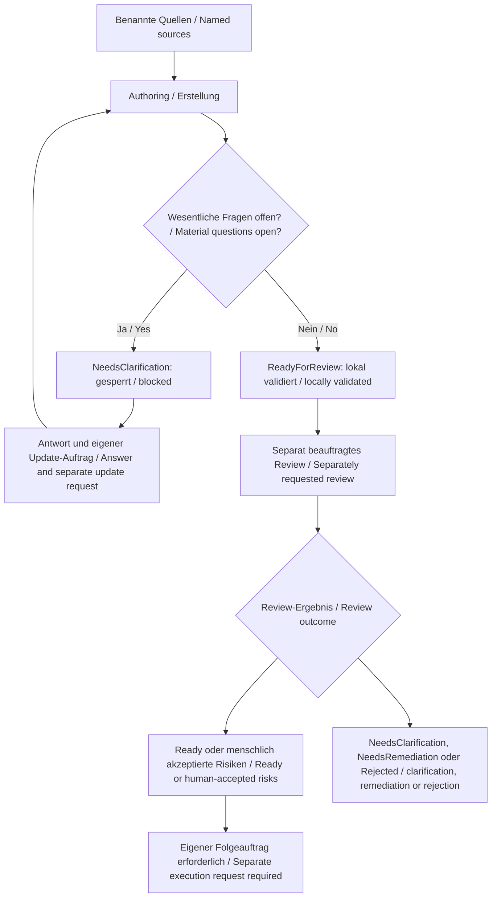

<!-- intake-authoring:begin -->
# LH-00 — Spec-Kit-Projektprofil und Lastenheft-Prozess / Spec Kit project profile and intake process

**Authoring-Status / Authoring status:** `ReadyForReview`.
**Review-Status / Review status:** Siehe [aktuelles separates Ergebnis](../specs/intake-review-result.json) / See the current separate result.
**Prozessabnahme / Process acceptance:** Offen / Open.
**Profil / Profile:** `show-commandtui400-de-en`.
**Plan-ID:** LH-00. **Issue:** [#1](https://github.com/hindermath/Show-CommandTui400/issues/1).
**Owner:** Thorsten Hindermann. **Erstellt / Created:** 2026-09-28. **Aktualisiert / Updated:** 2026-10-06.

## Zielgruppe und Begriffe / Audience and terms

Für Projektverantwortliche, Lastenheft-Autoren und spätere Implementierende.
Grundkenntnisse von Dateien, Terminal und PowerShell genügen; vorherige Spec-Kit-
Kenntnisse sind nicht erforderlich. Ein Lastenheft (Intake) beschreibt fachliche
Anforderungen. Authoring ist dessen Erstellung. Ein Receipt ist ein JSON-Nachweis
über Quellen und Inhalt; JSON ist ein textuelles Datenformat. SHA-256 ist die
Prüfsumme zur Erkennung geänderter Inhalte. Ein Review bewertet die fachliche
Qualität getrennt von der Erstellung. `ReadyForReview` heißt bereit für diese
Prüfung, nicht bereit zur Implementierung. A11Y bezeichnet Barrierefreiheit;
CEFR B2 bezeichnet das angestrebte Verständlichkeitsniveau der beiden Sprachen.

For project owners, intake authors and later implementers. Basic knowledge of
files, terminals and PowerShell is enough; prior Spec Kit experience is not
required. An intake describes domain requirements. Authoring creates it. A
receipt is a JSON record of sources and content; JSON is a text data format.
SHA-256 is a checksum used to detect changed content. Review assesses domain
quality separately from authoring. ReadyForReview means ready for that review,
not ready for implementation. A11Y means accessibility; CEFR B2 describes the
intended readability of both language tracks.

## Weitere Begriffe / Further terms

Spec Kit ist ein Werkzeugsatz, der von Anforderungen über technische Planung
bis zu Umsetzung und Prüfungen führt. Ein Projektprofil legt dafür die
projektspezifischen Schreib- und Ablageregeln fest. Eine Integration stellt
Kommandos in einer bestimmten Agentenumgebung bereit. Ein Preset ist ein
versioniertes Paket aus Regeln, Vorlagen, Kommandos und Prüfwerkzeugen. Eine
gepinnt genannte Version ist fest ausgewählt. Ein Backport überträgt eine
Korrektur auf eine ältere Version. Baseline heißt vereinbarte Ausgangsbasis.

Spec Kit is a toolset for moving from requirements through technical planning
to implementation and checks. A project profile defines project-specific writing
and storage rules. An integration exposes commands in a particular agent
environment. A preset is a versioned package of rules, templates, commands and
validators. A pinned version is fixed explicitly. A backport applies a fix to
an older version. A baseline is the agreed starting point.

Eine Collection ist eine verwaltete Sammlung von Anforderungsdokumenten mit
Regeln für Ablage und Status. Ihre vier portablen Rollen benennen Index,
Bearbeitungsreihenfolge, aktive Lastenhefte und fachliche Baseline; sie bezeichnen
keine Personen. Ein Serienmanifest ist eine maschinenlesbare Liste der
Lastenhefte einer Serie samt Reihenfolge, Abhängigkeiten und Status. Die
Konfiguration ordnet diese Funktionen später konkreten Dateien und Ordnern zu.

A collection is a managed set of requirement documents with storage and status
rules. Its four portable roles name the index, processing order, active intakes
and domain baseline; they do not identify people. A series manifest is a
machine-readable list of the series' intakes, their order, dependencies and
status. Configuration later maps these functions to actual files and folders.

FR kennzeichnet eine funktionale Anforderung, AC ein Abnahmekriterium, OD eine
fachliche Entscheidung und IAD eine dokumentierte Entscheidung bei der
Lastenheft-Erstellung. G kennzeichnet eine Governance-Regel, also eine verbindliche
Projektvorgabe; E einen Nachweisfall. Die Nummern verbinden zusammengehörige
Aussagen in beiden Sprachen. Ein Issue ist ein Vorgang auf GitHub. Ein Pull
Request (PR) schlägt eine Änderung zur Aufnahme in einen Git-Branch vor; ein
Branch ist eine Entwicklungslinie. Ein Commit speichert einen versionierten
Änderungsstand, Push überträgt ihn und Merge führt Entwicklungslinien zusammen.

FR marks a functional requirement, AC an acceptance criterion, OD a domain
decision and IAD a recorded intake-authoring decision. G marks a governance rule,
a binding project rule; E marks an evidence case. The numbers connect matching
statements in both languages. An issue is a GitHub work item. A pull request
(PR) proposes a change for a Git branch, a line of development. A commit records
a versioned change, push transfers it, and merge combines development lines.

Eine TUI ist eine textbasierte Bedienoberfläche im Terminal; ein Framework ist
ein technisches Grundgerüst für eine Anwendung. Bash ist eine Kommando- und
Skriptsprache. WSL2 ist die zweite Version des Windows-Subsystems für Linux;
damit läuft hier die Linux-Testumgebung Ubuntu innerhalb von Windows.
Markdown ist das Textformat dieses Dokuments. Mermaid beschreibt Diagramme
als Text; die ergänzende Textalternative erklärt denselben Ablauf ohne Diagramm.

A TUI is a text-based user interface in a terminal; a framework provides a
technical foundation for an application. Bash is a command and scripting
language. WSL2 is version two of the Windows Subsystem for Linux; it hosts this
project's Ubuntu Linux test environment within Windows. Markdown is this
document's text format. Mermaid describes diagrams as text; the accompanying
text alternative explains the same flow without a diagram.

WCAG (Web Content Accessibility Guidelines) sind Richtlinien für zugängliche
Inhalte; 2.2 ist die Version und AA das angestrebte Konformitätsniveau. Eine
Screenreader-Software liest Bildschirminhalte vor, Braille stellt sie als
Punktschrift bereit und ein Textbrowser zeigt Webseiten ohne grafische
Darstellung. Diese Zugänge bleiben bei der Prüfung getrennt zu betrachten.

WCAG (Web Content Accessibility Guidelines) defines accessible-content criteria;
2.2 is the version and AA the intended conformance level. Screen-reader software
reads screen content aloud, Braille presents it as raised dots, and a text
browser displays web pages without graphics. Assess these access methods
separately.

## Zweck / Purpose

Ein nachvollziehbares Verfahren schaffen, mit dem die acht vorbereiteten Issues
zu eigenständigen, prüfbaren Lastenheften werden. Fachlichkeit, technische
Spezifikation, Implementierungsplan und Freigabe bleiben unterscheidbar.

Establish a traceable procedure for turning the eight prepared issues into
independent, reviewable intakes. Keep requirements, technical specification,
implementation planning and permission separate.

## Istzustand / Current state

Das Bedienkonzept v0.2 ist die fachliche Baseline. Das Level-2-Repository ist auf
Basis von Home Baseline eingerichtet: Spec Kit 0.12.8, fünf Integrationen und
14 gepinnte Presets. Authoring 0.3.7, Review 0.2.4 und Sequencing 0.2.7 sind regulär
installiert; Security 0.7.0 und Architecture 0.6.1 sind gebunden. Kein Backport ist erforderlich. Die zugehörigen
plattformübergreifenden Release-Prüfungen belegen die Werkzeuge,
nicht den gesamten projektspezifischen PowerShell-Prozess. Ein minimales lokales
DE/EN-Profil und acht Issue-Entwürfe wurden mit dem ursprünglichen Authoring
erstellt und inzwischen veröffentlicht. Die frühere Reparatur erklärte Begriffe
und glich zwei normative DE/EN-Aussagen gemäß Owner-Entscheidung an.
IAD010 legt die gestufte Prozessabnahme fest. IAD011 aktualisierte Governance-/Release-Bezüge und Quellenbindungen. Nach der
Patchlieferung PR #26 bindet IAD012 Authoring 0.3.7 und aktuelle Quellen mit
neuem Receipt und unabhängigem Review; die Abnahme bleibt offen.
Es gibt keine Produktimplementierung.

The interaction concept v0.2 is the domain baseline. Home Baseline setup provides
Spec Kit 0.12.8, five integrations and fourteen pinned presets. Authoring 0.3.7,
Review 0.2.4 and Sequencing 0.2.7 are installed releases; Security 0.7.0 and
Architecture 0.6.1 are bound. No backport is needed. Their cross-platform
release checks prove the tool, not the full project-specific PowerShell process.
Initial authoring established a minimal local bilingual profile and eight
issue drafts, which have since been published. The earlier repair explained terms
and aligned two normative DE/EN statements according to owner decisions.
IAD010 defines staged process acceptance. IAD011 refreshed governance/release references and source bindings. After patch
delivery PR #26, IAD012 binds Authoring 0.3.7 and current sources through a new
receipt and independent review; acceptance remains open.
No product implementation exists.

Auf beiden Macs ist PowerShell 7.6.6.0 laut Owner installiert. Die vorhandenen
Spec-Kit-Basisskripte sind Bash-basiert. Durchgängige PowerShell-Basisskripte auf
beiden Macs sowie nativem Windows 11 und Ubuntu 24.04 unter WSL2 sind noch nicht
nachgewiesen. Windows-/WSL2-Versionen und tatsächliche Testergebnisse fehlen.
Die dokumentierte Entwicklungsumgebung entscheidet keine Produkt-Mindestversion.

The owner reports PowerShell 7.6.6.0 on both Macs. Existing Spec Kit base scripts
use Bash. End-to-end PowerShell base-script operation on both Macs, native
Windows 11 and Ubuntu 24.04 under WSL2 remains unproven. Windows/WSL2 versions
and actual results are outstanding. Development versions set no product minimum.

## Zielzustand / Target state

Ein später vollständig umgesetzter LH-00-Prozess erzeugt zweisprachige Intakes
mit eindeutiger Identität, gebundenen Quellen, überprüfbaren Anforderungen und
ehrlichen Nachweisen. Rollen, Status und Ablagen sind verständlich. Änderungen
erhalten Herkunft und Reihenfolge. Serienverwaltung und Plattformnachweise sind
validiert; Bestandsübersetzungen und zentrale Registerausrichtung sind erledigt.
Die Erstellung dieses Lastenhefts erreicht nur `ReadyForReview`.

A fully implemented later LH-00 process produces bilingual intakes with clear
identity, bound sources, testable requirements and honest evidence. Roles,
statuses and storage are understandable. Changes preserve provenance and order.
Series management and platform evidence validate; existing-document translations
and central registry alignment are complete. Authoring this document reaches
only ReadyForReview.

## Umfang / Scope

Der fachliche Umfang von LH-00 umfasst Projektprofil, Rollen, Ablage, Sprachpflege,
Authoring-/Reviewverfahren, Quellenbindung, kontrollierte Änderungen, Reihenfolge,
Serienverwaltung und Abnahme des PowerShell-Prozesses. Der Auftrag IAD010 umfasste die B-01-Quellenkorrektur und Pilotregel.
Der historische Auftrag IAD011 umfasste die frühere Nachweisaktualisierung.
Der historische Auftrag IAD012 lieferte das Update nach PR #26.
Der aktuelle Auftrag IAD013 umfasst ein gesondertes Intake-Update nach PR #29/#30,
frisches unabhängiges Review, gezielten Spec-/Plan-/Tasks-Abgleich, Startchecks
und MergeAndSync-Lieferung dieses Vorbereitungspakets mit Admin-Bypass.
Die übrigen Prozessanforderungen sind später umzusetzen.

LH-00 covers the project profile, roles, storage, language maintenance, authoring
and review, source binding, controlled changes, ordering, series management and
PowerShell process acceptance. IAD010 covered the B-01 source fix and pilot rule. Historical IAD011 covered the previous evidence refresh. IAD012 delivered the
update after PR #26. Current IAD013 covers a separate update after PR #29/#30, fresh independent review, targeted spec/plan/task
reconciliation, start checks and MergeAndSync/admin delivery of this preparation package. Remaining process requirements are for later implementation.

## Nicht-Ziele / Non-goals

Keine Produktimplementierung, keine TUI-Framework-/Sprachentscheidung, keine
Festlegung der Produkt-Mindestversion oder technischen Sitzungsintegration.
Keine ungeprüfte TuiVision-Governance, keine Geräteadapter oder Cloud-Pflicht.
Kein automatisches Review, Specify, Autonomous oder Parallel Autonomous.
Keine zentrale Flottenverteilung oder Release-Automation. Die frühere Reparaturlieferung
umfasste Commit, Push, PR, Merge, Synchronisation und Issue-1-Korrektur.
IAD010 und IAD011 erlauben hier keine neue Lieferung, Feature-Läufe, Releases
oder Remote-Rollouts. IAD011 erlaubte auch keinen Tool-Installations-/Routing-Refresh. IAD013 erlaubt
nur die Vorbereitung und ihre Lieferung, keine Implementierung, Serienaktivierung,
Pilotläufe, Releases, zentrale Änderungen oder Tool-/Routing-Schreibläufe.

No product implementation, TUI framework/language choice, product minimum
version or technical session integration decision. No unchecked TuiVision
governance, device adapters or mandatory cloud service. No automatic review,
Specify, Autonomous or Parallel Autonomous. No central fleet distribution or
release automation. Earlier repair delivery covered commit, push, PR, merge, sync and the
issue-1 correction. Neither IAD010 nor IAD011 grants new delivery, feature runs,
releases or remote rollouts here. IAD011 also excluded tool installation/routing refresh. IAD013 permits only
preparation and its delivery, without implementation, series activation, pilots,
releases, central changes or tool/routing writes.

## Anforderungen / Requirements

- **FR-00-001:** Spec-Kit-Version, verwendete Erweiterungen und tatsächlich verfügbare Intake-Kommandos feststellen und dokumentieren.
- **FR-00-002:** Projektprofil mit Deutsch zuerst (de-DE), Englisch danach (en), ungefähr CEFR B2 sowie Ablage, Statusmodell und Verantwortlichkeiten festlegen.
- **FR-00-003:** Bedienkonzept als fachliche Baseline referenzieren; Lastenhefte, technische Spezifikationen und Implementierungspläne getrennt halten.
- **FR-00-004:** Reihenfolge und Abhängigkeiten in einer einzigen verbindlichen Übersicht pflegen; Issues und Lastenhefte jeweils nach ihrer Erstellung verlinken.
- **FR-00-005:** Pflege fachliche Dokumente DE zuerst/EN danach mit gleichen IDs und ungefähr CEFR B2; erkläre Fach- und Workflowbegriffe bei erster Verwendung.
- **FR-00-006:** Beschreibe Status, Abhängigkeiten, Entscheidungen und nächste Aktion vollständig in Text; prüfe Tastatur-, Screenreader-, Braille- und Textbrowserzugang sowie WCAG 2.2 AA soweit anwendbar.
- **FR-00-007:** Ordne alle anwendbaren Level-2-Vorgaben Anforderungen, Abnahmekriterien, Ownern und Nachweisen zu; begründe N/A und kennzeichne offene Nachweise.
- **FR-00-008:** Erzeuge nachprüfbare Quellen- und Zielhashes mit Receipts; schütze bestehende Ziele und trenne Create, Update, Review und Ausführung.
- **FR-00-009:** Definiere Authoring- und Reviewstatus getrennt; ein Review oder ein kopierter Prompt erteilt keine automatische Produkt- oder Remote-Freigabe.
- **FR-00-010:** Weise den durchgängigen PowerShell-Spec-Kit-Prozess auf beiden Macs, nativem Windows 11 und Ubuntu 24.04 unter WSL2 getrennt nach; erfasse Versionen und Testgrenzen.
- **FR-00-011:** Konkretisiere später die portablen Collection-Rollen, Pfade und ein validiertes Serienmanifest aus der bestehenden Reihenfolge; bewahre IDs, Abhängigkeiten und Archivnachweise.
- **FR-00-012:** Erledige die inventarisierten Fachtextübersetzungen und die zentrale Register-Synchronisation vor der Abnahme des LH-00-Prozesses; bewahre historische Nachweise.

- **FR-00-001:** Identify and document the Spec Kit version, extensions and actually available intake commands.
- **FR-00-002:** Define the project profile with German first (de-DE), English second (en), about CEFR B2, storage, status model and responsibilities.
- **FR-00-003:** Reference the interaction concept as the domain baseline; keep intakes, technical specifications and implementation plans separate.
- **FR-00-004:** Maintain order and dependencies in one binding overview; link both issues and intakes after each is created.
- **FR-00-005:** Maintain domain documents in German first and English second, with matching IDs and about CEFR B2; explain technical and workflow terms on first use.
- **FR-00-006:** Explain status, dependencies, decisions and the next action fully in text; assess keyboard, screen reader, Braille and text-browser access and applicable WCAG 2.2 AA criteria.
- **FR-00-007:** Map every applicable Level-2 rule to requirements, acceptance criteria, owners and evidence; justify N/A and label open evidence.
- **FR-00-008:** Produce verifiable source and target hashes in receipts; protect existing targets and separate Create, Update, Review and execution.
- **FR-00-009:** Define authoring and review states separately; review or a copied prompt grants no automatic product or remote authority.
- **FR-00-010:** Prove the end-to-end PowerShell Spec Kit process separately on both Macs, native Windows 11 and Ubuntu 24.04 under WSL2; record versions and proof boundaries.
- **FR-00-011:** Later establish portable collection roles, paths and a validated series manifest from the existing order; preserve IDs, dependencies and archival evidence.
- **FR-00-012:** Complete inventoried domain-document translations and central registry synchronization before LH-00 process acceptance; preserve historical evidence.

## Qualität und Governance / Quality and governance

Die [Zuordnung G01–G12](../docs/intake-governance.md) bindet jede relevante
Level-2-Vorgabe an Nachweise. NIST SSDF (sichere Softwareentwicklung) und CWE
Top 25 (häufige Fehlertypen) sind anwendbar. Der fachliche Owner ist Thorsten,
der Autor prüft lokale Struktur und Konsistenz. Ein anderer Agent oder Mensch
prüft den Intake; das Ergebnis wird getrennt und an den Inhalt gebunden gespeichert.
Für jeden Standard werden Anwendbarkeit und Erfüllung getrennt erfasst.
Das Bedrohungsmodell des Produkts (Threat Model) beschreibt mögliche Angriffe
und Gegenmaßnahmen. Dieses Modell sowie Architektur- und Laufzeitnachweise
sind noch offen.
ASVS (Application Security Verification Standard) beschreibt Sicherheitsanforderungen
für Webanwendungen. Eine SBOM (Software Bill of Materials) ist eine Liste der
Softwarebestandteile; VEX (Vulnerability Exploitability eXchange) beschreibt,
ob bekannte Schwachstellen diese Bestandteile betreffen. Eine AI-SBOM ergänzt
Angaben zu Komponenten künstlicher Intelligenz (KI). Web-ASVS, Produkt-SBOM/VEX
und AI-SBOM sind für diese Dokumentarbeit begründet nicht anwendbar (`N/A`). Änderungen an Architektur oder Release lösen eine
Neubewertung aus.

The linked G01–G12 mapping binds each relevant Level-2 rule to evidence. NIST
SSDF (secure development practices) and CWE Top 25 (common weakness types)
apply. Thorsten is the subject owner; the author checks local structure and
consistency. Another agent or human reviews the intake; the result is stored
separately and bound to its content. Applicability and fulfillment
are recorded separately. A product threat model describes possible attacks
and countermeasures. This model, architecture and runtime evidence are open.
ASVS (Application Security Verification Standard) describes
security requirements for web applications. An SBOM (Software Bill of Materials)
lists software components; VEX (Vulnerability Exploitability eXchange) records
whether known vulnerabilities affect them. An AI-SBOM adds information about
artificial-intelligence components. Web ASVS, product SBOM/VEX and AI-SBOM are
justified as not applicable (`N/A`) to this document work. Architecture or release changes trigger
reassessment.

Tastatur, Screenreader, Braille und Textbrowser sind Nachweisperspektiven;
eine Markdown-Strukturprüfung ersetzt keine assistive Feldabnahme. Die Kriterien
von WCAG 2.2 AA werden hinsichtlich ihrer Anwendbarkeit geprüft. Zustände,
Reihenfolge und Entscheidungen stehen vollständig in Text. Keine Information
wird nur durch Farbe oder räumliche Anordnung vermittelt. Beide Sprachen behalten
dieselben IDs und dieselbe Bedeutung. Personenbezogene Angaben bleiben auf die
benannte Owner-Rolle begrenzt; keine Credentials oder privaten Maschinenpfade.

Keyboard, screen readers, Braille and text browsers are evidence perspectives;
Markdown structure checks do not replace assistive field acceptance. Assess
WCAG 2.2 AA criteria for applicability. States, order and decisions are fully
explained in text. Color and layout carry no exclusive meaning. Both languages
retain the same IDs and meaning. Personal information is limited to the named
owner role; include no credentials or private machine paths.

## Aktuelle Governance-Bewertung / Current governance assessment

Unter FR-00-007 und AC-00-005 werden Beispielprodukt, Entwicklungswerkzeuge und
Organisation getrennt bewertet: DS-GVO (Datenschutz-Grundverordnung), KI-VO
(EU-Verordnung über künstliche Intelligenz), CRA (Cyber Resilience Act,
EU-Cyberresilienzverordnung), NIS2 (EU-Richtlinie zur Netz- und Informationssicherheit)
und DORA (Digital Operational Resilience Act für den Finanzsektor). Dies sind
regulatorische Prüfgebiete, keine automatisch geltenden Produktanforderungen.
Jurisdiktion, Rolle, direkte/vertragliche Pflichten, Quelle, Owner, anderer Prüfer,
Nachweis und nächste Aktion werden festgehalten. Unbekanntes bleibt Open;
Ausbildungszweck und Produkt-AI-SBOM N/A ersetzen diese Prüfung nicht.
C5 bezeichnet Cloud-Prüfnachweise: Type 1 prüft einen Zeitpunkt, Type 2 einen
Zeitraum; Unknown bedeutet fehlende Einordnung. Bei Anwendbarkeit unterscheiden;
kein Audit oder Zertifikat behaupten. Bei anwendbarer C3A-Cloud-Autonomie die
exakten Kontroll-IDs C/AC (Kriterien/zusätzliche Kriterien) erhalten; SI liefert
ergänzende Auslegung, keinen eigenständig erfüllten Kontrollnachweis.
Die gelieferte B-01-Korrektur ersetzt keine reale Serien-/Prozessabnahme.
IAD010 und alle bisherigen Abnahmekriterien bleiben verbindlich.

Under FR-00-007 and AC-00-005 assess the sample product, development tooling and
organisation separately for GDPR (General Data Protection Regulation), the EU
AI Act, CRA (Cyber Resilience Act), NIS2 (network and information security
directive) and DORA (Digital Operational Resilience Act for financial entities).
These are
regulatory assessment areas, not automatically applicable product requirements.
Record jurisdiction, role, direct/contractual duties, source, owner, another
reviewer, evidence and next action. Unknown remains Open; education and product
AI-SBOM N/A do not replace assessment. C5 names cloud assurance evidence: Type 1
covers a point in time, Type 2 a period; Unknown means unclassified evidence.
Distinguish these when applicable; claim no audit/certification. For applicable
C3A cloud autonomy retain exact C/AC IDs (criteria/additional criteria);
SI provides supporting interpretation rather than a separately fulfilled control.
Delivered B-01 fixes do not prove real series/process acceptance. IAD010 and
all existing acceptance criteria remain binding.

## Ablauf und Status / Flow and status



Textalternative: Benannte Quellen führen zur Erstellung. Offene wesentliche
Fragen erzeugen `NeedsClarification` mit gesperrten Prompts. Nach Antworten braucht
eine Änderung des aktiven Intakes einen eigenen Update-Auftrag. Ohne offene
Authoring-Fragen und nach beiden Validatoren folgt `ReadyForReview`. Nur ein
separat beauftragtes Review kann `Ready`, `ReadyWithAcceptedRisks`,
`NeedsClarification`, `NeedsRemediation` oder `Rejected` liefern. Risiken müssen von einem Menschen
akzeptiert werden. Auch ein positives Review startet ohne eigenen Auftrag nichts.

Text alternative: Named sources enter authoring. Material open questions produce
NeedsClarification with blocked prompts. After answers, changing an active intake
requires a separate update request. With decisions resolved and both validators
passing, the result is ReadyForReview. Only a separately requested review can
produce Ready, ReadyWithAcceptedRisks, NeedsClarification, NeedsRemediation or Rejected. A human must
accept risks. Even a positive review starts nothing without its own request.

## Abhängigkeiten und Risiken / Dependencies and risks

LH-00 hat keinen fachlichen Vorgänger. Danach folgt LH-01, dann LH-02, LH-03,
LH-04 und LH-05. LH-05 hängt von LH-03 und LH-04 ab. LH-06 hängt von LH-01 und
LH-05 ab, LH-07 von LH-06. Nur der [Lastenheft-Plan](../docs/Lastenheft-Plan.md)
ist die verbindliche Reihenfolge; diese Textalternative erläutert sie.
Es existiert noch kein validiertes ausführbares Serienmanifest.

LH-00 has no domain predecessor. It is followed by LH-01, LH-02, LH-03, LH-04
and LH-05. LH-05 depends on LH-03 and LH-04. LH-06 depends on LH-01 and LH-05;
LH-07 depends on LH-06. The linked intake order is authoritative; this text
explains it. A validated executable series manifest does not yet exist.

Risiken: veröffentlichte Issues und archivierte Entwurfssnapshots haben getrennte
Versionsstände; jede neue Veröffentlichung muss gegen den aktuellen Remote-Stand
geprüft werden. Lokale Quelländerungen
machen Receipts veraltet. Zentrale Registerübernahme und Bestandsübersetzungen
sind offen. Plattform- und A11Y-Nachweise dürfen nicht aus Tooling-CI abgeleitet
werden. Owner und Fristen stehen bei FU01–FU07 der Governance-Zuordnung.

Risks: published issues and archived draft snapshots have distinct versions;
compare each new publication with current remote state. Changed local sources make receipts stale. Central registry
adoption and existing-document translations remain pending. Tooling CI must not
be treated as project platform or accessibility acceptance. Owners and deadlines
are recorded in FU01–FU07 of the governance mapping.

## Gestufte Abnahme und Pilotweg / Staged acceptance and pilot route

**IAD010:** Nach Umsetzung des Kernprozesses prüft ein isoliertes Beispiel auf
Mac A oder Mac B Erstellung, Änderung, Herkunftsnachweise, anderes Review und
Serienzustände. Der Nachweis benennt den tatsächlich verwendeten Mac. Erfolgreiche
Ergebnisse erlauben dem Owner eine begrenzte Pilotfreigabe, keine volle Abnahme.
LH-01 und danach LH-02 laufen nur mit eigenen Aufträgen, gültigen Intakes und
unabhängigen Reviews außerhalb der automatischen Serienauswahl. LH-02 verlangt
den belegten fachlichen Abschluss von LH-01. Prozessprobleme werden im bestehenden
LH-00-Nachweis gesammelt und korrigiert; Feature-Abnahmen bleiben getrennt.

Nach LH-02, vor LH-03 folgt die vollständige Prozessabnahme: alle vier Umgebungen,
A11Y, Bestandsübersetzungen und angewendete zentrale Registerausrichtung.
AC-00-001–009 bleiben uneingeschränkt verbindlich. LH-00 bleibt bis dahin offen;
Completed und Archivierung erfordern tatsächliche vollständige Abnahme und eigene
Statusautorität. LH-03 setzt volle LH-00-Abnahme sowie LH-02-Abschluss voraus.
Der zweite Mac und Windows/WSL2 begleiten nicht jeden Entwicklungsschritt.
B-01 muss vor tatsächlicher Serienaktivierung in den installierten Werkzeugen
behoben sein. Diese Regel plant den Pilotweg; sie startet kein Feature.

**IAD010:** After core-process implementation, an isolated example on Mac A or
Mac B proves creation, update, provenance, a different reviewer and series states.
The evidence identifies the actual Mac. Successful results let the owner grant
limited pilot permission, not full acceptance. LH-01 and then LH-02 run only with
separate requests, valid intakes and independent reviews, outside automatic series
selection. LH-02 requires evidenced domain completion of LH-01. Record and fix
process problems in existing LH-00 evidence; feature acceptance stays separate.

Full process acceptance follows after LH-02 and before LH-03: all four environments,
accessibility, existing-document translations and applied central registry alignment.
AC-00-001–009 remain fully binding. LH-00 stays open until then; Completed and archival
require actual full acceptance and separate status authority. LH-03 requires both
full LH-00 acceptance and LH-02 completion. The second Mac and Windows/WSL2 need not
accompany every development step. Fix B-01 in installed tools before actual series
activation. This rule plans the pilot route; it starts no feature.

Details und Autorität / Details and authority:
[gestufte Abnahmeentscheidung](../docs/planning/lh00-staged-acceptance-decisions.md).

## Erwartete Artefakte und Nachweise / Expected artefacts and evidence

Historisches Authoring: zweisprachiges Lastenheft, Receipt, Policy/Profil,
acht Issue-Entwürfe, Governance-Zuordnung, Planentscheidungen, zentraler
Patchvorschlag und lokaler Validierungsbericht. Unter dem historischen IAD011: aktualisiertes
Lastenheft mit neuem Schema-2.0-Receipt, Vorgängerarchive, eigenes Update-Journal,
frisches gesondertes Review, gezielter Plan-/Tasks-Abgleich und Preflight-Nachweis.
Gelieferte Werkzeug-/Preset-Nachweise werden wiederverwendet. Später verbleiben
reale Collection-/Serienverwaltung, Plattformprotokolle, Sprach-/A11Y-Nachweise
und angewendete zentrale Registerausrichtung vor vollständiger Prozessabnahme.
Ein erwarteter Nachweis ist kein bestandener Test; Git-Zahlen bleiben commitgebunden.

Historical authoring produced the bilingual intake, receipt, policy/profile,
eight issue drafts, governance mapping, plan decisions, central patch proposal
and local validation report. Historical IAD011 produced the refreshed intake/new
schema-2.0 receipt, predecessor archives, update journal, fresh separate review,
targeted plan/task reconciliation and preflight evidence. Reuse delivered tooling
and preset evidence. Real collection/series operations, platform records,
language/accessibility proof and applied central registry alignment remain before
full process acceptance. Expected evidence is not a passed test; Git statistics
remain bound to committed history.

Aktuell unter IAD013: gesonderter Update-/Review-Nachweis nach PR #29/#30,
bytegleiche Vorgängerarchive, gezielter Spec-/Plan-/Tasks-Abgleich und neuer
lesender Preflight; anschließend das ausdrücklich beauftragte Lieferpaket.
Keine dieser Vorbereitungsprüfungen erledigt einen Implementierungstask.

Current IAD013 produces separate update/review evidence after PR #29/#30,
exact predecessor archives, targeted spec/plan/task reconciliation and a fresh
read-only preflight, followed by the commissioned delivery package. These
preparation checks do not complete implementation tasks.

## Abnahmekriterien / Acceptance criteria

- **AC-00-001:** Ein Lastenheft lässt sich mit dem dokumentierten, tatsächlich verfügbaren Verfahren aus einem Issue erzeugen.
- **AC-00-002:** Jeder Intake enthält Zweck, Ist-/Zielzustand, Scope, Nicht-Ziele, Anforderungen, Risiken, Nachweise, Abnahmekriterien und offene Entscheidungen.
- **AC-00-003:** Es werden keine fremden Features, Build-Anforderungen oder Freigaben aus TuiVision übernommen.
- **AC-00-004:** Alle normativen Abschnitte liegen in beiden Sprachen mit gleicher Bedeutung und gleichen IDs vor; Begriffe sind erklärt.
- **AC-00-005:** Jede Governance-Zeile hat Quelle, Anforderung, Abnahmekriterium, Owner, Prüfer und Nachweisstatus; Mermaid besitzt eine gleichwertige Textalternative.
- **AC-00-006:** Beide installierten Validatoren bestehen für das Receipt; eine kontrolliert geänderte Zielkopie wird abgelehnt und bestehende Ziele werden nicht durch Create überschrieben.
- **AC-00-007:** Authoring, Review durch einen anderen Prüfer (Agent oder Mensch) als den Autor und Umsetzung besitzen unterscheidbare Status und Freigaben; ohne Auftrag startet kein Folgelauf.
- **AC-00-008:** Für Mac A, Mac B, Windows 11 und WSL2 existiert je ein Ergebnis mit Versionen, Befehl, Exitcode und Grenze oder eine sichtbare offene Blockade; vollständige Prozessabnahme setzt erfolgreiche Nachweise aller vier Umgebungen voraus.
- **AC-00-009:** Collection-Konfiguration und Serienmanifest sind validiert, Bestandsübersetzungen geprüft und die zentrale Registeränderung nachgewiesen; erst dann gilt der LH-00-Prozess als abgenommen.

- **AC-00-001:** The documented, available procedure can produce an intake from an issue.
- **AC-00-002:** Each intake includes purpose, current/target state, scope, non-goals, requirements, risks, evidence, acceptance criteria and open decisions.
- **AC-00-003:** No foreign features, build requirements or permissions are imported from TuiVision.
- **AC-00-004:** All normative sections exist in both languages with matching meaning and IDs; terms are explained.
- **AC-00-005:** Each governance row has a source, requirement, acceptance criterion, owner, reviewer and evidence status; Mermaid has equivalent text.
- **AC-00-006:** Both installed validators pass the receipt; a controlled changed target copy is rejected and Create does not overwrite existing targets.
- **AC-00-007:** Authoring, review by a different reviewer (agent or human) than the author, and implementation have distinct states and permissions; no downstream run starts without a request.
- **AC-00-008:** Mac A, Mac B, Windows 11 and WSL2 each have a result with versions, command, exit code and boundary, or a visible open blocker; full process acceptance requires successful evidence from all four environments.
- **AC-00-009:** The collection configuration and series manifest validate, existing-document translations are checked and the central registry change is evidenced; only then is the LH-00 process accepted.

## Nachweisfälle und Anforderungszuordnung / Evidence cases and requirement mapping

Die folgende Tabelle beschreibt die spätere fachliche Prozessabnahme. Der
separate Validierungsbericht belegt ausschließlich die jetzt ausgeführten
Authoring-Prüfungen. Nicht ausgeführte Teilfälle bleiben offen.

The table describes later process acceptance. The separate validation report
proves only authoring checks actually run now. Unexecuted subcases remain open.

| Fall / Case | FR-00 | AC-00 | Prüfung / Check |
|---|---|---|---|
| E01 | 001, 002 | 001 | Ein Issue anhand dokumentierter Kommandos verarbeiten; Versionen und Grenzen festhalten. / Process an issue with documented commands; capture versions and boundaries. |
| E02 | 002, 003, 005 | 002, 003, 004 | Pflichtabschnitte, DE/EN-Inhaltsparität und Scope prüfen. / Check required sections, bilingual parity and scope. |
| E03 | 006, 007 | 005 | G01–G12, Textalternative und assistiven Leserpfad prüfen; Struktur und Feldtest getrennt ausweisen. / Check mapping, text alternative and assistive reader path; separate structure from field tests. |
| E04 | 008 | 006 | Beide Validatoren; Ziel-/Quellhash-Drift und bestehendes Ziel kontrolliert ablehnen. / Both validators; reject controlled hash drift and an existing Create target. |
| E05 | 009 | 007 | Authoring-/Review-/Ausführungsstatus und fehlende Freigabe durchspielen. / Exercise authoring/review/execution states and absent authority. |
| E06 | 010 | 008 | Vollständige PowerShell-Prozessfälle auf Mac A, Mac B, Windows 11 und WSL2. / Full PowerShell process cases on all four environments. |
| E07 | 004, 011, 012 | 009 | Collection-/Serienprüfung, Sprachinventar und zentrale Registerlieferung nachweisen. / Prove collection/series validation, translations and central registry delivery. |

## Entscheidungen und offene Nachweise / Decisions and open evidence

**OD-00-001: Entschieden.** Historisch wurden GitHub Spec Kit 0.12.8 und
Authoring 0.3.5 gewählt; IAD011 band später 0.3.6. IAD012 band Authoring
0.3.7 mit fünf Integrationen
und aktueller Vierzehn-Preset-Matrix; Spec Kit bleibt 0.12.8. Keine Framework-
oder Produktspracheentscheidung.

**OD-00-001: Resolved.** The historical choice was GitHub Spec Kit 0.12.8 and
Authoring 0.3.5; IAD011 later bound 0.3.6. IAD012 bound Authoring 0.3.7
with five integrations and the
current fourteen-preset matrix; Spec Kit remains 0.12.8. This selects neither
a product framework nor a product language.

IAD001–IAD007 stehen vollständig in den [angenommenen Entscheidungen](../docs/planning/lh00-authoring-decisions.md).
Die frühere Deutsch-Ausnahme wurde durch den Owner-Plan ausdrücklich ersetzt;
veraltete Setup-Angaben sind durch den belegten Installationsstand korrigiert.
Quellenreihenfolge allein entscheidet keine Konflikte. In diesem Authoring-Pass
sind keine wesentlichen Fragen offen. Offene Prozessnachweise und spätere
Produktentscheidungen bleiben als Anforderungen bzw. Zuständigkeiten bestehen.

IAD001–IAD007 are fully recorded in the linked accepted decisions. The owner plan
explicitly replaces the former German-only exception; verified installation
state corrects outdated setup claims. Source order alone resolves no conflict.
This authoring pass has no material open question. Outstanding process evidence
and later product decisions remain requirements or future responsibilities.

## Reparaturentscheidungen / Repair decisions

Die [bestätigten Entscheidungen IAD008/IAD009](../docs/planning/lh00-repair-decisions.md)
gelten ergänzend zum archivierten Vorgängerstand: FR-00-004 verlinkt Issues und
Lastenhefte; AC-00-007 verlangt einen anderen Prüfer als den Autor. Begriffe wurden
für IR001 erklärt. IR002 gleicht ausschließlich diese beiden normativen Stellen
sprachlich an. Das neue Receipt erhält die Intake-ID und verweist auf die
archivierten Vorgänger. Das aktuelle Review entscheidet über die fachliche Reife;
eine Reparatur allein bedeutet keine Freigabe.

Confirmed IAD008/IAD009 supplement the archived predecessor: FR-00-004 links
issues and intakes; AC-00-007 requires a reviewer other than the author. IR001
adds term explanations. IR002 aligns only these two normative clauses across
languages. The new receipt preserves intake identity and references archived
predecessors. Current review determines readiness; editing alone grants none.

## Quellenaktualisierung IAD012 / Source refresh IAD012

[IAD012](../docs/planning/lh00-v037-refresh-decisions.md) dokumentiert das gesonderte
Update nach PR #26, den Auftrag zum anderen Review, zum technischen Abgleich und
zur MergeAndSync-Lieferung. Die Intake-ID, zwölf FR-00 und neun AC-00 je Sprache
bleiben erhalten. Historische Receipts/Reviews bleiben archiviert; nur das aktuelle,
inhaltsgebundene Ergebnis zeigt die heutige fachliche Reife. Dieser Auftrag startet
keine Implementierung und keine Folgevorlage.

IAD012 records the separate update after PR #26 and authority for another reviewer,
technical reconciliation and MergeAndSync delivery. Preserve intake identity and
twelve FR-00 and nine AC-00 per language. Archive historical receipts/reviews; only
the current content-bound result shows present semantic readiness. This request
starts no implementation and executes no follow-up template.

## Aktuelle Quellenaktualisierung IAD013 / Current source refresh IAD013

[IAD013](../docs/planning/lh00-macos15-refresh-decisions.md) bindet die Änderungen aus
PR #29/#30 mit neuem Receipt und vollständigem Review durch einen anderen Agenten.
GitHub Actions führt die automatisierten Prüfabläufe (CI) aus. Die Setup-Validierung
verwendet hier macOS 15, Ubuntu 22.04 und Windows 2022. PowerShell-Analyse und
Maintenance TUI bleiben gemäß Repository-Auswahl Linux-only. Erfolgreiche CI belegt
nur tatsächlich ausgeführte Werkzeugprüfungen, keine Produkt- oder Mac-A/B-Abnahme.
Der Runnerwechsel ändert keine FR/AC, Produkt-Mindestversion oder spätere Abnahme-
umgebung. Historische IAD012-Nachweise behalten ihren damaligen Kontext. Die aktuelle
Lieferbefugnis umfasst nur Vorbereitung und Nachweise; beide Folgeprompts bleiben
Vorlagen für einen gesonderten Auftrag.

IAD013 binds PR #29/#30 changes with a new receipt and complete review by another
agent. GitHub Actions runs automated check workflows (CI). Setup validation here
uses macOS 15, Ubuntu 22.04 and Windows 2022. PowerShell analysis and Maintenance TUI
remain Linux-only under the repository selection. Successful CI proves only executed
tool checks, not product or Mac A/B acceptance. Runner migration changes no FR/AC,
product minimum or later acceptance environment. Historical IAD012 evidence retains
its context. Current delivery authority covers preparation and evidence only; both
follow-up prompts remain templates requiring a separate request.

## Dokumentationsauswirkung / Documentation impact

`UpdateRequired`; Owner Thorsten. Leserpfad: README → Entwicklungsumgebung →
Governance/Profil → LH-00 → getrenntes Review. DE/EN in einer Datei; Distribution
`sourceOnly`, also ausschließlich versionierte Quellen und Dokumente. Keine
Verteilung in die aktive Home-Baseline-Laufzeitumgebung (Home Runtime).
Lokale Dokumentprüfung, keine
plattformübergreifende Produktabnahme. Bei Quellen-, Policy- oder Scopeänderung
Receipt-Freshness und Reviewstatus neu bewerten. Das [Receipt](../specs/intake-authoring-receipts/lh-00.json)
bindet die Quellen; der [ursprüngliche Validierungsbericht](../docs/lh00-validation.md) nennt
damalige Ergebnisse und Grenzen. Ein abgeschlossener Spec-Kit-Feature-Lauf liegt nicht vor.

UpdateRequired; owner Thorsten. Reader path: README → environment → governance/
profile → LH-00 → separate review. DE/EN in one file; sourceOnly means versioned
source files and documents only. No deployment into the active Home Baseline
runtime environment (Home Runtime). Local document validation is not cross-platform
product acceptance. Reassess receipt freshness and review status after source,
policy or scope changes. The linked receipt binds sources; the original validation report
states the outcomes and limits of that authoring stage. No Spec Kit feature run has completed.

<!-- intake-authoring:prompts -->
## Kopierfertige Folgeprompts / Copy-ready follow-up prompts

Die Prompts sind Vorlagen für einen späteren ausdrücklichen Auftrag nach
gültigem gesondertem Review. Die aktuelle Reparatur führt sie nicht aus.
Gleiche Pfade und IDs gelten für beide Sprachen; ein Aufruf je Kommando vermeidet
doppelte Ausführung. Der aktuelle Reviewbericht nennt den nächsten fachlichen Schritt.

These prompts are templates for a later explicit request after valid separate review.
The current repair does not execute them. Both languages use the same paths
and IDs; one invocation per command avoids duplicate execution. The current
review report names the next domain action.

<!-- spec-kit-command-id: speckit.specify -->
### Specify

```text
$speckit-specify Nutze ausschließlich intakes/LH-00.md als fachlichen Intake mit Profil show-commandtui400-de-en. Prüfe zuvor das aktuelle, gültige Intake-Review und den Receipt specs/intake-authoring-receipts/lh-00.json. Erzeuge nur die technische Spezifikation des beschriebenen LH-00-Prozesses, DE zuerst/EN danach. Keine Implementierung, keine Commits und keine Remote-Schreibzugriffe. Keine LH-01–LH-07-Funktion hinzufügen.
English: Bind the same intake and receipt, require a current valid intake review, and create only the bilingual technical specification of the LH-00 process. No implementation, commits, remote writes or LH-01–LH-07 product functions.
```

<!-- spec-kit-command-id: speckit.autonomous -->
### Autonomous

Autonomous führt nach eigenem Auftrag mehrere Spec-Kit-Schritte aus. Der
Parameter `DeliveryMode LocalImplementation` begrenzt einen solchen späteren
Lauf auf lokale Umsetzung. Er erlaubt keinen Commit, Push oder Merge. Specify
oben erstellt nur die technische Spezifikation, also die Beschreibung der
geplanten technischen Lösung.

Autonomous runs several Spec Kit steps after its own request. The parameter
DeliveryMode LocalImplementation limits that later run to local implementation;
it permits no commit, push or merge. Specify above creates only the technical
specification, a description of the planned technical solution.

```text
$speckit-autonomous Intake intakes/LH-00.md; DeliveryMode LocalImplementation. Nur nach neuem ausdrücklichem Laufauftrag und aktuellem gültigem Intake-Review beginnen. Binde specs/intake-authoring-receipts/lh-00.json und Profil show-commandtui400-de-en. Setze ausschließlich den LH-00-Prozess um, DE zuerst/EN danach. Keine Produktimplementierung aus LH-01–LH-07, keine Commits, Remote-Schreibzugriffe, zentralen Rollouts oder Freigabebypässe. Nicht verfügbare Plattformnachweise offen ausweisen.
English: With a new explicit run request and current valid review, implement only the LH-00 process locally using the same intake, receipt and profile. No product features, commits, remote writes, central rollout or approval bypass. Keep unavailable platform evidence open.
```

<!-- intake-authoring:end -->
